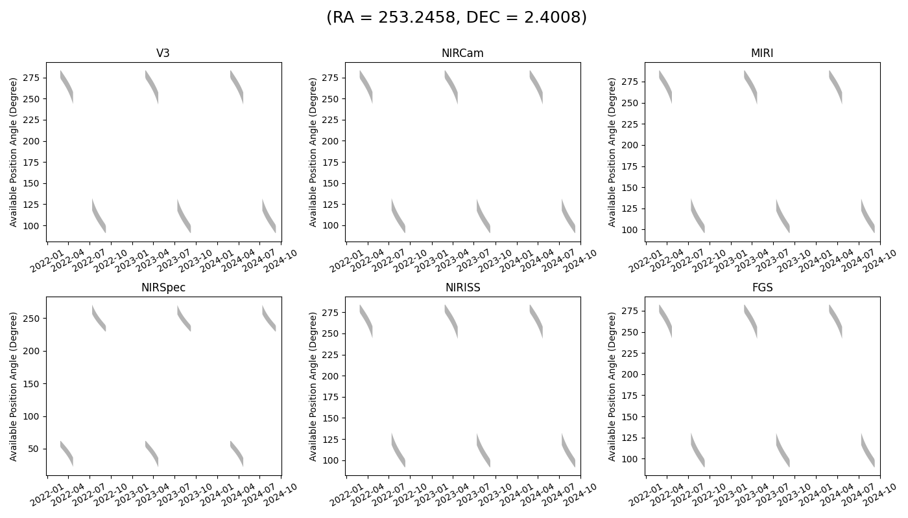
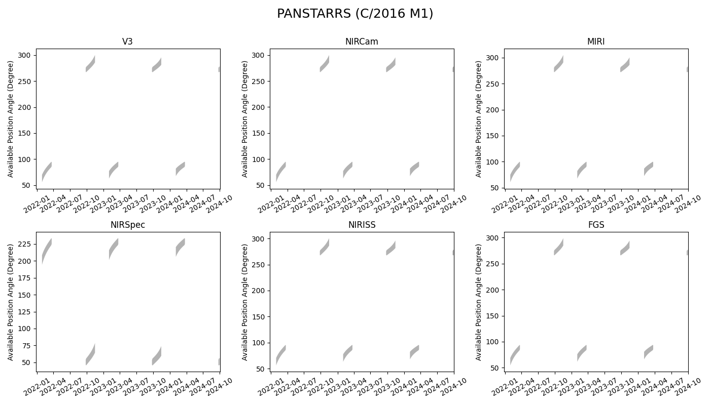
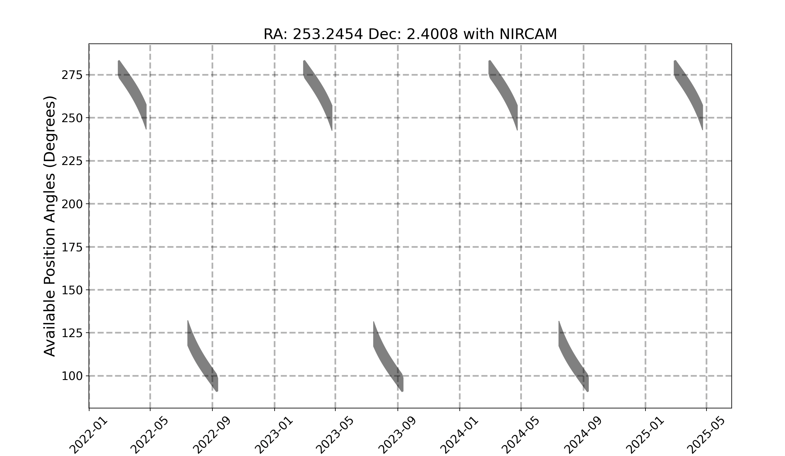
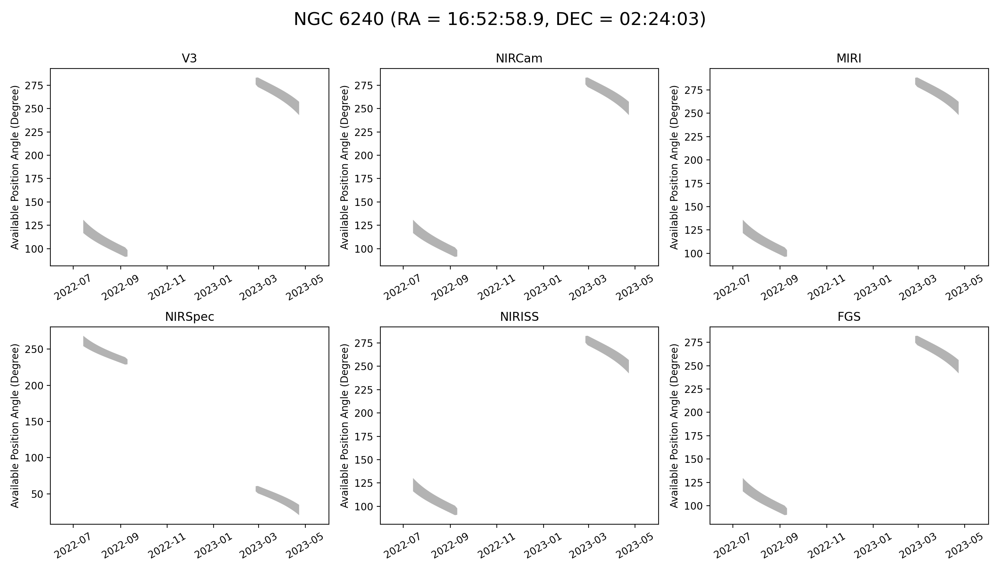

# JWST General Target Visibility Tool (jwst_gtvt)

JWST requires shielding from the Sun for operation, which limits the available position angles observable at a given time.  
This script calculates the allowed position angle for a given Right Ascension and Declination for each instrument on the telescope.
To report any issues, please use the JWST help portal https://jwsthelp.stsci.edu or feel free to open a github issue https://github.com/spacetelescope/jwst_gtvt/issues .

# Dependencies

This tool requires a few packages all of which are included in the Anaconda Python distribution.

* numpy

* maplotlib

* astropy

* astroquery (For moving target support)

# Installation

You can install the tool using `pip` with 
`pip install git+https://github.com/spacetelescope/jwst_gtvt.git`

Alternatively, you can download the ZIP file or clone the respository from GitHub and install the tool from inside the resulting directory with
`easy_install .`

# Usage
There are two scripts available.  `jwst_gtvt` for fixed targets, and `jwst_mtvt` for moving targets.  To see the help info use

    $ jwst_gtvt -h
        usage: jwst_gtvt [-h] [--v3pa V3PA] [--save_plot SAVE_PLOT]
                         [--save_table SAVE_TABLE] [--instrument INSTRUMENT]
                         [--name NAME] [--start_date START_DATE] [--end_date END_DATE]
                         ra dec

        positional arguments:
          ra                    Right Ascension of target in either sexagesimal
                                (hh:mm:ss.s) or degrees.
          dec                   Declination of target in either sexagesimal
                                (dd:mm:ss.s) or degrees.

        optional arguments:
          -h, --help            show this help message and exit
          --v3pa V3PA           Specify a desired V3 (telescope frame) Position Angle.
          --save_plot SAVE_PLOT
                                Path of file to save plot output.
          --save_table SAVE_TABLE
                                Path of file to save table output.
          --instrument INSTRUMENT
                                If specified plot shows only windows for this
                                instrument. Options: nircam, nirspec, niriss, miri,
                                fgs, v3 (case insensitive).
          --name NAME           Target Name to appear on plots. Names with space
                                should use double quotes e.g. "NGC 6240".
          --start_date START_DATE
                                Start date for visibility search in yyyy-mm-dd format.
                                Earliest available is 2020-01-01.
          --end_date END_DATE   End date for visibility search in yyyy-mm-dd format.
                                Latest available is 2023-12-31.
# Example

By default you need only specify R.A. and Dec. in either sexigesimal or degrees.
The observability windows will be printed to the terminal and a plot showing the windows for each instrument will pop up.

`$ jwst_gtvt 16:52:58.9 02:24:03`

`$ jwst_gtvt 253.2458 2.4008`

For moving targets, use `jwst_mtvt`

`$ jwst_mtvt Ceres`

Periodic comets and most asteroids benefit from using the `--smallbody` flag

`$ jwst_mtvt 2`  # Venus (no windows)

`$ jwst_mtvt 2 --smallbody`  # Pallas

`$ jwst_mtvt 2P --smallbody`  # Comet Encke

`$ jwst_mtvt C/2016 M1`  # works with or without --smallbody

Setting the `--name` flag will add a target name to the plot title

`$ jwst_gtvt 16:52:58.9 02:24:03 --name "NGC 6240"`

You can specify the instrument via the `--instrument` flag.

`$ jwst_gtvt 16:52:58.9 02:24:03 --name "NGC 6240" --instrument nircam`

and the resulting plot will only contain the windows for the specified instrument.
The allowed values for `--instrument` are 'nircam', 'nirspec', 'niriss', 'miri', 'fgs', and 'v3' (case insensitive).

You can save the text ouput to a file instead of having it output to terminal with `--save_table`.  
Likewise, you can save the plot with `--save_plot`.
The plot can be saved in any format supported by matplotlib (.png, .jpeg, .pdf, .eps) by specifying the desired extension in the filename.

`$ jwst_gtvt 16:52:58.9 02:24:03 --save_table visibility.txt --save_plot visibility.png`

If you only want to plot a specific range of dates, rather than the entire available ephemeris you specify a `--start_date` or `--end_date` in ISO format (yyyy-mm-dd).
For example

`$ jwst_gtvt 16:52:58.9 02:24:03 --name "NGC 6240" --start_date 2020-01-01 --end_date 2021-01-01`

Specifying the `--v3pa` will display the observing windows which contain the desired V3 position angle in the text output.

Below is an example of the full text output

    $ jwst_gtvt 16:52:58.9 02:24:03

    Using Equatorial Coordinates

           Target
                    ecliptic
    RA      Dec     latitude
    253.245   2.401  24.771

    Checked interval [2020-01-01, 2023-12-31]
    |           Window [days]                 |    Normal V3 PA [deg]    |
       Start           End         Duration         Start         End         RA            Dec
     2020-02-24      2020-04-22        57.96     279.64411     249.47611     253.24542       2.40083
     2020-07-12      2020-09-09        59.00     124.38425      94.74234     253.24542       2.40083
     2021-02-24      2021-04-23        58.00     279.32715     248.90449     253.24542       2.40083
     2021-07-12      2021-09-09        59.00     124.54229      94.87365     253.24542       2.40083
     2022-02-24      2022-04-23        58.00     279.42431     249.15401     253.24542       2.40083
     2022-07-13      2022-09-10        59.00     123.90127      94.59937     253.24542       2.40083
     2023-02-24      2023-04-23        58.00     279.52495     249.40672     253.24542       2.40083
     2023-07-13      2023-09-10        59.00     124.06733      94.73488     253.24542       2.40083

                    V3PA          NIRCam           NIRSpec         NIRISS           MIRI          FGS
       Date      min    max      min    max       min    max     min    max      min    max      min    max

    2020-02-25   276.18 283.06   276.15 283.03    53.67  60.55   275.61 282.49   281.19 288.08   274.93 281.81
    2020-02-26   275.18 283.20   275.15 283.18    52.67  60.69   274.61 282.63   280.20 288.22   273.93 281.95
    2020-02-27   274.18 283.35   274.16 283.32    51.67  60.83   273.61 282.78   279.20 288.36   272.93 282.10
    2020-02-28   273.23 283.44   273.21 283.42    50.72  60.93   272.66 282.87   278.25 288.46   271.98 282.19
    2020-02-29   272.81 283.02   272.79 282.99    50.30  60.50   272.24 282.45   277.83 288.03   271.56 281.77
    2020-03-01   272.39 282.59   272.36 282.56    49.88  60.08   271.82 282.02   277.41 287.61   271.14 281.34
    2020-03-02   271.97 282.17   271.94 282.14    49.45  59.66   271.40 281.60   276.98 287.18   270.72 280.92
    2020-03-03   271.54 281.75   271.52 281.72    49.03  59.23   270.97 281.18   276.56 286.76   270.29 280.49
    2020-03-04   271.12 281.33   271.09 281.30    48.61  58.81   270.55 280.76   276.13 286.34   269.87 280.07
    2020-03-05   270.69 280.91   270.66 280.88    48.18  58.39   270.12 280.34   275.71 285.92   269.44 279.65
    2020-03-06   270.26 280.49   270.24 280.46    47.75  57.97   269.69 279.92   275.28 285.50   269.01 279.24
    2020-03-07   269.83 280.07   269.81 280.04    47.32  57.56   269.26 279.50   274.85 285.08   268.58 278.82
    2020-03-08   269.40 279.65   269.37 279.63    46.89  57.14   268.83 279.08   274.42 284.67   268.15 278.40
    2020-03-09   268.97 279.24   268.94 279.21    46.45  56.72   268.40 278.67   273.98 284.25   267.72 277.98
    2020-03-10   268.53 278.82   268.50 278.79    46.02  56.31   267.96 278.25   273.54 283.83   267.28 277.57
    2020-03-11   268.09 278.40   268.06 278.38    45.58  55.89   267.52 277.83   273.10 283.42   266.84 277.15
    2020-03-12   267.65 277.98   267.62 277.96    45.13  55.47   267.08 277.41   272.66 283.00   266.40 276.73
    2020-03-13   267.20 277.57   267.17 277.54    44.69  55.05   266.63 277.00   272.22 282.58   265.95 276.32
    2020-03-14   266.75 277.15   266.73 277.12    44.24  54.64   266.18 276.58   271.77 282.16   265.50 275.90
    2020-03-15   266.30 276.73   266.27 276.70    43.79  54.22   265.73 276.16   271.31 281.74   265.05 275.48
    2020-03-16   265.84 276.31   265.82 276.28    43.33  53.80   265.27 275.74   270.86 281.32   264.59 275.06
    2020-03-17   265.38 275.89   265.36 275.86    42.87  53.37   264.81 275.32   270.40 280.90   264.13 274.64
    2020-03-18   264.92 275.46   264.89 275.44    42.40  52.95   264.35 274.89   269.93 280.48   263.67 274.21
    2020-03-19   264.45 275.04   264.42 275.01    41.93  52.53   263.88 274.47   269.46 280.05   263.20 273.79
    2020-03-20   263.97 274.61   263.95 274.59    41.46  52.10   263.40 274.04   268.99 279.63   262.72 273.36
    2020-03-21   263.49 274.18   263.47 274.16    40.98  51.67   262.92 273.61   268.51 279.20   262.24 272.93
    2020-03-22   263.01 273.75   262.98 273.72    40.49  51.24   262.44 273.18   268.02 278.77   261.76 272.50
    2020-03-23   262.52 273.32   262.49 273.29    40.00  50.80   261.95 272.75   267.53 278.33   261.26 272.06
    2020-03-24   262.02 272.88   261.99 272.85    39.51  50.37   261.45 272.31   267.03 277.89   260.77 271.63
    2020-03-25   261.51 272.44   261.49 272.41    39.00  49.92   260.94 271.87   266.53 277.45   260.26 271.19
    2020-03-26   261.00 271.99   260.98 271.97    38.49  49.48   260.43 271.42   266.02 277.01   259.75 270.74
    2020-03-27   260.49 271.54   260.46 271.52    37.97  49.03   259.92 270.97   265.50 276.56   259.24 270.29
    2020-03-28   259.96 271.09   259.94 271.07    37.45  48.58   259.39 270.52   264.98 276.11   258.71 269.84
    2020-03-29   259.43 270.63   259.40 270.61    36.92  48.12   258.86 270.06   264.45 275.65   258.18 269.38
    2020-03-30   258.89 270.17   258.86 270.15    36.38  47.66   258.32 269.60   263.90 275.19   257.64 268.92
    2020-03-31   258.34 269.71   258.31 269.68    35.83  47.19   257.77 269.14   263.35 274.72   257.09 268.46
    2020-04-01   257.78 269.23   257.76 269.21    35.27  46.72   257.21 268.66   262.80 274.25   256.53 267.98
    2020-04-02   257.21 268.76   257.19 268.73    34.70  46.24   256.64 268.19   262.23 273.77   255.96 267.51
    2020-04-03   256.64 268.27   256.61 268.25    34.12  45.76   256.07 267.70   261.65 273.29   255.39 267.02
    2020-04-04   256.05 267.78   256.02 267.76    33.54  45.27   255.48 267.21   261.06 272.80   254.80 266.53
    2020-04-05   255.45 267.29   255.42 267.26    32.94  44.77   254.88 266.72   260.47 272.30   254.20 266.04
    2020-04-06   254.84 266.78   254.81 266.76    32.33  44.27   254.27 266.21   259.86 271.80   253.59 265.53
    2020-04-07   254.22 266.27   254.19 266.25    31.71  43.76   253.65 265.70   259.23 271.29   252.97 265.02
    2020-04-08   253.59 265.75   253.56 265.73    31.07  43.24   253.02 265.18   258.60 270.77   252.33 264.50
    2020-04-09   252.94 265.22   252.91 265.20    30.43  42.71   252.37 264.65   257.95 270.24   251.69 263.97
    2020-04-10   252.28 264.69   252.25 264.66    29.77  42.18   251.71 264.12   257.29 269.70   251.03 263.44
    2020-04-11   251.60 264.14   251.58 264.12    29.09  41.63   251.03 263.57   256.62 269.16   250.35 262.89
    2020-04-12   250.92 263.59   250.89 263.56    28.40  41.07   250.35 263.02   255.93 268.60   249.66 262.34
    2020-04-13   250.21 263.02   250.18 262.99    27.70  40.51   249.64 262.45   255.23 268.03   248.96 261.77
    2020-04-14   249.49 262.44   249.46 262.42    26.98  39.93   248.92 261.87   254.51 267.46   248.24 261.19
    2020-04-15   248.75 261.85   248.73 261.83    26.24  39.34   248.18 261.28   253.77 266.87   247.50 260.60
    2020-04-16   248.00 261.25   247.97 261.22    25.49  38.74   247.43 260.68   253.01 266.27   246.75 260.00
    2020-04-17   247.23 260.64   247.20 260.61    24.71  38.12   246.66 260.07   252.24 265.65   245.97 259.39
    2020-04-18   246.43 260.01   246.41 259.98    23.92  37.50   245.86 259.44   251.45 265.02   245.18 258.76
    2020-04-19   245.62 259.37   245.59 259.34    23.11  36.85   245.05 258.80   250.64 264.38   244.37 258.12
    2020-04-20   244.79 258.71   244.76 258.68    22.27  36.20   244.22 258.14   249.80 263.73   243.54 257.46
    2020-04-21   243.93 258.04   243.90 258.01    21.42  35.52   243.36 257.47   248.95 263.05   242.68 256.79
    2020-04-22   243.05 257.35   243.03 257.32    20.54  34.83   242.48 256.78   248.07 262.36   241.80 256.10

    2020-07-13   117.11 131.49   117.09 131.47   254.60 268.98   116.54 130.92   122.13 136.51   115.86 130.24
    2020-07-14   116.42 130.61   116.40 130.58   253.91 268.10   115.85 130.04   121.44 135.63   115.17 129.36
    2020-07-15   115.75 129.75   115.72 129.72   253.24 267.24   115.18 129.18   120.76 134.77   114.50 128.50
    2020-07-16   115.09 128.91   115.06 128.89   252.58 266.40   114.52 128.34   120.11 133.93   113.84 127.66
    2020-07-17   114.45 128.10   114.42 128.07   251.94 265.59   113.88 127.53   119.46 133.11   113.20 126.85
    2020-07-18   113.82 127.30   113.79 127.28   251.31 264.79   113.25 126.73   118.84 132.32   112.57 126.05
    2020-07-19   113.21 126.53   113.18 126.50   250.69 264.02   112.64 125.96   118.22 131.54   111.96 125.28
    2020-07-20   112.61 125.77   112.58 125.75   250.10 263.26   112.04 125.20   117.62 130.79   111.36 124.52
    2020-07-21   112.02 125.04   111.99 125.01   249.51 262.52   111.45 124.47   117.04 130.05   110.77 123.79
    2020-07-22   111.45 124.32   111.42 124.29   248.93 261.81   110.88 123.75   116.46 129.33   110.20 123.07
    2020-07-23   110.88 123.62   110.86 123.59   248.37 261.10   110.31 123.05   115.90 128.63   109.63 122.36
    2020-07-24   110.33 122.93   110.30 122.90   247.82 260.42   109.76 122.36   115.35 127.94   109.08 121.68
    2020-07-25   109.79 122.26   109.76 122.23   247.28 259.74   109.22 121.69   114.80 127.27   108.54 121.01
    2020-07-26   109.26 121.60   109.23 121.57   246.75 259.09   108.69 121.03   114.27 126.62   108.01 120.35
    2020-07-27   108.74 120.96   108.71 120.93   246.22 258.45   108.17 120.39   113.75 125.97   107.48 119.71
    2020-07-28   108.22 120.33   108.20 120.30   245.71 257.82   107.65 119.76   113.24 125.34   106.97 119.08
    2020-07-29   107.72 119.71   107.69 119.69   245.20 257.20   107.15 119.14   112.73 124.73   106.47 118.46
    2020-07-30   107.22 119.11   107.19 119.08   244.71 256.60   106.65 118.54   112.24 124.12   105.97 117.86
    2020-07-31   106.73 118.52   106.70 118.49   244.22 256.00   106.16 117.95   111.75 123.53   105.48 117.27
    2020-08-01   106.25 117.94   106.22 117.91   243.74 255.42   105.68 117.37   111.26 122.95   105.00 116.68
    2020-08-02   105.77 117.37   105.75 117.34   243.26 254.85   105.20 116.80   110.79 122.38   104.52 116.11
    2020-08-03   105.31 116.81   105.28 116.78   242.79 254.29   104.74 116.24   110.32 121.82   104.05 115.55
    2020-08-04   104.84 116.26   104.82 116.23   242.33 253.74   104.27 115.69   109.86 121.27   103.59 115.00
    2020-08-05   104.39 115.71   104.36 115.69   241.87 253.20   103.82 115.14   109.40 120.73   103.13 114.46
    2020-08-06   103.93 115.18   103.91 115.16   241.42 252.67   103.36 114.61   108.95 120.20   102.68 113.93
    2020-08-07   103.49 114.66   103.46 114.63   240.98 252.15   102.92 114.09   108.50 119.68   102.24 113.41
    2020-08-08   103.05 114.15   103.02 114.12   240.53 251.63   102.48 113.58   108.06 119.16   101.80 112.89
    2020-08-09   102.61 113.64   102.58 113.61   240.10 251.13   102.04 113.07   107.62 118.65   101.36 112.39
    2020-08-10   102.18 113.14   102.15 113.11   239.66 250.63   101.61 112.57   107.19 118.15   100.93 111.89
    2020-08-11   101.75 112.65   101.72 112.62   239.23 250.13   101.18 112.08   106.76 117.66   100.50 111.39
    2020-08-12   101.32 112.16   101.30 112.13   238.81 249.65   100.75 111.59   106.34 117.18   100.07 110.91
    2020-08-13   100.90 111.68   100.87 111.65   238.39 249.17   100.33 111.11   105.92 116.70    99.65 110.43
    2020-08-14   100.48 111.21   100.45 111.18   237.97 248.69    99.91 110.64   105.50 116.22    99.23 109.96
    2020-08-15   100.07 110.74   100.04 110.71   237.55 248.23    99.50 110.17   105.08 115.76    98.81 109.49
    2020-08-16    99.65 110.28    99.63 110.25   237.14 247.77    99.08 109.71   104.67 115.29    98.40 109.03
    2020-08-17    99.24 109.82    99.22 109.80   236.73 247.31    98.67 109.25   104.26 114.84    97.99 108.57
    2020-08-18    98.83 109.37    98.81 109.34   236.32 246.86    98.26 108.80   103.85 114.39    97.58 108.12
    2020-08-19    98.43 108.92    98.40 108.90   235.91 246.41    97.86 108.35   103.44 113.94    97.18 107.67
    2020-08-20    98.02 108.48    98.00 108.45   235.51 245.97    97.45 107.91   103.04 113.50    96.77 107.23
    2020-08-21    97.62 108.04    97.59 108.02   235.11 245.53    97.05 107.47   102.63 113.06    96.37 106.79
    2020-08-22    97.22 107.61    97.19 107.58   234.70 245.10    96.65 107.04   102.23 112.62    95.97 106.36
    2020-08-23    96.82 107.18    96.79 107.15   234.30 244.67    96.25 106.61   101.83 112.19    95.57 105.93
    2020-08-24    96.42 106.75    96.39 106.73   233.90 244.24    95.85 106.18   101.43 111.77    95.17 105.50
    2020-08-25    96.02 106.33    95.99 106.30   233.51 243.82    95.45 105.76   101.03 111.34    94.77 105.08
    2020-08-26    95.62 105.91    95.59 105.88   233.11 243.40    95.05 105.34   100.63 110.92    94.37 104.66
    2020-08-27    95.22 105.49    95.19 105.46   232.71 242.98    94.65 104.92   100.24 110.51    93.97 104.24
    2020-08-28    94.82 105.08    94.80 105.05   232.31 242.56    94.25 104.51    99.84 110.09    93.57 103.82
    2020-08-29    94.43 104.66    94.40 104.64   231.91 242.15    93.86 104.09    99.44 109.68    93.17 103.41
    2020-08-30    94.03 104.25    94.00 104.23   231.51 241.74    93.46 103.68    99.04 109.27    92.78 103.00
    2020-08-31    93.63 103.84    93.60 103.82   231.12 241.33    93.06 103.27    98.64 108.86    92.38 102.59
    2020-09-01    93.23 103.44    93.20 103.41   230.72 240.92    92.66 102.87    98.24 108.45    91.98 102.19
    2020-09-02    92.83 103.03    92.80 103.01   230.32 240.52    92.26 102.46    97.84 108.05    91.58 101.78
    2020-09-03    92.43 102.63    92.40 102.60   229.92 240.12    91.86 102.06    97.44 107.64    91.18 101.38
    2020-09-04    92.03 102.23    92.00 102.20   229.51 239.71    91.46 101.66    97.04 107.24    90.78 100.98
    2020-09-05    91.62 101.82    91.60 101.80   229.11 239.31    91.05 101.25    96.64 106.84    90.37 100.57
    2020-09-06    91.22 101.42    91.19 101.40   228.70 238.91    90.65 100.85    96.23 106.44    89.97 100.17
    2020-09-07    91.15 100.68    91.13 100.65   228.64 238.17    90.58 100.11    96.17 105.70    89.90  99.43
    2020-09-08    91.30  99.73    91.27  99.70   228.79 237.21    90.73  99.16    96.32 104.74    90.05  98.48
    2020-09-09    91.45  98.77    91.42  98.74   228.93 236.26    90.88  98.20    96.46 103.79    90.19  97.52

    2021-02-25   275.43 283.14   275.40 283.12    52.91  60.63   274.86 282.57   280.44 288.16   274.18 281.89
    2021-02-26   274.43 283.29   274.40 283.26    51.92  60.77   273.86 282.72   279.45 288.30   273.18 282.04
    2021-02-27   273.43 283.43   273.41 283.40    50.92  60.92   272.86 282.86   278.45 288.45   272.18 282.18
    2021-02-28   272.91 283.11   272.88 283.08    50.39  60.60   272.34 282.54   277.92 288.13   271.66 281.86
    2021-03-01   272.48 282.69   272.46 282.66    49.97  60.17   271.91 282.12   277.50 287.70   271.23 281.44
    2021-03-02   272.06 282.26   272.04 282.24    49.55  59.75   271.49 281.69   277.08 287.28   270.81 281.01
    2021-03-03   271.64 281.84   271.61 281.81    49.13  59.33   271.07 281.27   276.65 286.86   270.39 280.59
    2021-03-04   271.21 281.42   271.19 281.39    48.70  58.91   270.64 280.85   276.23 286.44   269.96 280.17
    2021-03-05   270.79 281.00   270.76 280.97    48.28  58.49   270.22 280.43   275.80 286.02   269.54 279.75
    2021-03-06   270.36 280.58   270.34 280.56    47.85  58.07   269.79 280.01   275.38 285.60   269.11 279.33
    2021-03-07   269.93 280.17   269.91 280.14    47.42  57.65   269.36 279.60   274.95 285.18   268.68 278.92
    2021-03-08   269.50 279.75   269.48 279.72    46.99  57.24   268.93 279.18   274.52 284.76   268.25 278.50
    2021-03-09   269.07 279.33   269.04 279.31    46.56  56.82   268.50 278.76   274.08 284.35   267.82 278.08
    2021-03-10   268.63 278.92   268.61 278.89    46.12  56.40   268.06 278.35   273.65 283.93   267.38 277.67
    2021-03-11   268.20 278.50   268.17 278.47    45.68  55.99   267.63 277.93   273.21 283.52   266.94 277.25
    2021-03-12   267.75 278.09   267.73 278.06    45.24  55.57   267.18 277.52   272.77 283.10   266.50 276.83
    2021-03-13   267.31 277.67   267.28 277.64    44.80  55.16   266.74 277.10   272.33 282.68   266.06 276.42
    2021-03-14   266.86 277.25   266.84 277.22    44.35  54.74   266.29 276.68   271.88 282.27   265.61 276.00
    2021-03-15   266.41 276.83   266.39 276.81    43.90  54.32   265.84 276.26   271.43 281.85   265.16 275.58
    2021-03-16   265.96 276.41   265.93 276.39    43.45  53.90   265.39 275.84   270.97 281.43   264.71 275.16
    2021-03-17   265.50 275.99   265.47 275.97    42.99  53.48   264.93 275.42   270.51 281.01   264.25 274.74
    2021-03-18   265.04 275.57   265.01 275.54    42.52  53.06   264.47 275.00   270.05 280.59   263.79 274.32
    2021-03-19   264.57 275.15   264.54 275.12    42.06  52.63   264.00 274.58   269.58 280.16   263.32 273.90
    2021-03-20   264.10 274.72   264.07 274.69    41.58  52.21   263.53 274.15   269.11 279.74   262.85 273.47
    2021-03-21   263.62 274.29   263.59 274.27    41.11  51.78   263.05 273.72   268.63 279.31   262.37 273.04
    2021-03-22   263.14 273.86   263.11 273.84    40.62  51.35   262.57 273.29   268.15 278.88   261.88 272.61
    2021-03-23   262.65 273.43   262.62 273.40    40.13  50.92   262.08 272.86   267.66 278.44   261.40 272.18
    2021-03-24   262.15 272.99   262.13 272.97    39.64  50.48   261.58 272.42   267.17 278.01   260.90 271.74
    2021-03-25   261.65 272.55   261.63 272.53    39.14  50.04   261.08 271.98   266.67 277.57   260.40 271.30
    2021-03-26   261.14 272.11   261.12 272.08    38.63  49.60   260.57 271.54   266.16 277.13   259.89 270.86
    2021-03-27   260.63 271.67   260.60 271.64    38.12  49.15   260.06 271.10   265.64 276.68   259.38 270.41
    2021-03-28   260.11 271.21   260.08 271.19    37.60  48.70   259.54 270.64   265.12 276.23   258.86 269.96
    2021-03-29   259.58 270.76   259.55 270.73    37.07  48.25   259.01 270.19   264.59 275.77   258.33 269.51
    2021-03-30   259.04 270.30   259.01 270.27    36.53  47.79   258.47 269.73   264.06 275.32   257.79 269.05
    2021-03-31   258.49 269.84   258.47 269.81    35.98  47.32   257.92 269.27   263.51 274.85   257.24 268.59
    2021-04-01   257.94 269.37   257.91 269.34    35.43  46.85   257.37 268.80   262.96 274.38   256.69 268.12
    2021-04-02   257.38 268.89   257.35 268.86    34.86  46.38   256.81 268.32   262.39 273.91   256.13 267.64
    2021-04-03   256.80 268.41   256.78 268.38    34.29  45.90   256.23 267.84   261.82 273.43   255.55 267.16
    2021-04-04   256.22 267.92   256.19 267.90    33.71  45.41   255.65 267.35   261.23 272.94   254.97 266.67
    2021-04-05   255.62 267.43   255.60 267.40    33.11  44.92   255.05 266.86   260.64 272.44   254.37 266.18
    2021-04-06   255.02 266.93   254.99 266.90    32.51  44.42   254.45 266.36   260.03 271.94   253.77 265.68
    2021-04-07   254.40 266.42   254.38 266.39    31.89  43.91   253.83 265.85   259.42 271.44   253.15 265.17
    2021-04-08   253.77 265.90   253.75 265.88    31.26  43.39   253.20 265.33   258.79 270.92   252.52 264.65
    2021-04-09   253.13 265.38   253.10 265.35    30.62  42.87   252.56 264.81   258.15 270.39   251.88 264.13
    2021-04-10   252.47 264.85   252.45 264.82    29.96  42.33   251.90 264.28   257.49 269.86   251.22 263.59
    2021-04-11   251.81 264.30   251.78 264.28    29.29  41.79   251.24 263.73   256.82 269.32   250.55 263.05
    2021-04-12   251.12 263.75   251.10 263.72    28.61  41.24   250.55 263.18   256.14 268.77   249.87 262.50
    2021-04-13   250.42 263.19   250.40 263.16    27.91  40.68   249.85 262.62   255.44 268.20   249.17 261.94
    2021-04-14   249.71 262.61   249.68 262.59    27.20  40.10   249.14 262.04   254.72 267.63   248.46 261.36
    2021-04-15   248.98 262.03   248.95 262.00    26.46  39.52   248.41 261.46   253.99 267.04   247.73 260.78
    2021-04-16   248.23 261.43   248.20 261.41    25.71  38.92   247.66 260.86   253.24 266.45   246.98 260.18
    2021-04-17   247.46 260.82   247.43 260.80    24.95  38.31   246.89 260.25   252.48 265.84   246.21 259.57
    2021-04-18   246.67 260.20   246.65 260.17    24.16  37.69   246.10 259.63   251.69 265.21   245.42 258.95
    2021-04-19   245.87 259.56   245.84 259.54    23.36  37.05   245.30 258.99   250.88 264.58   244.62 258.31
    2021-04-20   245.04 258.91   245.01 258.88    22.53  36.40   244.47 258.34   250.06 263.93   243.79 257.66
    2021-04-21   244.19 258.24   244.17 258.22    21.68  35.73   243.62 257.67   249.21 263.26   242.94 256.99
    2021-04-22   243.32 257.56   243.29 257.53    20.81  35.05   242.75 256.99   248.34 262.57   242.07 256.31
    2021-04-23   242.43 256.86   242.40 256.83    19.91  34.34   241.86 256.29   247.44 261.87   241.18 255.61

    2021-07-13   117.25 131.67   117.23 131.65   254.74 269.16   116.68 131.10   122.27 136.69   116.00 130.42
    2021-07-14   116.56 130.78   116.53 130.76   254.05 268.27   115.99 130.21   121.57 135.80   115.31 129.53
    2021-07-15   115.88 129.92   115.85 129.89   253.37 267.41   115.31 129.35   120.90 134.94   114.63 128.67
    2021-07-16   115.22 129.08   115.19 129.05   252.71 266.57   114.65 128.51   120.24 134.10   113.97 127.83
    2021-07-17   114.58 128.26   114.55 128.24   252.06 265.75   114.01 127.69   119.59 133.28   113.33 127.01
    2021-07-18   113.95 127.46   113.92 127.44   251.43 264.95   113.38 126.89   118.96 132.48   112.70 126.21
    2021-07-19   113.33 126.69   113.31 126.66   250.82 264.17   112.76 126.12   118.35 131.70   112.08 125.44
    2021-07-20   112.73 125.93   112.71 125.90   250.22 263.42   112.16 125.36   117.75 130.94   111.48 124.68
    2021-07-21   112.14 125.19   112.12 125.16   249.63 262.68   111.57 124.62   117.16 130.21   110.89 123.94
    2021-07-22   111.57 124.47   111.54 124.44   249.06 261.96   111.00 123.90   116.58 129.48   110.32 123.22
    2021-07-23   111.00 123.76   110.98 123.74   248.49 261.25   110.43 123.19   116.02 128.78   109.75 122.51
    2021-07-24   110.45 123.08   110.42 123.05   247.94 260.56   109.88 122.51   115.47 128.09   109.20 121.82
    2021-07-25   109.91 122.40   109.88 122.38   247.40 259.89   109.34 121.83   114.92 127.42   108.66 121.15
    2021-07-26   109.38 121.74   109.35 121.72   246.86 259.23   108.81 121.17   114.39 126.76   108.13 120.49
    2021-07-27   108.85 121.10   108.83 121.07   246.34 258.59   108.28 120.53   113.87 126.12   107.60 119.85
    2021-07-28   108.34 120.47   108.31 120.44   245.83 257.96   107.77 119.90   113.35 125.48   107.09 119.22
    2021-07-29   107.83 119.85   107.81 119.83   245.32 257.34   107.26 119.28   112.85 124.87   106.58 118.60
    2021-07-30   107.34 119.25   107.31 119.22   244.82 256.73   106.77 118.68   112.35 124.26   106.09 118.00
    2021-07-31   106.85 118.65   106.82 118.63   244.33 256.14   106.28 118.08   111.86 123.67   105.60 117.40
    2021-08-01   106.36 118.07   106.34 118.05   243.85 255.56   105.79 117.50   111.38 123.09   105.11 116.82
    2021-08-02   105.89 117.50   105.86 117.47   243.38 254.99   105.32 116.93   110.90 122.52   104.64 116.25
    2021-08-03   105.42 116.94   105.39 116.91   242.91 254.43   104.85 116.37   110.44 121.95   104.17 115.69
    2021-08-04   104.96 116.39   104.93 116.36   242.44 253.88   104.39 115.82   109.97 121.40   103.71 115.14
    2021-08-05   104.50 115.85   104.47 115.82   241.99 253.33   103.93 115.28   109.52 120.86   103.25 114.60
    2021-08-06   104.05 115.31   104.02 115.29   241.54 252.80   103.48 114.74   109.06 120.33   102.80 114.06
    2021-08-07   103.60 114.79   103.58 114.76   241.09 252.28   103.03 114.22   108.62 119.81   102.35 113.54
    2021-08-08   103.16 114.28   103.13 114.25   240.65 251.76   102.59 113.71   108.18 119.29   101.91 113.02
    2021-08-09   102.72 113.77   102.70 113.74   240.21 251.26   102.15 113.20   107.74 118.78   101.47 112.52
    2021-08-10   102.29 113.27   102.26 113.24   239.78 250.76   101.72 112.70   107.31 118.28   101.04 112.02
    2021-08-11   101.86 112.77   101.84 112.75   239.35 250.26   101.29 112.20   106.88 117.79   100.61 111.52
    2021-08-12   101.44 112.29   101.41 112.26   238.92 249.78   100.87 111.72   106.45 117.30   100.19 111.04
    2021-08-13   101.02 111.81   100.99 111.78   238.50 249.30   100.45 111.24   106.03 116.82    99.76 110.56
    2021-08-14   100.60 111.34   100.57 111.31   238.08 248.82   100.03 110.77   105.61 116.35    99.35 110.08
    2021-08-15   100.18 110.87   100.15 110.84   237.67 248.36    99.61 110.30   105.20 115.88    98.93 109.62
    2021-08-16    99.77 110.41    99.74 110.38   237.26 247.89    99.20 109.84   104.78 115.42    98.52 109.15
    2021-08-17    99.36 109.95    99.33 109.92   236.85 247.44    98.79 109.38   104.37 114.96    98.11 108.70
    2021-08-18    98.95 109.50    98.92 109.47   236.44 246.98    98.38 108.93   103.97 114.51    97.70 108.25
    2021-08-19    98.54 109.05    98.52 109.02   236.03 246.54    97.97 108.48   103.56 114.07    97.29 107.80
    2021-08-20    98.14 108.61    98.11 108.58   235.63 246.10    97.57 108.04   103.15 113.62    96.89 107.36
    2021-08-21    97.74 108.17    97.71 108.14   235.22 245.66    97.17 107.60   102.75 113.18    96.49 106.92
    2021-08-22    97.34 107.74    97.31 107.71   234.82 245.22    96.77 107.17   102.35 112.75    96.08 106.48
    2021-08-23    96.94 107.30    96.91 107.28   234.42 244.79    96.37 106.73   101.95 112.32    95.68 106.05
    2021-08-24    96.54 106.88    96.51 106.85   234.02 244.37    95.97 106.31   101.55 111.89    95.29 105.63
    2021-08-25    96.14 106.45    96.11 106.43   233.63 243.94    95.57 105.88   101.15 111.47    94.89 105.20
    2021-08-26    95.74 106.03    95.71 106.01   233.23 243.52    95.17 105.46   100.76 111.05    94.49 104.78
    2021-08-27    95.34 105.62    95.32 105.59   232.83 243.10    94.77 105.05   100.36 110.63    94.09 104.37
    2021-08-28    94.95 105.20    94.92 105.17   232.43 242.69    94.38 104.63    99.96 110.22    93.69 103.95
    2021-08-29    94.55 104.79    94.52 104.76   232.04 242.28    93.98 104.22    99.56 109.80    93.30 103.54
    2021-08-30    94.15 104.38    94.12 104.35   231.64 241.87    93.58 103.81    99.17 109.39    92.90 103.13
    2021-08-31    93.75 103.97    93.73 103.94   231.24 241.46    93.18 103.40    98.77 108.99    92.50 102.72
    2021-09-01    93.35 103.56    93.33 103.54   230.84 241.05    92.78 102.99    98.37 108.58    92.10 102.31
    2021-09-02    92.95 103.16    92.93 103.13   230.44 240.65    92.38 102.59    97.97 108.17    91.70 101.91
    2021-09-03    92.55 102.76    92.53 102.73   230.04 240.24    91.98 102.19    97.57 107.77    91.30 101.50
    2021-09-04    92.15 102.35    92.13 102.33   229.64 239.84    91.58 101.78    97.17 107.37    90.90 101.10
    2021-09-05    91.75 101.95    91.72 101.93   229.24 239.44    91.18 101.38    96.77 106.97    90.50 100.70
    2021-09-06    91.35 101.55    91.32 101.53   228.83 239.04    90.78 100.98    96.36 106.57    90.10 100.30
    2021-09-07    91.14 100.96    91.11 100.93   228.62 238.44    90.57 100.39    96.15 105.97    89.88  99.71
    2021-09-08    91.28 100.00    91.26  99.98   228.77 237.49    90.71  99.43    96.30 105.02    90.03  98.75
    2021-09-09    91.43  99.05    91.40  99.02   228.92 236.54    90.86  98.48    96.44 104.06    90.18  97.80

    2022-02-25   275.68 283.08   275.66 283.05    53.17  60.57   275.11 282.51   280.70 288.10   274.43 281.83
    2022-02-26   274.69 283.22   274.66 283.20    52.18  60.71   274.12 282.65   279.70 288.24   273.44 281.97
    2022-02-27   273.69 283.37   273.67 283.34    51.18  60.85   273.12 282.80   278.71 288.38   272.44 282.12
    2022-02-28   273.00 283.21   272.98 283.18    50.49  60.70   272.43 282.64   278.02 288.23   271.75 281.96
    2022-03-01   272.58 282.79   272.56 282.76    50.07  60.27   272.01 282.22   277.60 287.80   271.33 281.53
    2022-03-02   272.16 282.36   272.14 282.34    49.65  59.85   271.59 281.79   277.18 287.38   270.91 281.11
    2022-03-03   271.74 281.94   271.71 281.91    49.23  59.43   271.17 281.37   276.76 286.96   270.49 280.69
    2022-03-04   271.32 281.52   271.29 281.49    48.80  59.01   270.75 280.95   276.33 286.54   270.07 280.27
    2022-03-05   270.89 281.10   270.87 281.08    48.38  58.59   270.32 280.53   275.91 286.12   269.64 279.85
    2022-03-06   270.47 280.68   270.44 280.66    47.95  58.17   269.90 280.11   275.48 285.70   269.22 279.43
    2022-03-07   270.04 280.27   270.01 280.24    47.53  57.76   269.47 279.70   275.05 285.28   268.79 279.02
    2022-03-08   269.61 279.85   269.58 279.83    47.10  57.34   269.04 279.28   274.62 284.87   268.36 278.60
    2022-03-09   269.18 279.44   269.15 279.41    46.66  56.92   268.61 278.87   274.19 284.45   267.93 278.19
    2022-03-10   268.74 279.02   268.72 278.99    46.23  56.51   268.17 278.45   273.76 284.04   267.49 277.77
    2022-03-11   268.31 278.61   268.28 278.58    45.79  56.09   267.74 278.04   273.32 283.62   267.06 277.35
    2022-03-12   267.87 278.19   267.84 278.16    45.35  55.68   267.30 277.62   272.88 283.21   266.62 276.94
    2022-03-13   267.43 277.77   267.40 277.75    44.91  55.26   266.86 277.20   272.44 282.79   266.17 276.52
    2022-03-14   266.98 277.36   266.95 277.33    44.47  54.85   266.41 276.79   271.99 282.37   265.73 276.11
    2022-03-15   266.53 276.94   266.50 276.91    44.02  54.43   265.96 276.37   271.55 281.96   265.28 275.69
    2022-03-16   266.08 276.52   266.05 276.50    43.57  54.01   265.51 275.95   271.09 281.54   264.83 275.27
    2022-03-17   265.62 276.10   265.59 276.08    43.11  53.59   265.05 275.53   270.64 281.12   264.37 274.85
    2022-03-18   265.16 275.68   265.13 275.66    42.65  53.17   264.59 275.11   270.18 280.70   263.91 274.43
    2022-03-19   264.69 275.26   264.67 275.23    42.18  52.75   264.12 274.69   269.71 280.27   263.44 274.01
    2022-03-20   264.22 274.83   264.20 274.81    41.71  52.32   263.65 274.26   269.24 279.85   262.97 273.58
    2022-03-21   263.75 274.41   263.72 274.38    41.24  51.90   263.18 273.84   268.76 279.42   262.50 273.16
    2022-03-22   263.27 273.98   263.24 273.95    40.76  51.47   262.70 273.41   268.28 278.99   262.02 272.73
    2022-03-23   262.78 273.55   262.76 273.52    40.27  51.04   262.21 272.98   267.80 278.56   261.53 272.30
    2022-03-24   262.29 273.11   262.26 273.09    39.78  50.60   261.72 272.54   267.31 278.13   261.04 271.86
    2022-03-25   261.79 272.68   261.77 272.65    39.28  50.16   261.22 272.11   266.81 277.69   260.54 271.42
    2022-03-26   261.29 272.23   261.26 272.21    38.77  49.72   260.72 271.66   266.30 277.25   260.04 270.98
    2022-03-27   260.78 271.79   260.75 271.76    38.26  49.28   260.21 271.22   265.79 276.81   259.53 270.54
    2022-03-28   260.26 271.34   260.23 271.31    37.74  48.83   259.69 270.77   265.27 276.36   259.01 270.09
    2022-03-29   259.73 270.89   259.70 270.86    37.22  48.38   259.16 270.32   264.75 275.90   258.48 269.64
    2022-03-30   259.20 270.43   259.17 270.40    36.68  47.92   258.63 269.86   264.21 275.45   257.95 269.18
    2022-03-31   258.65 269.97   258.63 269.94    36.14  47.46   258.08 269.40   263.67 274.98   257.40 268.72
    2022-04-01   258.10 269.50   258.08 269.48    35.59  46.99   257.53 268.93   263.12 274.52   256.85 268.25
    2022-04-02   257.54 269.03   257.52 269.00    35.03  46.52   256.97 268.46   262.56 274.04   256.29 267.78
    2022-04-03   256.97 268.55   256.95 268.52    34.46  46.04   256.40 267.98   261.99 273.57   255.72 267.30
    2022-04-04   256.39 268.07   256.36 268.04    33.88  45.55   255.82 267.50   261.41 273.08   255.14 266.81
    2022-04-05   255.80 267.57   255.77 267.55    33.29  45.06   255.23 267.00   260.82 272.59   254.55 266.32
    2022-04-06   255.20 267.08   255.17 267.05    32.69  44.56   254.63 266.51   260.21 272.09   253.95 265.83
    2022-04-07   254.59 266.57   254.56 266.54    32.07  44.06   254.02 266.00   259.60 271.59   253.34 265.32
    2022-04-08   253.96 266.06   253.93 266.03    31.45  43.54   253.39 265.49   258.98 271.07   252.71 264.81
    2022-04-09   253.32 265.54   253.30 265.51    30.81  43.02   252.75 264.97   258.34 270.55   252.07 264.28
    2022-04-10   252.67 265.01   252.65 264.98    30.16  42.49   252.10 264.44   257.69 270.02   251.42 263.75
    2022-04-11   252.01 264.47   251.98 264.44    29.50  41.95   251.44 263.90   257.02 269.48   250.76 263.22
    2022-04-12   251.33 263.92   251.30 263.89    28.82  41.40   250.76 263.35   256.34 268.93   250.08 262.67
    2022-04-13   250.64 263.36   250.61 263.33    28.12  40.85   250.07 262.79   255.65 268.37   249.38 262.11
    2022-04-14   249.93 262.79   249.90 262.76    27.41  40.28   249.36 262.22   254.94 267.80   248.67 261.54
    2022-04-15   249.20 262.21   249.17 262.18    26.69  39.69   248.63 261.64   254.21 267.22   247.95 260.96
    2022-04-16   248.46 261.61   248.43 261.59    25.94  39.10   247.89 261.04   253.47 266.63   247.20 260.36
    2022-04-17   247.69 261.01   247.67 260.98    25.18  38.50   247.12 260.44   252.71 266.02   246.44 259.76
    2022-04-18   246.91 260.39   246.89 260.36    24.40  37.88   246.34 259.82   251.93 265.40   245.66 259.14
    2022-04-19   246.11 259.76   246.09 259.73    23.60  37.24   245.54 259.19   251.13 264.77   244.86 258.51
    2022-04-20   245.29 259.11   245.27 259.08    22.78  36.60   244.72 258.54   250.31 264.12   244.04 257.86
    2022-04-21   244.45 258.45   244.42 258.42    21.94  35.93   243.88 257.88   249.47 263.46   243.20 257.20
    2022-04-22   243.59 257.77   243.56 257.74    21.07  35.25   243.02 257.20   248.60 262.78   242.34 256.52
    2022-04-23   242.70 257.07   242.67 257.04    20.19  34.56   242.13 256.50   247.71 262.09   241.45 255.82

    2022-07-14   116.69 130.95   116.66 130.93   254.18 268.44   116.12 130.38   121.71 135.97   115.44 129.70
    2022-07-15   116.01 130.09   115.99 130.06   253.50 267.58   115.44 129.52   121.03 135.10   114.76 128.84
    2022-07-16   115.35 129.24   115.32 129.22   252.84 266.73   114.78 128.67   120.37 134.26   114.10 127.99
    2022-07-17   114.70 128.42   114.68 128.40   252.19 265.91   114.13 127.85   119.72 133.44   113.45 127.17
    2022-07-18   114.07 127.62   114.05 127.60   251.56 265.11   113.50 127.05   119.09 132.64   112.82 126.37
    2022-07-19   113.46 126.84   113.43 126.82   250.95 264.33   112.89 126.27   118.47 131.86   112.21 125.59
    2022-07-20   112.86 126.08   112.83 126.06   250.34 263.57   112.29 125.51   117.87 131.10   111.61 124.83
    2022-07-21   112.27 125.34   112.24 125.32   249.75 262.83   111.70 124.77   117.28 130.36   111.02 124.09
    2022-07-22   111.69 124.62   111.66 124.59   249.18 262.11   111.12 124.05   116.71 129.63   110.44 123.37
    2022-07-23   111.13 123.91   111.10 123.89   248.61 261.40   110.56 123.34   116.14 128.93   109.87 122.66
    2022-07-24   110.57 123.22   110.55 123.20   248.06 260.71   110.00 122.65   115.59 128.24   109.32 121.97
    2022-07-25   110.03 122.55   110.00 122.52   247.52 260.04   109.46 121.98   115.04 127.56   108.78 121.30
    2022-07-26   109.50 121.89   109.47 121.86   246.98 259.38   108.93 121.32   114.51 126.90   108.24 120.64
    2022-07-27   108.97 121.24   108.95 121.22   246.46 258.73   108.40 120.67   113.99 126.26   107.72 119.99
    2022-07-28   108.46 120.61   108.43 120.58   245.95 258.10   107.89 120.04   113.47 125.63   107.21 119.36
    2022-07-29   107.95 119.99   107.93 119.97   245.44 257.48   107.38 119.42   112.97 125.01   106.70 118.74
    2022-07-30   107.45 119.39   107.43 119.36   244.94 256.87   106.88 118.82   112.47 124.40   106.20 118.14
    2022-07-31   106.96 118.79   106.94 118.77   244.45 256.28   106.39 118.22   111.98 123.81   105.71 117.54
    2022-08-01   106.48 118.21   106.46 118.18   243.97 255.70   105.91 117.64   111.50 123.22   105.23 116.96
    2022-08-02   106.01 117.64   105.98 117.61   243.49 255.12   105.44 117.07   111.02 122.65   104.76 116.39
    2022-08-03   105.54 117.08   105.51 117.05   243.02 254.56   104.97 116.51   110.55 122.09   104.29 115.82
    2022-08-04   105.07 116.52   105.05 116.50   242.56 254.01   104.50 115.95   110.09 121.54   103.82 115.27
    2022-08-05   104.62 115.98   104.59 115.96   242.10 253.47   104.05 115.41   109.63 121.00   103.37 114.73
    2022-08-06   104.17 115.45   104.14 115.42   241.65 252.94   103.60 114.88   109.18 120.46   102.91 114.20
    2022-08-07   103.72 114.92   103.69 114.90   241.21 252.41   103.15 114.35   108.73 119.94   102.47 113.67
    2022-08-08   103.28 114.41   103.25 114.38   240.77 251.90   102.71 113.84   108.29 119.42   102.03 113.16
    2022-08-09   102.84 113.90   102.81 113.87   240.33 251.39   102.27 113.33   107.86 118.92   101.59 112.65
    2022-08-10   102.41 113.40   102.38 113.37   239.90 250.89   101.84 112.83   107.42 118.41   101.16 112.15
    2022-08-11   101.98 112.91   101.95 112.88   239.47 250.39   101.41 112.34   106.99 117.92   100.73 111.65
    2022-08-12   101.55 112.42   101.53 112.39   239.04 249.91   100.98 111.85   106.57 117.43   100.30 111.17
    2022-08-13   101.13 111.94   101.11 111.91   238.62 249.43   100.56 111.37   106.15 116.95    99.88 110.69
    2022-08-14   100.71 111.46   100.69 111.44   238.20 248.95   100.14 110.89   105.73 116.48    99.46 110.21
    2022-08-15   100.30 111.00   100.27 110.97   237.79 248.48    99.73 110.43   105.31 116.01    99.05 109.75
    2022-08-16    99.89 110.53    99.86 110.51   237.37 248.02    99.32 109.96   104.90 115.55    98.64 109.28
    2022-08-17    99.48 110.08    99.45 110.05   236.96 247.56    98.91 109.51   104.49 115.09    98.23 108.83
    2022-08-18    99.07 109.63    99.04 109.60   236.56 247.11    98.50 109.06   104.08 114.64    97.82 108.37
    2022-08-19    98.66 109.18    98.64 109.15   236.15 246.67    98.09 108.61   103.68 114.19    97.41 107.93
    2022-08-20    98.26 108.74    98.23 108.71   235.75 246.22    97.69 108.17   103.27 113.75    97.01 107.48
    2022-08-21    97.86 108.30    97.83 108.27   235.34 245.78    97.29 107.73   102.87 113.31    96.61 107.05
    2022-08-22    97.46 107.86    97.43 107.84   234.94 245.35    96.89 107.29   102.47 112.88    96.20 106.61
    2022-08-23    97.06 107.43    97.03 107.41   234.54 244.92    96.49 106.86   102.07 112.45    95.80 106.18
    2022-08-24    96.66 107.01    96.63 106.98   234.14 244.49    96.09 106.44   101.67 112.02    95.41 105.75
    2022-08-25    96.26 106.58    96.23 106.56   233.75 244.07    95.69 106.01   101.27 111.60    95.01 105.33
    2022-08-26    95.86 106.16    95.84 106.13   233.35 243.65    95.29 105.59   100.88 111.18    94.61 104.91
    2022-08-27    95.46 105.74    95.44 105.72   232.95 243.23    94.89 105.17   100.48 110.76    94.21 104.49
    2022-08-28    95.07 105.33    95.04 105.30   232.56 242.82    94.50 104.76   100.08 110.34    93.82 104.08
    2022-08-29    94.67 104.92    94.65 104.89   232.16 242.40    94.10 104.35    99.69 109.93    93.42 103.67
    2022-08-30    94.27 104.51    94.25 104.48   231.76 241.99    93.70 103.94    99.29 109.52    93.02 103.25
    2022-08-31    93.88 104.10    93.85 104.07   231.36 241.58    93.31 103.53    98.89 109.11    92.63 102.85
    2022-09-01    93.48 103.69    93.45 103.66   230.97 241.18    92.91 103.12    98.50 108.71    92.23 102.44
    2022-09-02    93.08 103.29    93.05 103.26   230.57 240.77    92.51 102.72    98.10 108.30    91.83 102.04
    2022-09-03    92.68 102.88    92.66 102.86   230.17 240.37    92.11 102.31    97.70 107.90    91.43 101.63
    2022-09-04    92.28 102.48    92.25 102.45   229.77 239.97    91.71 101.91    97.30 107.50    91.03 101.23
    2022-09-05    91.88 102.08    91.85 102.05   229.37 239.57    91.31 101.51    96.89 107.10    90.63 100.83
    2022-09-06    91.48 101.68    91.45 101.65   228.96 239.17    90.91 101.11    96.49 106.70    90.23 100.43
    2022-09-07    91.12 101.24    91.09 101.21   228.60 238.72    90.55 100.67    96.13 106.25    89.87  99.99
    2022-09-08    91.26 100.28    91.24 100.26   228.75 237.77    90.69  99.71    96.28 105.30    90.01  99.03
    2022-09-09    91.41  99.33    91.38  99.30   228.90 236.82    90.84  98.76    96.42 104.35    90.16  98.08
    2022-09-10    91.55  98.38    91.53  98.35   229.04 235.86    90.98  97.81    96.57 103.39    90.30  97.13

    2023-02-25   275.95 283.02   275.92 282.99    53.43  60.51   275.38 282.45   280.96 288.03   274.70 281.77
    2023-02-26   274.95 283.16   274.93 283.13    52.44  60.65   274.38 282.59   279.97 288.18   273.70 281.91
    2023-02-27   273.96 283.30   273.93 283.28    51.45  60.79   273.39 282.73   278.98 288.32   272.71 282.05
    2023-02-28   273.11 283.31   273.08 283.29    50.59  60.80   272.54 282.74   278.12 288.33   271.85 282.06
    2023-03-01   272.69 282.89   272.66 282.86    50.17  60.38   272.12 282.32   277.70 287.90   271.44 281.64
    2023-03-02   272.27 282.47   272.24 282.44    49.75  59.95   271.70 281.90   277.28 287.48   271.01 281.22
    2023-03-03   271.84 282.04   271.82 282.02    49.33  59.53   271.27 281.47   276.86 287.06   270.59 280.79
    2023-03-04   271.42 281.63   271.40 281.60    48.91  59.11   270.85 281.06   276.44 286.64   270.17 280.37
    2023-03-05   271.00 281.21   270.97 281.18    48.49  58.69   270.43 280.64   276.01 286.22   269.75 279.96
    2023-03-06   270.57 280.79   270.55 280.76    48.06  58.28   270.00 280.22   275.59 285.81   269.32 279.54
    2023-03-07   270.15 280.37   270.12 280.35    47.64  57.86   269.58 279.80   275.16 285.39   268.90 279.12
    2023-03-08   269.72 279.96   269.69 279.93    47.21  57.45   269.15 279.39   274.74 284.97   268.47 278.71
    2023-03-09   269.29 279.54   269.26 279.52    46.78  57.03   268.72 278.97   274.31 284.56   268.04 278.29
    2023-03-10   268.86 279.13   268.83 279.10    46.35  56.62   268.29 278.56   273.87 284.14   267.61 277.88
    2023-03-11   268.42 278.71   268.40 278.69    45.91  56.20   267.85 278.14   273.44 283.73   267.17 277.46
    2023-03-12   267.99 278.30   267.96 278.27    45.47  55.79   267.42 277.73   273.00 283.32   266.73 277.05
    2023-03-13   267.54 277.89   267.52 277.86    45.03  55.37   266.97 277.32   272.56 282.90   266.29 276.63
    2023-03-14   267.10 277.47   267.07 277.44    44.59  54.96   266.53 276.90   272.12 282.49   265.85 276.22
    2023-03-15   266.65 277.05   266.63 277.03    44.14  54.54   266.08 276.48   271.67 282.07   265.40 275.80
    2023-03-16   266.20 276.64   266.18 276.61    43.69  54.12   265.63 276.07   271.22 281.65   264.95 275.39
    2023-03-17   265.75 276.22   265.72 276.19    43.24  53.71   265.18 275.65   270.76 281.23   264.50 274.97
    2023-03-18   265.29 275.80   265.26 275.77    42.78  53.29   264.72 275.23   270.30 280.81   264.04 274.55
    2023-03-19   264.83 275.38   264.80 275.35    42.31  52.86   264.26 274.81   269.84 280.39   263.58 274.13
    2023-03-20   264.36 274.95   264.33 274.93    41.85  52.44   263.79 274.38   269.37 279.97   263.11 273.70
    2023-03-21   263.89 274.53   263.86 274.50    41.37  52.02   263.32 273.96   268.90 279.54   262.63 273.28
    2023-03-22   263.41 274.10   263.38 274.07    40.89  51.59   262.84 273.53   268.42 279.12   262.16 272.85
    2023-03-23   262.92 273.67   262.90 273.64    40.41  51.16   262.35 273.10   267.94 278.69   261.67 272.42
    2023-03-24   262.43 273.24   262.41 273.21    39.92  50.73   261.86 272.67   267.45 278.25   261.18 271.99
    2023-03-25   261.94 272.80   261.91 272.78    39.43  50.29   261.37 272.23   266.95 277.82   260.69 271.55
    2023-03-26   261.44 272.36   261.41 272.34    38.92  49.85   260.87 271.79   266.45 277.38   260.19 271.11
    2023-03-27   260.93 271.92   260.90 271.89    38.41  49.41   260.36 271.35   265.94 276.94   259.68 270.67
    2023-03-28   260.41 271.47   260.39 271.45    37.90  48.96   259.84 270.90   265.43 276.49   259.16 270.22
    2023-03-29   259.89 271.02   259.86 271.00    37.38  48.51   259.32 270.45   264.90 276.04   258.64 269.77
    2023-03-30   259.36 270.57   259.33 270.54    36.84  48.05   258.79 270.00   264.37 275.58   258.11 269.32
    2023-03-31   258.82 270.11   258.79 270.08    36.31  47.59   258.25 269.54   263.83 275.12   257.57 268.86
    2023-04-01   258.27 269.64   258.24 269.62    35.76  47.13   257.70 269.07   263.28 274.66   257.02 268.39
    2023-04-02   257.71 269.17   257.69 269.14    35.20  46.66   257.14 268.60   262.73 274.19   256.46 267.92
    2023-04-03   257.15 268.70   257.12 268.67    34.63  46.18   256.58 268.13   262.16 273.71   255.90 267.44
    2023-04-04   256.57 268.21   256.54 268.19    34.06  45.70   256.00 267.64   261.58 273.23   255.32 266.96
    2023-04-05   255.98 267.72   255.96 267.70    33.47  45.21   255.41 267.15   261.00 272.74   254.73 266.47
    2023-04-06   255.38 267.23   255.36 267.20    32.87  44.72   254.81 266.66   260.40 272.24   254.13 265.98
    2023-04-07   254.78 266.73   254.75 266.70    32.26  44.21   254.21 266.16   259.79 271.74   253.53 265.48
    2023-04-08   254.16 266.22   254.13 266.19    31.64  43.70   253.59 265.65   259.17 271.23   252.90 264.96
    2023-04-09   253.52 265.70   253.50 265.67    31.01  43.18   252.95 265.13   258.54 270.71   252.27 264.45
    2023-04-10   252.88 265.17   252.85 265.14    30.36  42.66   252.31 264.60   257.89 270.19   251.62 263.92
    2023-04-11   252.22 264.63   252.19 264.61    29.70  42.12   251.65 264.06   257.23 269.65   250.96 263.38
    2023-04-12   251.54 264.09   251.51 264.06    29.03  41.58   250.97 263.52   256.56 269.10   250.29 262.84
    2023-04-13   250.85 263.53   250.83 263.51    28.34  41.02   250.28 262.96   255.87 268.55   249.60 262.28
    2023-04-14   250.15 262.97   250.12 262.94    27.63  40.45   249.58 262.40   255.16 267.98   248.90 261.72
    2023-04-15   249.43 262.39   249.40 262.36    26.91  39.88   248.86 261.82   254.44 267.40   248.18 261.14
    2023-04-16   248.69 261.80   248.66 261.77    26.18  39.29   248.12 261.23   253.70 266.82   247.44 260.55
    2023-04-17   247.93 261.20   247.91 261.17    25.42  38.69   247.36 260.63   252.95 266.21   246.68 259.95
    2023-04-18   247.16 260.58   247.13 260.56    24.65  38.07   246.59 260.01   252.17 265.60   245.91 259.33
    2023-04-19   246.36 259.96   246.34 259.93    23.85  37.44   245.79 259.39   251.38 264.97   245.11 258.70
    2023-04-20   245.55 259.31   245.52 259.29    23.04  36.80   244.98 258.74   250.56 264.33   244.30 258.06
    2023-04-21   244.71 258.65   244.69 258.63    22.20  36.14   244.14 258.08   249.73 263.67   243.46 257.40
    2023-04-22   243.86 257.98   243.83 257.95    21.34  35.47   243.29 257.41   248.87 263.00   242.61 256.73
    2023-04-23   242.97 257.29   242.95 257.26    20.46  34.78   242.40 256.72   247.99 262.31   241.72 256.04

    2023-07-14   116.84 131.14   116.81 131.11   254.33 268.63   116.27 130.57   121.85 136.15   115.59 129.89
    2023-07-15   116.16 130.27   116.13 130.24   253.64 267.76   115.59 129.70   121.17 135.28   114.91 129.02
    2023-07-16   115.49 129.42   115.47 129.40   252.98 266.91   114.92 128.85   120.51 134.44   114.24 128.17
    2023-07-17   114.85 128.60   114.82 128.57   252.33 266.09   114.28 128.03   119.86 133.61   113.60 127.35
    2023-07-18   114.21 127.80   114.19 127.77   251.70 265.28   113.64 127.23   119.23 132.81   112.96 126.55
    2023-07-19   113.60 127.02   113.57 126.99   251.08 264.50   113.03 126.45   118.61 132.03   112.35 125.76
    2023-07-20   112.99 126.25   112.97 126.23   250.48 263.74   112.42 125.68   118.01 131.27   111.74 125.00
    2023-07-21   112.40 125.51   112.38 125.48   249.89 263.00   111.83 124.94   117.42 130.52   111.15 124.26
    2023-07-22   111.83 124.78   111.80 124.76   249.31 262.27   111.26 124.21   116.84 129.80   110.57 123.53
    2023-07-23   111.26 124.08   111.23 124.05   248.75 261.56   110.69 123.51   116.27 129.09   110.01 122.82
    2023-07-24   110.70 123.38   110.68 123.36   248.19 260.87   110.13 122.81   115.72 128.40   109.45 122.13
    2023-07-25   110.16 122.71   110.13 122.68   247.65 260.19   109.59 122.14   115.18 127.72   108.91 121.46
    2023-07-26   109.63 122.05   109.60 122.02   247.11 259.53   109.06 121.48   114.64 127.06   108.38 120.80
    2023-07-27   109.10 121.40   109.08 121.37   246.59 258.89   108.53 120.83   114.12 126.41   107.85 120.15
    2023-07-28   108.59 120.77   108.56 120.74   246.08 258.25   108.02 120.20   113.60 125.78   107.34 119.52
    2023-07-29   108.08 120.15   108.05 120.12   245.57 257.63   107.51 119.58   113.10 125.16   106.83 118.89
    2023-07-30   107.58 119.54   107.56 119.51   245.07 257.03   107.01 118.97   112.60 124.55   106.33 118.29
    2023-07-31   107.09 118.94   107.07 118.92   244.58 256.43   106.52 118.37   112.11 123.96   105.84 117.69
    2023-08-01   106.61 118.36   106.58 118.33   244.10 255.85   106.04 117.79   111.62 123.37   105.36 117.11
    2023-08-02   106.13 117.79   106.11 117.76   243.62 255.27   105.56 117.22   111.15 122.80   104.88 116.53
    2023-08-03   105.66 117.22   105.64 117.20   243.15 254.71   105.09 116.65   110.68 122.24   104.41 115.97
    2023-08-04   105.20 116.67   105.17 116.64   242.69 254.16   104.63 116.10   110.22 121.69   103.95 115.42
    2023-08-05   104.74 116.13   104.72 116.10   242.23 253.61   104.17 115.56   109.76 121.14   103.49 114.88
    2023-08-06   104.29 115.59   104.26 115.57   241.78 253.08   103.72 115.02   109.31 120.61   103.04 114.34
    2023-08-07   103.84 115.07   103.82 115.04   241.33 252.55   103.27 114.50   108.86 120.08   102.59 113.82
    2023-08-08   103.40 114.55   103.38 114.52   240.89 252.04   102.83 113.98   108.42 119.57   102.15 113.30
    2023-08-09   102.97 114.04   102.94 114.01   240.45 251.53   102.40 113.47   107.98 119.06   101.71 112.79
    2023-08-10   102.53 113.54   102.51 113.51   240.02 251.03   101.96 112.97   107.55 118.56   101.28 112.29
    2023-08-11   102.10 113.05   102.08 113.02   239.59 250.53   101.53 112.48   107.12 118.06   100.85 111.79
    2023-08-12   101.68 112.56   101.65 112.53   239.17 250.05   101.11 111.99   106.69 117.57   100.43 111.31
    2023-08-13   101.26 112.08   101.23 112.05   238.74 249.57   100.69 111.51   106.27 117.09   100.01 110.83
    2023-08-14   100.84 111.60   100.81 111.58   238.33 249.09   100.27 111.03   105.85 116.62    99.59 110.35
    2023-08-15   100.42 111.13   100.40 111.11   237.91 248.62    99.85 110.56   105.44 116.15    99.17 109.88
    2023-08-16   100.01 110.67    99.98 110.65   237.50 248.16    99.44 110.10   105.03 115.69    98.76 109.42
    2023-08-17    99.60 110.21    99.57 110.19   237.09 247.70    99.03 109.64   104.62 115.23    98.35 108.96
    2023-08-18    99.19 109.76    99.17 109.74   236.68 247.25    98.62 109.19   104.21 114.78    97.94 108.51
    2023-08-19    98.79 109.31    98.76 109.29   236.28 246.80    98.22 108.74   103.80 114.33    97.54 108.06
    2023-08-20    98.38 108.87    98.36 108.84   235.87 246.36    97.81 108.30   103.40 113.89    97.13 107.62
    2023-08-21    97.98 108.43    97.96 108.41   235.47 245.92    97.41 107.86   103.00 113.45    96.73 107.18
    2023-08-22    97.58 108.00    97.55 107.97   235.07 245.48    97.01 107.43   102.60 113.01    96.33 106.75
    2023-08-23    97.18 107.57    97.16 107.54   234.67 245.05    96.61 107.00   102.20 112.58    95.93 106.32
    2023-08-24    96.78 107.14    96.76 107.11   234.27 244.63    96.21 106.57   101.80 112.15    95.53 105.89
    2023-08-25    96.39 106.72    96.36 106.69   233.87 244.20    95.82 106.15   101.40 111.73    95.14 105.46
    2023-08-26    95.99 106.29    95.96 106.27   233.48 243.78    95.42 105.72   101.00 111.31    94.74 105.04
    2023-08-27    95.59 105.88    95.57 105.85   233.08 243.36    95.02 105.31   100.61 110.89    94.34 104.63
    2023-08-28    95.20 105.46    95.17 105.43   232.68 242.95    94.63 104.89   100.21 110.48    93.95 104.21
    2023-08-29    94.80 105.05    94.77 105.02   232.29 242.54    94.23 104.48    99.82 110.06    93.55 103.80
    2023-08-30    94.40 104.64    94.38 104.61   231.89 242.13    93.83 104.07    99.42 109.65    93.15 103.39
    2023-08-31    94.01 104.23    93.98 104.20   231.49 241.72    93.44 103.66    99.02 109.25    92.76 102.98
    2023-09-01    93.61 103.82    93.58 103.80   231.10 241.31    93.04 103.25    98.63 108.84    92.36 102.57
    2023-09-02    93.21 103.42    93.19 103.39   230.70 240.91    92.64 102.85    98.23 108.43    91.96 102.17
    2023-09-03    92.81 103.02    92.79 102.99   230.30 240.50    92.24 102.45    97.83 108.03    91.56 101.76
    2023-09-04    92.41 102.61    92.39 102.59   229.90 240.10    91.84 102.04    97.43 107.63    91.16 101.36
    2023-09-05    92.01 102.21    91.99 102.19   229.50 239.70    91.44 101.64    97.03 107.23    90.76 100.96
    2023-09-06    91.61 101.81    91.58 101.79   229.10 239.30    91.04 101.24    96.63 106.83    90.36 100.56
    2023-09-07    91.21 101.41    91.18 101.39   228.69 238.90    90.64 100.84    96.22 106.43    89.95 100.16
    2023-09-08    91.24 100.58    91.21 100.55   228.73 238.06    90.67 100.01    96.25 105.59    89.99  99.33
    2023-09-09    91.38  99.63    91.36  99.60   228.87 237.11    90.81  99.06    96.40 104.64    90.13  98.37
    2023-09-10    91.53  98.67    91.50  98.65   229.01 236.16    90.96  98.10    96.54 103.69    90.28  97.42

# Troubleshooting

Unless specified, astroquery will cache queries to Horizons. This can cause some issues when trying to query targets
when changes are made upstream at JPL. To find and clear the cache, you can use the astropy.

    >>> import astropy
    >>> path = astropy.config.get_cache_dir()
    >>> print(path)

This will print where astropy is caching all of it's data. If astroquery has been used to search for targets in the past,
`<value_of_path>/astroquery/Horizons/` will exist. Now you have the full path and can remove it manually.

You can also use our `delete_cache` utility function. After the software is installed you can enter:
   
    $ delete_cache

If cached results exist you will be prompted whether you want to delete the cache folder or not.