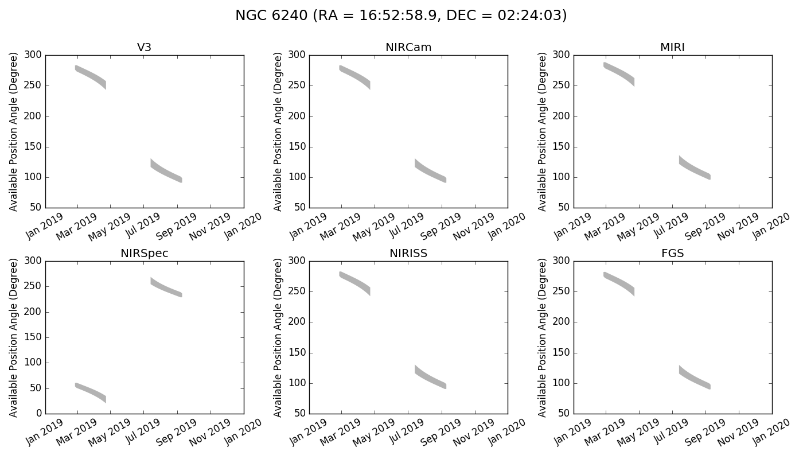

# JWST General Target Visbility Tool (jwst_gtvt)

JWST requires shielding from the sun for operation, which limits the available position angles observable at a given time.  
This script calculates the allowed position angle for a given Right Ascension and Declination for each instrument on the telescope.

# Dependencies

This tool requires a few packages all of which are included in the Anaconda python distribution.

* NumPy

* Maplotlib

* AstroPy

For optional moving target support:

* [callhorizons](https://pypi.python.org/pypi/CALLHORIZONS)

# Installation

You can install the tool using `pip` with 
`pip install git+https://github.com/spacetelescope/jwst_gtvt.git`

Alternatively, you can download the .zip file or clone the respository from GitHub and install the tool from inside the resulting directory with
`python setup.py install`

# Usage
There are two scripts available.  `jwst_gtvt` for fixed targets, and `jwst_mtvt` for moving targets.  To see the help info use

    $ jwst_gtvt -h
        usage: jwst_gtvt [-h] [--v3pa V3PA] [--save_plot SAVE_PLOT]
                         [--save_table SAVE_TABLE] [--instrument INSTRUMENT]
                         [--name NAME] [--start_date START_DATE] [--end_date END_DATE]
                         ra dec

        positional arguments:
          ra                    Right Ascension of target in either sexagesimal
                                (hh:mm:ss.s) or degrees.
          dec                   Declination of target in either sexagesimal
                                (dd:mm:ss.s) or degrees.

        optional arguments:
          -h, --help            show this help message and exit
          --v3pa V3PA           Specify a desired V3 (telescope frame) Position Angle.
          --save_plot SAVE_PLOT
                                Path of file to save plot output.
          --save_table SAVE_TABLE
                                Path of file to save table output.
          --instrument INSTRUMENT
                                If specified plot shows only windows for this
                                instrument. Options: nircam, nirspec, niriss, miri,
                                fgs, v3 (case insensitive).
          --name NAME           Target Name to appear on plots. Names with space
                                should use double quotes e.g. "NGC 6240".
          --start_date START_DATE
                                Start date for visibility search in yyyy-mm-dd format.
                                Earliest available is 2018-01-01.
          --end_date END_DATE   End date for visibility search in yyyy-mm-dd format.
                                Latest available is 2021-12-31.
# Example

By default you need only specify R.A. and Dec. in either sexigesimal or degrees.
The observability windows will be printed to the terminal and a plot showing the windows for each instrument will pop up.

`$ jwst_gtvt 16:52:58.9 02:24:03`

`$ jwst_gtvt 253.2458 2.4008`

For moving targets, use `jwst_mtvt`

`$ jwst_mtvt Ceres`

Periodic comets and most asteroids benefit from using the `--smallbody` flag

`$ jwst_mtvt 2`  # Venus (no windows)

`$ jwst_mtvt 2 --smallbody`  # Pallas

`$ jwst_mtvt 2P --smallbody`  # Comet Encke

`$ jwst_mtvt C/2016 M1`  # works with or without --smallbody

Setting the `--name` flag will add a target name to the plot title

`$ jwst_gtvt 16:52:58.9 02:24:03 --name "NGC 6240"`

You can specify the instrument via the `--instrument` flag.

`$ jwst_gtvt 16:52:58.9 02:24:03 --name "NGC 6240" --instrument nircam`

and the resulting plot will only contain the windows for the specified instrument.
The allowed values for `--instrument` are 'nircam', 'nirspec', 'niriss', 'miri', 'fgs', and 'v3' (case insensitive).

You can save the text ouput to a file instead of having it output to terminal with `--save_table`.  
Likewise, you can save the plot with `--save_plot`.
The plot can be saved in any format supported by matplotlib (.png, .jpeg, .pdf, .eps) by specifying the desired extension in the filename.

`$ jwst_gtvt 16:52:58.9 02:24:03 --save_table visibility.txt --save_plot visibility.png`

If you only want to plot a specific range of dates, rather than the entire available ephemeris you specify a `--start_date` or `--end_date` in ISO format (yyyy-mm-dd).
For example

`$ jwst_gtvt 16:52:58.9 02:24:03 --name "NGC 6240" --start_date 2019-01-01 --end_date 2020-01-01`

Specifying the `--v3pa` will display the observing windows which contain the desired V3 position angle in the text output.

Below is an example of the full text output

    $ jwst_gtvt 16:52:58.9 02:24:03
    Using Equatorial Coordinates

           Target
                    ecliptic
    RA      Dec     latitude
    253.245   2.401  24.771

    Checked interval [2018-01-01, 2021-12-31]
    |           Window [days]                 |    Normal V3 PA [deg]    |
       Start           End         Duration         Start         End          RA             Dec
     2018-02-24      2018-04-23        58.00     279.57900     249.12646     253.24542       2.40083
     2018-07-13      2018-09-10        59.00     124.05426      94.58220     253.24542       2.40083
     2019-02-24      2019-04-23        57.94     279.66097     249.33417     253.24542       2.40083
     2019-07-13      2019-09-10        59.00     124.25231      94.68801     253.24542       2.40083
     2020-02-25      2020-04-22        57.00     279.37036     249.54609     253.24542       2.40083
     2020-07-12      2020-09-09        59.00     124.45580      94.79263     253.24542       2.40083
     2021-02-24      2021-04-22        57.00     279.47993     249.75876     253.24542       2.40083
     2021-07-12      2021-09-10        60.00     124.66068      94.48675     253.24542       2.40083

                    V3PA          NIRCam           NIRSpec         NIRISS           MIRI          FGS
       Date      min    max      min    max       min    max     min    max      min    max      min    max

    2018-02-25   275.96 283.11   275.93 283.09    53.45  60.60   275.39 282.54   280.98 288.13   274.71 281.86
    2018-02-26   274.97 283.26   274.94 283.23    52.45  60.75   274.40 282.69   279.98 288.27   273.72 282.01
    2018-02-27   273.97 283.41   273.95 283.38    51.46  60.90   273.40 282.84   278.99 288.42   272.72 282.16
    2018-02-28   273.16 283.37   273.14 283.35    50.65  60.86   272.59 282.80   278.18 288.39   271.91 282.12
    2018-03-01   272.75 282.95   272.72 282.92    50.23  60.44   272.18 282.38   277.76 287.96   271.49 281.70
    2018-03-02   272.33 282.53   272.30 282.50    49.81  60.01   271.76 281.96   277.34 287.54   271.08 281.28
    2018-03-03   271.91 282.11   271.88 282.08    49.39  59.59   271.34 281.54   276.92 287.12   270.66 280.86
    2018-03-04   271.48 281.69   271.46 281.66    48.97  59.17   270.91 281.12   276.50 286.70   270.23 280.44
    2018-03-05   271.06 281.27   271.03 281.24    48.55  58.76   270.49 280.70   276.08 286.29   269.81 280.02
    2018-03-06   270.64 280.85   270.61 280.83    48.12  58.34   270.07 280.28   275.65 285.87   269.39 279.60
    2018-03-07   270.21 280.44   270.18 280.41    47.70  57.92   269.64 279.87   275.23 285.45   268.96 279.19
    2018-03-08   269.78 280.02   269.75 280.00    47.27  57.51   269.21 279.45   274.80 285.04   268.53 278.77
    2018-03-09   269.35 279.61   269.32 279.58    46.84  57.09   268.78 279.04   274.37 284.62   268.10 278.36
    2018-03-10   268.92 279.19   268.89 279.17    46.40  56.68   268.35 278.62   273.93 284.21   267.67 277.94
    2018-03-11   268.48 278.78   268.45 278.75    45.97  56.26   267.91 278.21   273.50 283.79   267.23 277.53
    2018-03-12   268.04 278.36   268.02 278.33    45.53  55.85   267.47 277.79   273.06 283.38   266.79 277.11
    2018-03-13   267.60 277.95   267.57 277.92    45.09  55.43   267.03 277.38   272.62 282.96   266.35 276.69
    2018-03-14   267.15 277.53   267.13 277.50    44.64  55.02   266.58 276.96   272.17 282.54   265.90 276.28
    2018-03-15   266.71 277.11   266.68 277.09    44.19  54.60   266.14 276.54   271.72 282.13   265.45 275.86
    2018-03-16   266.25 276.69   266.23 276.67    43.74  54.18   265.68 276.12   271.27 281.71   265.00 275.44
    2018-03-17   265.79 276.27   265.77 276.25    43.28  53.76   265.22 275.70   270.81 281.29   264.54 275.02
    2018-03-18   265.33 275.85   265.31 275.82    42.82  53.34   264.76 275.28   270.35 280.87   264.08 274.60
    2018-03-19   264.87 275.43   264.84 275.40    42.35  52.92   264.30 274.86   269.88 280.44   263.62 274.18
    2018-03-20   264.40 275.00   264.37 274.98    41.88  52.49   263.83 274.43   269.41 280.02   263.14 273.75
    2018-03-21   263.92 274.57   263.89 274.55    41.41  52.06   263.35 274.00   268.93 279.59   262.67 273.32
    2018-03-22   263.44 274.14   263.41 274.12    40.92  51.63   262.87 273.57   268.45 279.16   262.19 272.89
    2018-03-23   262.95 273.71   262.92 273.68    40.44  51.20   262.38 273.14   267.96 278.73   261.70 272.46
    2018-03-24   262.45 273.28   262.43 273.25    39.94  50.76   261.88 272.71   267.47 278.29   261.20 272.02
    2018-03-25   261.95 272.84   261.93 272.81    39.44  50.32   261.38 272.27   266.97 277.85   260.70 271.59
    2018-03-26   261.45 272.39   261.42 272.37    38.93  49.88   260.88 271.82   266.46 277.41   260.20 271.14
    2018-03-27   260.93 271.95   260.91 271.92    38.42  49.43   260.36 271.38   265.95 276.96   259.68 270.70
    2018-03-28   260.41 271.50   260.38 271.47    37.90  48.98   259.84 270.93   265.43 276.51   259.16 270.24
    2018-03-29   259.88 271.04   259.86 271.01    37.37  48.53   259.31 270.47   264.90 276.06   258.63 269.79
    2018-03-30   259.34 270.58   259.32 270.55    36.83  48.07   258.77 270.01   264.36 275.60   258.09 269.33
    2018-03-31   258.80 270.12   258.77 270.09    36.28  47.60   258.23 269.55   263.81 275.13   257.55 268.86
    2018-04-01   258.24 269.65   258.22 269.62    35.73  47.13   257.67 269.08   263.26 274.66   256.99 268.39
    2018-04-02   257.68 269.17   257.65 269.14    35.16  46.66   257.11 268.60   262.69 274.18   256.43 267.92
    2018-04-03   257.10 268.69   257.08 268.66    34.59  46.17   256.53 268.12   262.12 273.70   255.85 267.44
    2018-04-04   256.52 268.20   256.49 268.17    34.00  45.69   255.95 267.63   261.53 273.21   255.27 266.95
    2018-04-05   255.92 267.70   255.90 267.68    33.41  45.19   255.35 267.13   260.94 272.72   254.67 266.45
    2018-04-06   255.31 267.20   255.29 267.17    32.80  44.69   254.74 266.63   260.33 272.22   254.06 265.95
    2018-04-07   254.70 266.69   254.67 266.66    32.18  44.18   254.13 266.12   259.71 271.71   253.44 265.44
    2018-04-08   254.06 266.17   254.04 266.15    31.55  43.66   253.49 265.60   259.08 271.19   252.81 264.92
    2018-04-09   253.42 265.65   253.39 265.62    30.91  43.13   252.85 265.08   258.44 270.66   252.17 264.40
    2018-04-10   252.76 265.11   252.74 265.09    30.25  42.60   252.19 264.54   257.78 270.13   251.51 263.86
    2018-04-11   252.09 264.57   252.06 264.54    29.58  42.05   251.52 264.00   257.11 269.58   250.84 263.32
    2018-04-12   251.40 264.01   251.38 263.99    28.89  41.50   250.83 263.44   256.42 269.03   250.15 262.76
    2018-04-13   250.70 263.45   250.68 263.42    28.19  40.93   250.13 262.88   255.72 268.46   249.45 262.20
    2018-04-14   249.98 262.87   249.96 262.84    27.47  40.36   249.41 262.30   255.00 267.89   248.73 261.62
    2018-04-15   249.25 262.28   249.22 262.26    26.74  39.77   248.68 261.71   254.26 267.30   248.00 261.03
    2018-04-16   248.50 261.68   248.47 261.66    25.98  39.17   247.93 261.11   253.51 266.70   247.24 260.43
    2018-04-17   247.72 261.07   247.70 261.04    25.21  38.56   247.15 260.50   252.74 266.08   246.47 259.82
    2018-04-18   246.93 260.44   246.91 260.42    24.42  37.93   246.36 259.87   251.95 265.46   245.68 259.19
    2018-04-19   246.12 259.80   246.10 259.78    23.61  37.29   245.55 259.23   251.14 264.82   244.87 258.55
    2018-04-20   245.29 259.15   245.26 259.12    22.78  36.63   244.72 258.58   250.31 264.16   244.04 257.90
    2018-04-21   244.44 258.47   244.41 258.45    21.92  35.96   243.87 257.90   249.45 263.49   243.19 257.22
    2018-04-22   243.56 257.79   243.53 257.76    21.05  35.27   242.99 257.22   248.57 262.80   242.31 256.53
    2018-04-23   242.66 257.08   242.63 257.05    20.14  34.57   242.09 256.51   247.67 262.09   241.41 255.83

    2018-07-14   116.85 131.11   116.82 131.08   254.33 268.59   116.28 130.54   121.86 136.12   115.60 129.86
    2018-07-15   116.17 130.24   116.14 130.22   253.66 267.73   115.60 129.67   121.18 135.26   114.92 128.99
    2018-07-16   115.51 129.41   115.48 129.38   253.00 266.89   114.94 128.84   120.53 134.42   114.26 128.15
    2018-07-17   114.87 128.59   114.84 128.56   252.35 266.08   114.30 128.02   119.88 133.60   113.61 127.34
    2018-07-18   114.24 127.79   114.21 127.76   251.72 265.28   113.67 127.22   119.25 132.81   112.99 126.54
    2018-07-19   113.62 127.01   113.59 126.99   251.11 264.50   113.05 126.44   118.64 132.03   112.37 125.76
    2018-07-20   113.02 126.26   112.99 126.23   250.51 263.74   112.45 125.69   118.03 131.27   111.77 125.01
    2018-07-21   112.43 125.52   112.40 125.49   249.92 263.00   111.86 124.95   117.45 130.53   111.18 124.27
    2018-07-22   111.85 124.79   111.83 124.77   249.34 262.28   111.28 124.22   116.87 129.81   110.60 123.54
    2018-07-23   111.29 124.09   111.26 124.06   248.77 261.58   110.72 123.52   116.30 129.10   110.04 122.84
    2018-07-24   110.73 123.40   110.71 123.37   248.22 260.89   110.16 122.83   115.75 128.41   109.48 122.15
    2018-07-25   110.19 122.72   110.16 122.70   247.68 260.21   109.62 122.15   115.20 127.74   108.94 121.47
    2018-07-26   109.65 122.06   109.63 122.04   247.14 259.55   109.08 121.49   114.67 127.08   108.40 120.81
    2018-07-27   109.13 121.42   109.10 121.39   246.62 258.90   108.56 120.85   114.14 126.43   107.88 120.17
    2018-07-28   108.61 120.78   108.59 120.76   246.10 258.27   108.04 120.21   113.63 125.80   107.36 119.53
    2018-07-29   108.10 120.16   108.08 120.14   245.59 257.65   107.53 119.59   113.12 125.18   106.85 118.91
    2018-07-30   107.60 119.55   107.58 119.53   245.09 257.04   107.03 118.98   112.62 124.57   106.35 118.30
    2018-07-31   107.11 118.96   107.09 118.93   244.60 256.44   106.54 118.39   112.13 123.97   105.86 117.71
    2018-08-01   106.63 118.37   106.60 118.35   244.11 255.86   106.06 117.80   111.64 123.39   105.38 117.12
    2018-08-02   106.15 117.80   106.12 117.77   243.64 255.28   105.58 117.23   111.16 122.81   104.90 116.55
    2018-08-03   105.68 117.23   105.65 117.21   243.16 254.72   105.11 116.66   110.69 122.25   104.43 115.98
    2018-08-04   105.21 116.68   105.18 116.65   242.70 254.17   104.64 116.11   110.23 121.69   103.96 115.43
    2018-08-05   104.75 116.13   104.72 116.11   242.24 253.62   104.18 115.56   109.77 121.15   103.50 114.88
    2018-08-06   104.30 115.60   104.27 115.57   241.78 253.08   103.73 115.03   109.31 120.61   103.04 114.35
    2018-08-07   103.85 115.07   103.82 115.04   241.33 252.56   103.28 114.50   108.86 120.08   102.59 113.82
    2018-08-08   103.40 114.55   103.37 114.52   240.89 252.04   102.83 113.98   108.42 119.56   102.15 113.30
    2018-08-09   102.96 114.04   102.93 114.01   240.45 251.52   102.39 113.47   107.98 119.05   101.71 112.79
    2018-08-10   102.52 113.53   102.50 113.50   240.01 251.02   101.95 112.96   107.54 118.55   101.27 112.28
    2018-08-11   102.09 113.03   102.06 113.01   239.58 250.52   101.52 112.46   107.11 118.05   100.84 111.78
    2018-08-12   101.66 112.54   101.64 112.52   239.15 250.03   101.09 111.97   106.68 117.56   100.41 111.29
    2018-08-13   101.24 112.06   101.21 112.03   238.72 249.55   100.67 111.49   106.25 117.07    99.99 110.81
    2018-08-14   100.82 111.58   100.79 111.55   238.30 249.07   100.25 111.01   105.83 116.60    99.56 110.33
    2018-08-15   100.40 111.11   100.37 111.08   237.88 248.60    99.83 110.54   105.41 116.12    99.15 109.86
    2018-08-16    99.98 110.64    99.95 110.61   237.47 248.13    99.41 110.07   104.99 115.66    98.73 109.39
    2018-08-17    99.57 110.18    99.54 110.15   237.05 247.67    99.00 109.61   104.58 115.19    98.31 108.93
    2018-08-18    99.15 109.72    99.13 109.70   236.64 247.21    98.58 109.15   104.17 114.74    97.90 108.47
    2018-08-19    98.74 109.27    98.72 109.24   236.23 246.76    98.17 108.70   103.76 114.29    97.49 108.02
    2018-08-20    98.34 108.82    98.31 108.80   235.82 246.31    97.77 108.25   103.35 113.84    97.09 107.57
    2018-08-21    97.93 108.38    97.90 108.35   235.42 245.87    97.36 107.81   102.94 113.40    96.68 107.13
    2018-08-22    97.52 107.94    97.50 107.91   235.01 245.43    96.95 107.37   102.54 112.96    96.27 106.69
    2018-08-23    97.12 107.51    97.09 107.48   234.61 244.99    96.55 106.94   102.14 112.52    95.87 106.26
    2018-08-24    96.72 107.07    96.69 107.05   234.21 244.56    96.15 106.50   101.73 112.09    95.47 105.82
    2018-08-25    96.32 106.65    96.29 106.62   233.80 244.13    95.75 106.08   101.33 111.66    95.07 105.39
    2018-08-26    95.91 106.22    95.89 106.19   233.40 243.71    95.34 105.65   100.93 111.24    94.66 104.97
    2018-08-27    95.51 105.80    95.49 105.77   233.00 243.29    94.94 105.23   100.53 110.81    94.26 104.55
    2018-08-28    95.11 105.38    95.09 105.35   232.60 242.87    94.54 104.81   100.13 110.39    93.86 104.13
    2018-08-29    94.71 104.96    94.69 104.93   232.20 242.45    94.14 104.39    99.73 109.98    93.46 103.71
    2018-08-30    94.31 104.55    94.28 104.52   231.80 242.03    93.74 103.98    99.33 109.56    93.06 103.29
    2018-08-31    93.91 104.13    93.88 104.11   231.40 241.62    93.34 103.56    98.92 109.15    92.66 102.88
    2018-09-01    93.51 103.72    93.48 103.69   230.99 241.21    92.94 103.15    98.52 108.74    92.26 102.47
    2018-09-02    93.10 103.31    93.08 103.28   230.59 240.80    92.53 102.74    98.12 108.33    91.85 102.06
    2018-09-03    92.70 102.90    92.67 102.88   230.19 240.39    92.13 102.33    97.72 107.92    91.45 101.65
    2018-09-04    92.30 102.50    92.27 102.47   229.78 239.98    91.73 101.93    97.31 107.51    91.05 101.25
    2018-09-05    91.89 102.09    91.86 102.06   229.38 239.58    91.32 101.52    96.91 107.11    90.64 100.84
    2018-09-06    91.48 101.69    91.46 101.66   228.97 239.17    90.91 101.12    96.50 106.70    90.23 100.44
    2018-09-07    91.07 101.28    91.05 101.26   228.56 238.77    90.50 100.71    96.09 106.30    89.82 100.03
    2018-09-08    91.12 100.42    91.09 100.39   228.61 237.91    90.55  99.85    96.13 105.44    89.87  99.17
    2018-09-09    91.26  99.46    91.24  99.43   228.75 236.95    90.69  98.89    96.28 104.48    90.01  98.21
    2018-09-10    91.40  98.50    91.38  98.47   228.89 235.99    90.83  97.93    96.42 103.52    90.15  97.25

    2019-02-25   276.21 283.08   276.19 283.05    53.70  60.56   275.64 282.51   281.23 288.09   274.96 281.82
    2019-02-26   275.22 283.22   275.19 283.20    52.70  60.71   274.65 282.65   280.23 288.24   273.97 281.97
    2019-02-27   274.22 283.37   274.20 283.34    51.71  60.86   273.65 282.80   279.24 288.39   272.97 282.12
    2019-02-28   273.27 283.48   273.24 283.45    50.76  60.97   272.70 282.91   278.28 288.49   272.02 282.23
    2019-03-01   272.85 283.05   272.82 283.03    50.34  60.54   272.28 282.48   277.87 288.07   271.60 281.80
    2019-03-02   272.43 282.63   272.41 282.61    49.92  60.12   271.86 282.06   277.45 287.65   271.18 281.38
    2019-03-03   272.01 282.21   271.99 282.19    49.50  59.70   271.44 281.64   277.03 287.23   270.76 280.96
    2019-03-04   271.59 281.79   271.56 281.77    49.08  59.28   271.02 281.22   276.61 286.81   270.34 280.54
    2019-03-05   271.17 281.37   271.14 281.35    48.65  58.86   270.60 280.80   276.18 286.39   269.92 280.12
    2019-03-06   270.74 280.96   270.72 280.93    48.23  58.45   270.17 280.39   275.76 285.97   269.49 279.71
    2019-03-07   270.32 280.54   270.29 280.52    47.80  58.03   269.75 279.97   275.33 285.56   269.07 279.29
    2019-03-08   269.89 280.13   269.86 280.10    47.38  57.61   269.32 279.56   274.90 285.14   268.64 278.88
    2019-03-09   269.46 279.71   269.43 279.68    46.95  57.20   268.89 279.14   274.47 284.73   268.21 278.46
    2019-03-10   269.03 279.30   269.00 279.27    46.51  56.78   268.46 278.73   274.04 284.31   267.78 278.05
    2019-03-11   268.59 278.88   268.56 278.85    46.08  56.37   268.02 278.31   273.61 283.90   267.34 277.63
    2019-03-12   268.15 278.47   268.13 278.44    45.64  55.95   267.58 277.90   273.17 283.48   266.90 277.21
    2019-03-13   267.71 278.05   267.68 278.02    45.20  55.54   267.14 277.48   272.73 283.07   266.46 276.80
    2019-03-14   267.27 277.63   267.24 277.61    44.75  55.12   266.70 277.06   272.28 282.65   266.02 276.38
    2019-03-15   266.82 277.22   266.79 277.19    44.31  54.70   266.25 276.65   271.83 282.23   265.57 275.97
    2019-03-16   266.37 276.80   266.34 276.77    43.85  54.29   265.80 276.23   271.38 281.81   265.12 275.55
    2019-03-17   265.91 276.38   265.88 276.35    43.40  53.87   265.34 275.81   270.92 281.39   264.66 275.13
    2019-03-18   265.45 275.96   265.42 275.93    42.94  53.44   264.88 275.39   270.46 280.97   264.20 274.71
    2019-03-19   264.98 275.53   264.96 275.51    42.47  53.02   264.41 274.96   270.00 280.55   263.73 274.28
    2019-03-20   264.51 275.11   264.49 275.08    42.00  52.60   263.94 274.54   269.53 280.12   263.26 273.86
    2019-03-21   264.04 274.68   264.01 274.66    41.53  52.17   263.47 274.11   269.05 279.70   262.79 273.43
    2019-03-22   263.56 274.25   263.53 274.23    41.05  51.74   262.99 273.68   268.57 279.27   262.31 273.00
    2019-03-23   263.07 273.82   263.04 273.79    40.56  51.31   262.50 273.25   268.09 278.84   261.82 272.57
    2019-03-24   262.58 273.38   262.55 273.36    40.07  50.87   262.01 272.81   267.59 278.40   261.33 272.13
    2019-03-25   262.08 272.95   262.05 272.92    39.57  50.43   261.51 272.38   267.10 277.96   260.83 271.70
    2019-03-26   261.57 272.50   261.55 272.48    39.06  49.99   261.00 271.93   266.59 277.52   260.32 271.25
    2019-03-27   261.06 272.06   261.04 272.03    38.55  49.55   260.49 271.49   266.08 277.07   259.81 270.81
    2019-03-28   260.54 271.61   260.52 271.58    38.03  49.10   259.97 271.04   265.56 276.62   259.29 270.36
    2019-03-29   260.01 271.15   259.99 271.13    37.50  48.64   259.44 270.58   265.03 276.17   258.76 269.90
    2019-03-30   259.48 270.70   259.45 270.67    36.97  48.18   258.91 270.13   264.49 275.71   258.23 269.45
    2019-03-31   258.93 270.23   258.91 270.21    36.42  47.72   258.36 269.66   263.95 275.25   257.68 268.98
    2019-04-01   258.38 269.76   258.36 269.74    35.87  47.25   257.81 269.19   263.40 274.78   257.13 268.51
    2019-04-02   257.82 269.29   257.79 269.26    35.31  46.78   257.25 268.72   262.83 274.30   256.57 268.04
    2019-04-03   257.25 268.81   257.22 268.78    34.73  46.30   256.68 268.24   262.26 273.82   256.00 267.56
    2019-04-04   256.66 268.32   256.64 268.29    34.15  45.81   256.09 267.75   261.68 273.34   255.41 267.07
    2019-04-05   256.07 267.83   256.05 267.80    33.56  45.32   255.50 267.26   261.09 272.84   254.82 266.58
    2019-04-06   255.47 267.33   255.44 267.30    32.95  44.81   254.90 266.76   260.48 272.34   254.22 266.08
    2019-04-07   254.85 266.82   254.82 266.79    32.34  44.31   254.28 266.25   259.87 271.83   253.60 265.57
    2019-04-08   254.22 266.30   254.20 266.28    31.71  43.79   253.65 265.73   259.24 271.32   252.97 265.05
    2019-04-09   253.58 265.78   253.56 265.75    31.07  43.27   253.01 265.21   258.60 270.79   252.33 264.53
    2019-04-10   252.93 265.25   252.90 265.22    30.42  42.73   252.36 264.68   257.94 270.26   251.68 264.00
    2019-04-11   252.26 264.70   252.23 264.68    29.75  42.19   251.69 264.13   257.27 269.72   251.01 263.45
    2019-04-12   251.58 264.15   251.55 264.13    29.06  41.64   251.01 263.58   256.59 269.17   250.33 262.90
    2019-04-13   250.88 263.59   250.85 263.56    28.37  41.08   250.31 263.02   255.89 268.60   249.63 262.34
    2019-04-14   250.16 263.02   250.14 262.99    27.65  40.50   249.59 262.45   255.18 268.03   248.91 261.76
    2019-04-15   249.43 262.43   249.41 262.40    26.92  39.92   248.86 261.86   254.45 267.45   248.18 261.18
    2019-04-16   248.68 261.83   248.66 261.81    26.17  39.32   248.11 261.26   253.70 266.85   247.43 260.58
    2019-04-17   247.92 261.22   247.89 261.20    25.41  38.71   247.35 260.65   252.93 266.24   246.67 259.97
    2019-04-18   247.13 260.60   247.11 260.57    24.62  38.09   246.56 260.03   252.15 265.62   245.88 259.35
    2019-04-19   246.33 259.96   246.30 259.94    23.81  37.45   245.76 259.39   251.34 264.98   245.08 258.71
    2019-04-20   245.50 259.31   245.47 259.28    22.99  36.80   244.93 258.74   250.51 264.33   244.25 258.06
    2019-04-21   244.65 258.64   244.62 258.62    22.14  36.13   244.08 258.07   249.67 263.66   243.40 257.39
    2019-04-22   243.78 257.96   243.75 257.93    21.27  35.45   243.21 257.39   248.80 262.97   242.53 256.71
    2019-04-23   242.88 257.26   242.86 257.23    20.37  34.74   242.31 256.69   247.90 262.27   241.63 256.01

    2019-07-14   117.02 131.33   116.99 131.30   254.51 268.82   116.45 130.76   122.03 136.34   115.77 130.08
    2019-07-15   116.34 130.46   116.31 130.43   253.83 267.95   115.77 129.89   121.35 135.48   115.09 129.21
    2019-07-16   115.68 129.62   115.65 129.59   253.16 267.10   115.11 129.05   120.69 134.63   114.42 128.37
    2019-07-17   115.03 128.79   115.00 128.77   252.51 266.28   114.46 128.22   120.04 133.81   113.78 127.54
    2019-07-18   114.39 127.99   114.37 127.96   251.88 265.48   113.82 127.42   119.41 133.01   113.14 126.74
    2019-07-19   113.78 127.21   113.75 127.18   251.26 264.70   113.21 126.64   118.79 132.22   112.52 125.96
    2019-07-20   113.17 126.45   113.14 126.42   250.66 263.93   112.60 125.88   118.19 131.46   111.92 125.20
    2019-07-21   112.58 125.70   112.55 125.68   250.07 263.19   112.01 125.13   117.59 130.72   111.33 124.45
    2019-07-22   112.00 124.98   111.97 124.95   249.49 262.46   111.43 124.41   117.01 129.99   110.75 123.72
    2019-07-23   111.43 124.27   111.40 124.24   248.92 261.75   110.86 123.70   116.44 129.28   110.18 123.01
    2019-07-24   110.87 123.57   110.85 123.54   248.36 261.06   110.30 123.00   115.89 128.59   109.62 122.32
    2019-07-25   110.33 122.89   110.30 122.87   247.81 260.38   109.76 122.32   115.34 127.91   109.07 121.64
    2019-07-26   109.79 122.23   109.76 122.20   247.28 259.72   109.22 121.66   114.80 127.24   108.54 120.98
    2019-07-27   109.26 121.58   109.23 121.55   246.75 259.07   108.69 121.01   114.28 126.59   108.01 120.33
    2019-07-28   108.74 120.94   108.72 120.92   246.23 258.43   108.17 120.37   113.76 125.96   107.49 119.69
    2019-07-29   108.23 120.32   108.21 120.29   245.72 257.81   107.66 119.75   113.25 125.33   106.98 119.07
    2019-07-30   107.73 119.71   107.70 119.68   245.22 257.19   107.16 119.14   112.75 124.72   106.48 118.46
    2019-07-31   107.24 119.11   107.21 119.08   244.72 256.60   106.67 118.54   112.25 124.12   105.99 117.86
    2019-08-01   106.75 118.52   106.72 118.49   244.24 256.01   106.18 117.95   111.76 123.53   105.50 117.27
    2019-08-02   106.27 117.94   106.24 117.92   243.76 255.43   105.70 117.37   111.28 122.96   105.02 116.69
    2019-08-03   105.80 117.38   105.77 117.35   243.28 254.86   105.23 116.81   110.81 122.39   104.54 116.12
    2019-08-04   105.33 116.82   105.30 116.79   242.82 254.31   104.76 116.25   110.34 121.83   104.08 115.57
    2019-08-05   104.87 116.27   104.84 116.24   242.35 253.76   104.30 115.70   109.88 121.29   103.62 115.02
    2019-08-06   104.41 115.73   104.38 115.71   241.90 253.22   103.84 115.16   109.43 120.75   103.16 114.48
    2019-08-07   103.96 115.20   103.93 115.18   241.45 252.69   103.39 114.63   108.97 120.22   102.71 113.95
    2019-08-08   103.51 114.68   103.49 114.65   241.00 252.17   102.94 114.11   108.53 119.69   102.26 113.43
    2019-08-09   103.07 114.17   103.05 114.14   240.56 251.65   102.50 113.60   108.09 119.18   101.82 112.91
    2019-08-10   102.63 113.66   102.61 113.63   240.12 251.15   102.06 113.09   107.65 118.67   101.38 112.41
    2019-08-11   102.20 113.16   102.17 113.13   239.69 250.65   101.63 112.59   107.22 118.18   100.95 111.91
    2019-08-12   101.77 112.67   101.75 112.64   239.26 250.15   101.20 112.10   106.79 117.68   100.52 111.42
    2019-08-13   101.35 112.18   101.32 112.15   238.83 249.67   100.78 111.61   106.36 117.20   100.09 110.93
    2019-08-14   100.92 111.70   100.90 111.68   238.41 249.19   100.35 111.13   105.94 116.72    99.67 110.45
    2019-08-15   100.50 111.23   100.48 111.20   237.99 248.72    99.93 110.66   105.52 116.24    99.25 109.98
    2019-08-16   100.09 110.76   100.06 110.73   237.57 248.25    99.52 110.19   105.10 115.77    98.83 109.51
    2019-08-17    99.67 110.30    99.64 110.27   237.16 247.78    99.10 109.73   104.69 115.31    98.42 109.05
    2019-08-18    99.26 109.84    99.23 109.81   236.75 247.33    98.69 109.27   104.27 114.85    98.01 108.59
    2019-08-19    98.85 109.39    98.82 109.36   236.34 246.87    98.28 108.82   103.86 114.40    97.60 108.14
    2019-08-20    98.44 108.94    98.41 108.91   235.93 246.42    97.87 108.37   103.46 113.95    97.19 107.69
    2019-08-21    98.03 108.49    98.01 108.47   235.52 245.98    97.46 107.92   103.05 113.51    96.78 107.24
    2019-08-22    97.63 108.05    97.60 108.03   235.12 245.54    97.06 107.48   102.64 113.07    96.38 106.80
    2019-08-23    97.22 107.62    97.20 107.59   234.71 245.10    96.65 107.05   102.24 112.63    95.97 106.37
    2019-08-24    96.82 107.18    96.79 107.16   234.31 244.67    96.25 106.61   101.84 112.20    95.57 105.93
    2019-08-25    96.42 106.76    96.39 106.73   233.91 244.24    95.85 106.19   101.43 111.77    95.17 105.50
    2019-08-26    96.02 106.33    95.99 106.30   233.50 243.82    95.45 105.76   101.03 111.34    94.77 105.08
    2019-08-27    95.62 105.91    95.59 105.88   233.10 243.39    95.05 105.34   100.63 110.92    94.37 104.65
    2019-08-28    95.22 105.49    95.19 105.46   232.70 242.97    94.65 104.92   100.23 110.50    93.96 104.23
    2019-08-29    94.81 105.07    94.79 105.04   232.30 242.55    94.24 104.50    99.83 110.08    93.56 103.82
    2019-08-30    94.41 104.65    94.39 104.63   231.90 242.14    93.84 104.08    99.43 109.67    93.16 103.40
    2019-08-31    94.01 104.24    93.99 104.21   231.50 241.73    93.44 103.67    99.03 109.25    92.76 102.99
    2019-09-01    93.61 103.83    93.58 103.80   231.10 241.31    93.04 103.26    98.63 108.84    92.36 102.58
    2019-09-02    93.21 103.42    93.18 103.39   230.70 240.90    92.64 102.85    98.22 108.43    91.96 102.17
    2019-09-03    92.80 103.01    92.78 102.98   230.29 240.50    92.23 102.44    97.82 108.02    91.55 101.76
    2019-09-04    92.40 102.60    92.37 102.57   229.89 240.09    91.83 102.03    97.42 107.62    91.15 101.35
    2019-09-05    91.99 102.19    91.97 102.17   229.48 239.68    91.42 101.62    97.01 107.21    90.74 100.94
    2019-09-06    91.59 101.79    91.56 101.76   229.07 239.28    91.02 101.22    96.60 106.80    90.34 100.54
    2019-09-07    91.18 101.39    91.15 101.36   228.67 238.87    90.61 100.82    96.19 106.40    89.93 100.13
    2019-09-08    91.08 100.67    91.06 100.64   228.57 238.16    90.51 100.10    96.10 105.68    89.83  99.42
    2019-09-09    91.23  99.71    91.20  99.68   228.71 237.20    90.66  99.14    96.24 104.72    89.97  98.46
    2019-09-10    91.37  98.75    91.34  98.72   228.85 236.23    90.80  98.18    96.38 103.76    90.12  97.50

    2020-02-26   275.47 283.18   275.45 283.16    52.96  60.67   274.90 282.61   280.49 288.20   274.22 281.93
    2020-02-27   274.48 283.33   274.45 283.31    51.96  60.82   273.91 282.76   279.49 288.35   273.23 282.08
    2020-02-28   273.48 283.48   273.46 283.45    50.97  60.97   272.91 282.91   278.50 288.50   272.23 282.23
    2020-02-29   272.96 283.16   272.93 283.14    50.45  60.65   272.39 282.59   277.97 288.18   271.71 281.91
    2020-03-01   272.54 282.74   272.51 282.71    50.03  60.23   271.97 282.17   277.55 287.76   271.29 281.49
    2020-03-02   272.12 282.32   272.09 282.29    49.61  59.81   271.55 281.75   277.13 287.33   270.87 281.07
    2020-03-03   271.70 281.90   271.67 281.87    49.19  59.39   271.13 281.33   276.71 286.92   270.45 280.65
    2020-03-04   271.28 281.48   271.25 281.46    48.76  58.97   270.71 280.91   276.29 286.50   270.03 280.23
    2020-03-05   270.85 281.06   270.83 281.04    48.34  58.55   270.28 280.49   275.87 286.08   269.60 279.81
    2020-03-06   270.43 280.65   270.40 280.62    47.91  58.14   269.86 280.08   275.44 285.66   269.18 279.40
    2020-03-07   270.00 280.23   269.97 280.21    47.49  57.72   269.43 279.66   275.01 285.25   268.75 278.98
    2020-03-08   269.57 279.82   269.54 279.79    47.06  57.30   269.00 279.25   274.58 284.83   268.32 278.57
    2020-03-09   269.14 279.40   269.11 279.38    46.62  56.89   268.57 278.83   274.15 284.42   267.89 278.15
    2020-03-10   268.70 278.99   268.68 278.96    46.19  56.47   268.13 278.42   273.72 284.00   267.45 277.74
    2020-03-11   268.27 278.57   268.24 278.55    45.75  56.06   267.70 278.00   273.28 283.59   267.01 277.32
    2020-03-12   267.82 278.16   267.80 278.13    45.31  55.64   267.25 277.59   272.84 283.17   266.57 276.91
    2020-03-13   267.38 277.74   267.35 277.71    44.87  55.23   266.81 277.17   272.40 282.76   266.13 276.49
    2020-03-14   266.93 277.32   266.91 277.30    44.42  54.81   266.36 276.75   271.95 282.34   265.68 276.07
    2020-03-15   266.48 276.91   266.46 276.88    43.97  54.39   265.91 276.34   271.50 281.92   265.23 275.65
    2020-03-16   266.03 276.49   266.00 276.46    43.51  53.97   265.46 275.92   271.04 281.50   264.78 275.24
    2020-03-17   265.57 276.07   265.54 276.04    43.05  53.55   265.00 275.50   270.58 281.08   264.32 274.81
    2020-03-18   265.10 275.64   265.08 275.62    42.59  53.13   264.53 275.07   270.12 280.66   263.85 274.39
    2020-03-19   264.63 275.22   264.61 275.19    42.12  52.71   264.06 274.65   269.65 280.23   263.38 273.97
    2020-03-20   264.16 274.79   264.13 274.77    41.65  52.28   263.59 274.22   269.18 279.81   262.91 273.54
    2020-03-21   263.68 274.36   263.66 274.34    41.17  51.85   263.11 273.79   268.70 279.38   262.43 273.11
    2020-03-22   263.20 273.93   263.17 273.90    40.68  51.42   262.63 273.36   268.21 278.95   261.95 272.68
    2020-03-23   262.71 273.50   262.68 273.47    40.19  50.98   262.14 272.93   267.72 278.51   261.45 272.25
    2020-03-24   262.21 273.06   262.18 273.03    39.70  50.55   261.64 272.49   267.22 278.07   260.96 271.81
    2020-03-25   261.70 272.62   261.68 272.59    39.19  50.11   261.13 272.05   266.72 277.63   260.45 271.37
    2020-03-26   261.19 272.17   261.17 272.15    38.68  49.66   260.62 271.60   266.21 277.19   259.94 270.92
    2020-03-27   260.68 271.72   260.65 271.70    38.16  49.21   260.11 271.15   265.69 276.74   259.43 270.47
    2020-03-28   260.15 271.27   260.12 271.24    37.64  48.76   259.58 270.70   265.17 276.29   258.90 270.02
    2020-03-29   259.62 270.81   259.59 270.79    37.10  48.30   259.05 270.24   264.63 275.83   258.37 269.56
    2020-03-30   259.08 270.35   259.05 270.32    36.56  47.84   258.51 269.78   264.09 275.37   257.82 269.10
    2020-03-31   258.52 269.88   258.50 269.86    36.01  47.37   257.95 269.31   263.54 274.90   257.27 268.63
    2020-04-01   257.96 269.41   257.94 269.38    35.45  46.90   257.39 268.84   262.98 274.43   256.71 268.16
    2020-04-02   257.39 268.93   257.37 268.91    34.88  46.42   256.82 268.36   262.41 273.95   256.14 267.68
    2020-04-03   256.81 268.45   256.79 268.42    34.30  45.93   256.24 267.88   261.83 273.46   255.56 267.20
    2020-04-04   256.22 267.95   256.20 267.93    33.71  45.44   255.65 267.38   261.24 272.97   254.97 266.70
    2020-04-05   255.62 267.46   255.60 267.43    33.11  44.94   255.05 266.89   260.64 272.47   254.37 266.21
    2020-04-06   255.01 266.95   254.98 266.92    32.50  44.44   254.44 266.38   260.03 271.97   253.76 265.70
    2020-04-07   254.39 266.44   254.36 266.41    31.87  43.92   253.82 265.87   259.40 271.45   253.13 265.19
    2020-04-08   253.75 265.91   253.72 265.89    31.24  43.40   253.18 265.34   258.76 270.93   252.50 264.66
    2020-04-09   253.10 265.38   253.07 265.36    30.58  42.87   252.53 264.81   258.11 270.40   251.85 264.13
    2020-04-10   252.43 264.84   252.41 264.82    29.92  42.33   251.86 264.27   257.45 269.86   251.18 263.59
    2020-04-11   251.75 264.29   251.73 264.27    29.24  41.78   251.18 263.72   256.77 269.31   250.50 263.04
    2020-04-12   251.06 263.73   251.03 263.71    28.55  41.22   250.49 263.16   256.07 268.75   249.81 262.48
    2020-04-13   250.35 263.16   250.32 263.14    27.84  40.65   249.78 262.59   255.36 268.18   249.10 261.91
    2020-04-14   249.62 262.58   249.60 262.56    27.11  40.07   249.05 262.01   254.64 267.60   248.37 261.33
    2020-04-15   248.88 261.99   248.85 261.96    26.37  39.48   248.31 261.42   253.89 267.00   247.63 260.74
    2020-04-16   248.12 261.38   248.09 261.36    25.60  38.87   247.55 260.81   253.13 266.40   246.87 260.13
    2020-04-17   247.34 260.76   247.31 260.74    24.82  38.25   246.77 260.19   252.35 265.78   246.08 259.51
    2020-04-18   246.54 260.13   246.51 260.10    24.02  37.62   245.97 259.56   251.55 265.14   245.28 258.88
    2020-04-19   245.71 259.48   245.69 259.45    23.20  36.97   245.14 258.91   250.73 264.50   244.46 258.23
    2020-04-20   244.87 258.82   244.84 258.79    22.36  36.30   244.30 258.25   249.89 263.83   243.62 257.57
    2020-04-21   244.01 258.14   243.98 258.11    21.49  35.62   243.44 257.57   249.02 263.15   242.75 256.89
    2020-04-22   243.12 257.44   243.09 257.41    20.60  34.93   242.55 256.87   248.13 262.45   241.87 256.19

    2020-07-13   117.20 131.56   117.17 131.53   254.69 269.04   116.63 130.99   122.21 136.57   115.95 130.30
    2020-07-14   116.51 130.68   116.49 130.66   254.00 268.17   115.94 130.11   121.53 135.70   115.26 129.43
    2020-07-15   115.84 129.83   115.82 129.81   253.33 267.32   115.27 129.26   120.86 134.85   114.59 128.58
    2020-07-16   115.19 129.00   115.17 128.98   252.68 266.49   114.62 128.43   120.21 134.02   113.94 127.75
    2020-07-17   114.56 128.20   114.53 128.17   252.04 265.68   113.99 127.63   119.57 133.21   113.31 126.95
    2020-07-18   113.93 127.41   113.91 127.38   251.42 264.90   113.36 126.84   118.95 132.42   112.68 126.16
    2020-07-19   113.32 126.64   113.30 126.61   250.81 264.13   112.75 126.07   118.34 131.66   112.07 125.39
    2020-07-20   112.73 125.89   112.70 125.87   250.22 263.38   112.16 125.32   117.74 130.91   111.48 124.64
    2020-07-21   112.15 125.16   112.12 125.13   249.63 262.65   111.58 124.59   117.16 130.18   110.90 123.91
    2020-07-22   111.57 124.45   111.55 124.42   249.06 261.93   111.00 123.88   116.59 129.46   110.32 123.20
    2020-07-23   111.01 123.75   110.99 123.72   248.50 261.24   110.44 123.18   116.03 128.76   109.76 122.50
    2020-07-24   110.47 123.07   110.44 123.04   247.95 260.55   109.90 122.50   115.48 128.08   109.21 121.81
    2020-07-25   109.93 122.40   109.90 122.37   247.41 259.89   109.36 121.83   114.94 127.41   108.67 121.15
    2020-07-26   109.40 121.74   109.37 121.72   246.88 259.23   108.83 121.17   114.41 126.76   108.14 120.49
    2020-07-27   108.87 121.10   108.85 121.08   246.36 258.59   108.30 120.53   113.89 126.12   107.62 119.85
    2020-07-28   108.36 120.48   108.34 120.45   245.85 257.97   107.79 119.91   113.38 125.49   107.11 119.23
    2020-07-29   107.86 119.86   107.83 119.84   245.35 257.35   107.29 119.29   112.87 124.88   106.61 118.61
    2020-07-30   107.36 119.26   107.34 119.23   244.85 256.75   106.79 118.69   112.38 124.28   106.11 118.01
    2020-07-31   106.87 118.67   106.85 118.64   244.36 256.16   106.30 118.10   111.89 123.69   105.62 117.42
    2020-08-01   106.39 118.09   106.37 118.06   243.88 255.58   105.82 117.52   111.41 123.10   105.14 116.84
    2020-08-02   105.92 117.52   105.89 117.49   243.40 255.01   105.35 116.95   110.93 122.54   104.67 116.27
    2020-08-03   105.45 116.96   105.42 116.93   242.94 254.45   104.88 116.39   110.46 121.98   104.20 115.71
    2020-08-04   104.98 116.41   104.96 116.38   242.47 253.90   104.41 115.84   110.00 121.43   103.73 115.16
    2020-08-05   104.53 115.87   104.50 115.84   242.01 253.36   103.96 115.30   109.54 120.88   103.28 114.62
    2020-08-06   104.07 115.34   104.05 115.31   241.56 252.82   103.50 114.77   109.09 120.35   102.82 114.09
    2020-08-07   103.63 114.81   103.60 114.79   241.11 252.30   103.06 114.24   108.64 119.83   102.38 113.56
    2020-08-08   103.18 114.30   103.16 114.27   240.67 251.78   102.61 113.73   108.20 119.31   101.93 113.05
    2020-08-09   102.75 113.79   102.72 113.76   240.23 251.28   102.18 113.22   107.76 118.80   101.50 112.54
    2020-08-10   102.31 113.29   102.29 113.26   239.80 250.77   101.74 112.72   107.33 118.30   101.06 112.04
    2020-08-11   101.88 112.79   101.85 112.77   239.37 250.28   101.31 112.22   106.90 117.81   100.63 111.54
    2020-08-12   101.45 112.31   101.43 112.28   238.94 249.79   100.88 111.74   106.47 117.32   100.20 111.05
    2020-08-13   101.03 111.82   101.00 111.80   238.52 249.31   100.46 111.25   106.05 116.84    99.78 110.57
    2020-08-14   100.61 111.35   100.58 111.32   238.10 248.84   100.04 110.78   105.63 116.36    99.36 110.10
    2020-08-15   100.19 110.88   100.17 110.85   237.68 248.37    99.62 110.31   105.21 115.89    98.94 109.63
    2020-08-16    99.78 110.41    99.75 110.39   237.26 247.90    99.21 109.84   104.79 115.43    98.53 109.16
    2020-08-17    99.36 109.96    99.34 109.93   236.85 247.44    98.79 109.39   104.38 114.97    98.11 108.70
    2020-08-18    98.95 109.50    98.93 109.47   236.44 246.99    98.38 108.93   103.97 114.52    97.70 108.25
    2020-08-19    98.54 109.05    98.52 109.03   236.03 246.54    97.97 108.48   103.56 114.07    97.29 107.80
    2020-08-20    98.14 108.61    98.11 108.58   235.62 246.09    97.57 108.04   103.15 113.62    96.89 107.36
    2020-08-21    97.73 108.17    97.71 108.14   235.22 245.65    97.16 107.60   102.75 113.18    96.48 106.91
    2020-08-22    97.33 107.73    97.30 107.70   234.81 245.22    96.76 107.16   102.34 112.74    96.08 106.48
    2020-08-23    96.92 107.29    96.90 107.27   234.41 244.78    96.35 106.72   101.94 112.31    95.67 106.04
    2020-08-24    96.52 106.86    96.50 106.84   234.01 244.35    95.95 106.29   101.54 111.88    95.27 105.61
    2020-08-25    96.12 106.44    96.09 106.41   233.61 243.92    95.55 105.87   101.14 111.45    94.87 105.19
    2020-08-26    95.72 106.01    95.69 105.99   233.21 243.50    95.15 105.44   100.73 111.03    94.47 104.76
    2020-08-27    95.32 105.59    95.29 105.57   232.81 243.08    94.75 105.02   100.33 110.61    94.07 104.34
    2020-08-28    94.92 105.17    94.89 105.15   232.40 242.66    94.35 104.60    99.93 110.19    93.67 103.92
    2020-08-29    94.52 104.76    94.49 104.73   232.00 242.24    93.95 104.19    99.53 109.77    93.27 103.51
    2020-08-30    94.11 104.34    94.09 104.32   231.60 241.83    93.54 103.77    99.13 109.36    92.86 103.09
    2020-08-31    93.71 103.93    93.69 103.90   231.20 241.42    93.14 103.36    98.73 108.95    92.46 102.68
    2020-09-01    93.31 103.52    93.28 103.49   230.80 241.01    92.74 102.95    98.33 108.54    92.06 102.27
    2020-09-02    92.91 103.11    92.88 103.09   230.40 240.60    92.34 102.54    97.92 108.13    91.66 101.86
    2020-09-03    92.50 102.70    92.48 102.68   229.99 240.19    91.93 102.13    97.52 107.72    91.25 101.45
    2020-09-04    92.10 102.30    92.07 102.27   229.59 239.79    91.53 101.73    97.11 107.31    90.85 101.05
    2020-09-05    91.69 101.89    91.66 101.87   229.18 239.38    91.12 101.32    96.71 106.91    90.44 100.64
    2020-09-06    91.28 101.49    91.26 101.46   228.77 238.98    90.71 100.92    96.30 106.50    90.03 100.24
    2020-09-07    91.04 100.91    91.02 100.89   228.53 238.40    90.47 100.34    96.06 105.93    89.79  99.66
    2020-09-08    91.19  99.95    91.16  99.93   228.68 237.44    90.62  99.38    96.20 104.97    89.94  98.70
    2020-09-09    91.33  98.99    91.30  98.97   228.82 236.48    90.76  98.42    96.35 104.01    90.08  97.74

    2021-02-25   275.73 283.15   275.70 283.12    53.22  60.63   275.16 282.58   280.74 288.16   274.48 281.90
    2021-02-26   274.73 283.29   274.71 283.27    52.22  60.78   274.16 282.72   279.75 288.31   273.48 282.04
    2021-02-27   273.74 283.44   273.71 283.42    51.23  60.93   273.17 282.87   278.76 288.46   272.49 282.19
    2021-02-28   273.07 283.27   273.04 283.25    50.55  60.76   272.50 282.70   278.08 288.29   271.82 282.02
    2021-03-01   272.65 282.85   272.62 282.82    50.14  60.34   272.08 282.28   277.66 287.86   271.40 281.60
    2021-03-02   272.23 282.43   272.20 282.40    49.72  59.92   271.66 281.86   277.24 287.44   270.98 281.18
    2021-03-03   271.81 282.01   271.78 281.98    49.29  59.50   271.24 281.44   276.82 287.02   270.56 280.76
    2021-03-04   271.39 281.59   271.36 281.56    48.87  59.08   270.82 281.02   276.40 286.60   270.13 280.34
    2021-03-05   270.96 281.17   270.94 281.15    48.45  58.66   270.39 280.60   275.98 286.19   269.71 279.92
    2021-03-06   270.54 280.76   270.51 280.73    48.02  58.24   269.97 280.19   275.55 285.77   269.29 279.50
    2021-03-07   270.11 280.34   270.08 280.31    47.60  57.83   269.54 279.77   275.13 285.36   268.86 279.09
    2021-03-08   269.68 279.92   269.65 279.90    47.17  57.41   269.11 279.35   274.70 284.94   268.43 278.67
    2021-03-09   269.25 279.51   269.22 279.48    46.74  57.00   268.68 278.94   274.26 284.52   268.00 278.26
    2021-03-10   268.82 279.09   268.79 279.07    46.30  56.58   268.25 278.52   273.83 284.11   267.56 277.84
    2021-03-11   268.38 278.68   268.35 278.65    45.87  56.17   267.81 278.11   273.39 283.69   267.13 277.43
    2021-03-12   267.94 278.26   267.91 278.24    45.43  55.75   267.37 277.69   272.95 283.28   266.69 277.01
    2021-03-13   267.50 277.85   267.47 277.82    44.98  55.34   266.93 277.28   272.51 282.86   266.25 276.60
    2021-03-14   267.05 277.43   267.02 277.40    44.54  54.92   266.48 276.86   272.06 282.45   265.80 276.18
    2021-03-15   266.60 277.01   266.57 276.99    44.09  54.50   266.03 276.44   271.61 282.03   265.35 275.76
    2021-03-16   266.15 276.59   266.12 276.57    43.63  54.08   265.58 276.02   271.16 281.61   264.89 275.34
    2021-03-17   265.69 276.17   265.66 276.15    43.17  53.66   265.12 275.60   270.70 281.19   264.44 274.92
    2021-03-18   265.22 275.75   265.20 275.73    42.71  53.24   264.65 275.18   270.24 280.77   263.97 274.50
    2021-03-19   264.76 275.33   264.73 275.30    42.24  52.82   264.19 274.76   269.77 280.34   263.51 274.08
    2021-03-20   264.28 274.90   264.26 274.88    41.77  52.39   263.71 274.33   269.30 279.92   263.03 273.65
    2021-03-21   263.81 274.47   263.78 274.45    41.29  51.96   263.24 273.90   268.82 279.49   262.56 273.22
    2021-03-22   263.32 274.04   263.30 274.02    40.81  51.53   262.75 273.47   268.34 279.06   262.07 272.79
    2021-03-23   262.83 273.61   262.81 273.58    40.32  51.10   262.26 273.04   267.85 278.62   261.58 272.36
    2021-03-24   262.34 273.17   262.31 273.15    39.83  50.66   261.77 272.60   267.35 278.19   261.09 271.92
    2021-03-25   261.84 272.73   261.81 272.71    39.32  50.22   261.27 272.16   266.85 277.75   260.59 271.48
    2021-03-26   261.33 272.29   261.30 272.26    38.81  49.78   260.76 271.72   266.34 277.30   260.08 271.04
    2021-03-27   260.81 271.84   260.78 271.81    38.30  49.33   260.24 271.27   265.83 276.86   259.56 270.59
    2021-03-28   260.29 271.39   260.26 271.36    37.77  48.88   259.72 270.82   265.30 276.40   259.04 270.14
    2021-03-29   259.76 270.93   259.73 270.91    37.24  48.42   259.19 270.36   264.77 275.95   258.51 269.68
    2021-03-30   259.22 270.47   259.19 270.45    36.70  47.96   258.65 269.90   264.23 275.49   257.97 269.22
    2021-03-31   258.67 270.01   258.64 269.98    36.16  47.49   258.10 269.44   263.68 275.02   257.42 268.75
    2021-04-01   258.11 269.53   258.08 269.51    35.60  47.02   257.54 268.96   263.13 274.55   256.86 268.28
    2021-04-02   257.54 269.06   257.52 269.03    35.03  46.54   256.97 268.49   262.56 274.07   256.29 267.81
    2021-04-03   256.97 268.57   256.94 268.55    34.45  46.06   256.40 268.00   261.98 273.59   255.72 267.32
    2021-04-04   256.38 268.08   256.35 268.06    33.87  45.57   255.81 267.51   261.39 273.10   255.13 266.83
    2021-04-05   255.78 267.59   255.75 267.56    33.27  45.07   255.21 267.02   260.80 272.60   254.53 266.34
    2021-04-06   255.17 267.08   255.14 267.06    32.66  44.57   254.60 266.51   260.19 272.10   253.92 265.83
    2021-04-07   254.55 266.57   254.52 266.54    32.04  44.06   253.98 266.00   259.56 271.59   253.30 265.32
    2021-04-08   253.91 266.05   253.89 266.02    31.40  43.54   253.34 265.48   258.93 271.07   252.66 264.80
    2021-04-09   253.27 265.52   253.24 265.50    30.75  43.01   252.70 264.95   258.28 270.54   252.02 264.27
    2021-04-10   252.61 264.98   252.58 264.96    30.09  42.47   252.04 264.41   257.62 270.00   251.36 263.73
    2021-04-11   251.93 264.44   251.90 264.41    29.42  41.92   251.36 263.87   256.95 269.45   250.68 263.19
    2021-04-12   251.24 263.88   251.21 263.85    28.73  41.37   250.67 263.31   256.26 268.90   249.99 262.63
    2021-04-13   250.53 263.31   250.51 263.29    28.02  40.80   249.96 262.74   255.55 268.33   249.28 262.06
    2021-04-14   249.81 262.73   249.79 262.71    27.30  40.22   249.24 262.16   254.83 267.75   248.56 261.48
    2021-04-15   249.07 262.14   249.05 262.12    26.56  39.63   248.50 261.57   254.09 267.16   247.82 260.89
    2021-04-16   248.32 261.54   248.29 261.51    25.80  39.03   247.75 260.97   253.33 266.56   247.06 260.29
    2021-04-17   247.54 260.92   247.51 260.90    25.03  38.41   246.97 260.35   252.56 265.94   246.29 259.67
    2021-04-18   246.74 260.29   246.72 260.27    24.23  37.78   246.17 259.72   251.76 265.31   245.49 259.04
    2021-04-19   245.93 259.65   245.90 259.62    23.42  37.14   245.36 259.08   250.94 264.66   244.68 258.40
    2021-04-20   245.09 258.99   245.07 258.96    22.58  36.48   244.52 258.42   250.11 264.01   243.84 257.74
    2021-04-21   244.23 258.31   244.21 258.29    21.72  35.80   243.66 257.74   249.25 263.33   242.98 257.06
    2021-04-22   243.35 257.62   243.32 257.60    20.84  35.11   242.78 257.05   248.36 262.64   242.10 256.37

    2021-07-13   117.38 131.78   117.35 131.76   254.86 269.27   116.81 131.21   122.39 136.80   116.13 130.53
    2021-07-14   116.69 130.91   116.66 130.88   254.18 268.39   116.12 130.34   121.70 135.92   115.44 129.65
    2021-07-15   116.02 130.05   115.99 130.02   253.50 267.54   115.45 129.48   121.03 135.06   114.76 128.80
    2021-07-16   115.36 129.21   115.33 129.19   252.85 266.70   114.79 128.64   120.37 134.23   114.11 127.96
    2021-07-17   114.72 128.40   114.69 128.38   252.21 265.89   114.15 127.83   119.73 133.42   113.47 127.15
    2021-07-18   114.09 127.61   114.07 127.58   251.58 265.10   113.52 127.04   119.11 132.63   112.84 126.36
    2021-07-19   113.48 126.84   113.45 126.81   250.97 264.32   112.91 126.27   118.50 131.85   112.23 125.59
    2021-07-20   112.88 126.08   112.86 126.06   250.37 263.57   112.31 125.51   117.90 131.10   111.63 124.83
    2021-07-21   112.30 125.35   112.27 125.32   249.78 262.84   111.73 124.78   117.31 130.36   111.04 124.10
    2021-07-22   111.72 124.63   111.69 124.60   249.21 262.12   111.15 124.06   116.74 129.64   110.47 123.38
    2021-07-23   111.16 123.93   111.13 123.90   248.65 261.41   110.59 123.36   116.17 128.94   109.91 122.68
    2021-07-24   110.61 123.24   110.58 123.21   248.09 260.73   110.04 122.67   115.62 128.26   109.35 121.99
    2021-07-25   110.06 122.57   110.04 122.54   247.55 260.06   109.49 122.00   115.08 127.58   108.81 121.32
    2021-07-26   109.53 121.91   109.50 121.88   247.02 259.40   108.96 121.34   114.55 126.93   108.28 120.66
    2021-07-27   109.01 121.27   108.98 121.24   246.50 258.76   108.44 120.70   114.02 126.28   107.76 120.02
    2021-07-28   108.49 120.64   108.47 120.61   245.98 258.13   107.92 120.07   113.51 125.65   107.24 119.39
    2021-07-29   107.99 120.02   107.96 119.99   245.48 257.51   107.42 119.45   113.00 125.04   106.74 118.77
    2021-07-30   107.49 119.41   107.46 119.39   244.98 256.90   106.92 118.84   112.50 124.43   106.24 118.16
    2021-07-31   107.00 118.82   106.97 118.79   244.49 256.31   106.43 118.25   112.01 123.84   105.75 117.57
    2021-08-01   106.52 118.24   106.49 118.21   244.00 255.73   105.95 117.67   111.53 123.25   105.26 116.99
    2021-08-02   106.04 117.67   106.01 117.64   243.53 255.15   105.47 117.10   111.05 122.68   104.79 116.41
    2021-08-03   105.57 117.10   105.54 117.08   243.06 254.59   105.00 116.53   110.58 122.12   104.32 115.85
    2021-08-04   105.10 116.55   105.08 116.52   242.59 254.04   104.53 115.98   110.12 121.57   103.85 115.30
    2021-08-05   104.64 116.01   104.62 115.98   242.13 253.49   104.07 115.44   109.66 121.02   103.39 114.76
    2021-08-06   104.19 115.47   104.16 115.45   241.68 252.96   103.62 114.90   109.21 120.49   102.94 114.22
    2021-08-07   103.74 114.95   103.72 114.92   241.23 252.43   103.17 114.38   108.76 119.96   102.49 113.70
    2021-08-08   103.30 114.43   103.27 114.40   240.79 251.92   102.73 113.86   108.31 119.44   102.05 113.18
    2021-08-09   102.86 113.92   102.83 113.89   240.35 251.41   102.29 113.35   107.87 118.93   101.61 112.67
    2021-08-10   102.42 113.42   102.40 113.39   239.91 250.90   101.85 112.85   107.44 118.43   101.17 112.16
    2021-08-11   101.99 112.92   101.97 112.89   239.48 250.41   101.42 112.35   107.01 117.93   100.74 111.67
    2021-08-12   101.56 112.43   101.54 112.40   239.05 249.92   100.99 111.86   106.58 117.45   100.31 111.18
    2021-08-13   101.14 111.95   101.11 111.92   238.63 249.43   100.57 111.38   106.15 116.96    99.89 110.70
    2021-08-14   100.72 111.47   100.69 111.44   238.21 248.96   100.15 110.90   105.73 116.49    99.47 110.22
    2021-08-15   100.30 111.00   100.27 110.97   237.79 248.49    99.73 110.43   105.31 116.01    99.05 109.75
    2021-08-16    99.88 110.53    99.86 110.51   237.37 248.02    99.31 109.96   104.90 115.55    98.63 109.28
    2021-08-17    99.47 110.07    99.44 110.05   236.96 247.56    98.90 109.50   104.49 115.09    98.22 108.82
    2021-08-18    99.06 109.62    99.03 109.59   236.55 247.11    98.49 109.05   104.07 114.63    97.81 108.37
    2021-08-19    98.65 109.17    98.62 109.14   236.14 246.65    98.08 108.60   103.66 114.18    97.40 107.92
    2021-08-20    98.24 108.72    98.22 108.69   235.73 246.21    97.67 108.15   103.26 113.74    96.99 107.47
    2021-08-21    97.84 108.28    97.81 108.25   235.32 245.77    97.27 107.71   102.85 113.29    96.58 107.03
    2021-08-22    97.43 107.84    97.40 107.81   234.92 245.33    96.86 107.27   102.45 112.86    96.18 106.59
    2021-08-23    97.03 107.41    97.00 107.38   234.51 244.89    96.46 106.84   102.04 112.42    95.78 106.15
    2021-08-24    96.62 106.97    96.60 106.95   234.11 244.46    96.05 106.40   101.64 111.99    95.37 105.72
    2021-08-25    96.22 106.55    96.20 106.52   233.71 244.03    95.65 105.98   101.24 111.56    94.97 105.30
    2021-08-26    95.82 106.12    95.80 106.10   233.31 243.61    95.25 105.55   100.84 111.14    94.57 104.87
    2021-08-27    95.42 105.70    95.39 105.67   232.91 243.19    94.85 105.13   100.44 110.72    94.17 104.45
    2021-08-28    95.02 105.28    94.99 105.25   232.51 242.77    94.45 104.71   100.04 110.30    93.77 104.03
    2021-08-29    94.62 104.86    94.59 104.84   232.11 242.35    94.05 104.29    99.63 109.88    93.37 103.61
    2021-08-30    94.22 104.45    94.19 104.42   231.71 241.94    93.65 103.88    99.23 109.46    92.97 103.20
    2021-08-31    93.82 104.04    93.79 104.01   231.30 241.52    93.25 103.47    98.83 109.05    92.57 102.79
    2021-09-01    93.41 103.63    93.39 103.60   230.90 241.11    92.84 103.06    98.43 108.64    92.16 102.38
    2021-09-02    93.01 103.22    92.98 103.19   230.50 240.70    92.44 102.65    98.03 108.23    91.76 101.97
    2021-09-03    92.61 102.81    92.58 102.78   230.09 240.30    92.04 102.24    97.62 107.82    91.36 101.56
    2021-09-04    92.20 102.40    92.18 102.38   229.69 239.89    91.63 101.83    97.22 107.42    90.95 101.15
    2021-09-05    91.80 102.00    91.77 101.97   229.28 239.48    91.23 101.43    96.81 107.01    90.54 100.75
    2021-09-06    91.39 101.59    91.36 101.57   228.88 239.08    90.82 101.02    96.40 106.61    90.14 100.34
    2021-09-07    91.01 101.16    90.98 101.13   228.50 238.65    90.44 100.59    96.02 106.17    89.76  99.91
    2021-09-08    91.15 100.20    91.13 100.17   228.64 237.69    90.58  99.63    96.17 105.21    89.90  98.95
    2021-09-09    91.29  99.24    91.27  99.21   228.78 236.73    90.72  98.67    96.31 104.25    90.04  97.99
    2021-09-10    91.44  98.28    91.41  98.25   228.92 235.76    90.87  97.71    96.45 103.29    90.19  97.03