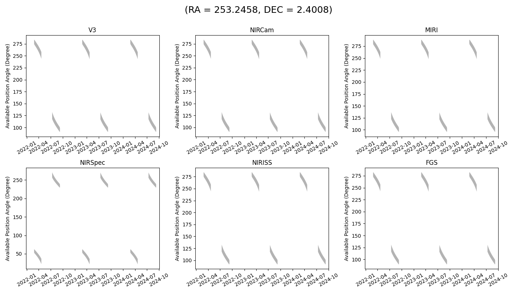
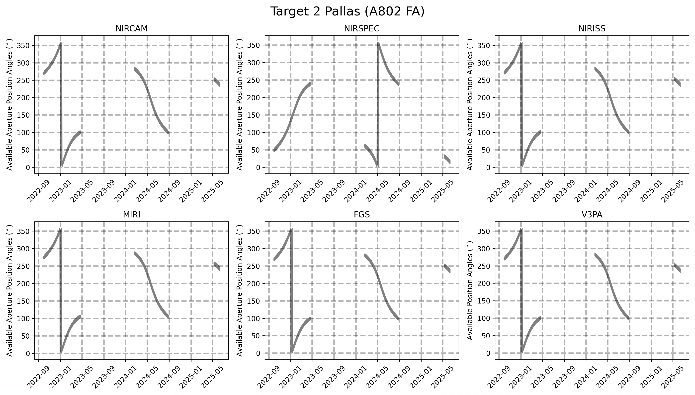
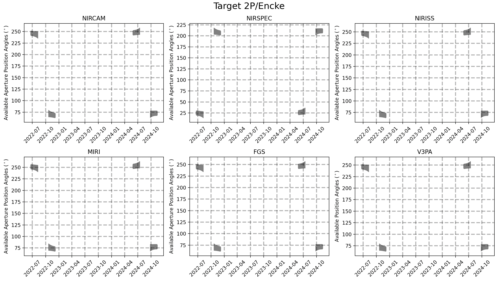
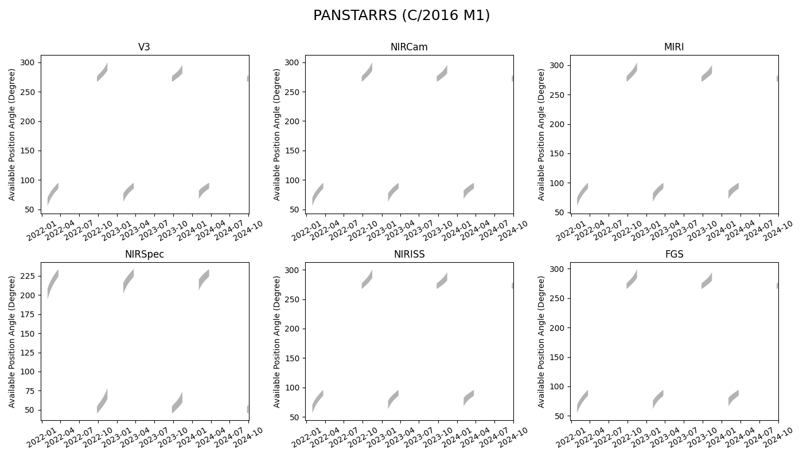
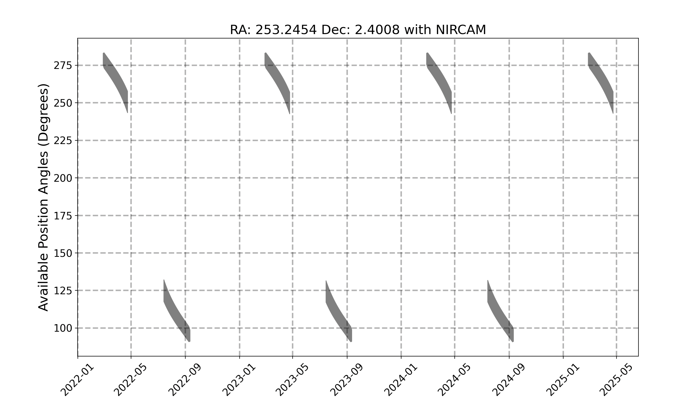
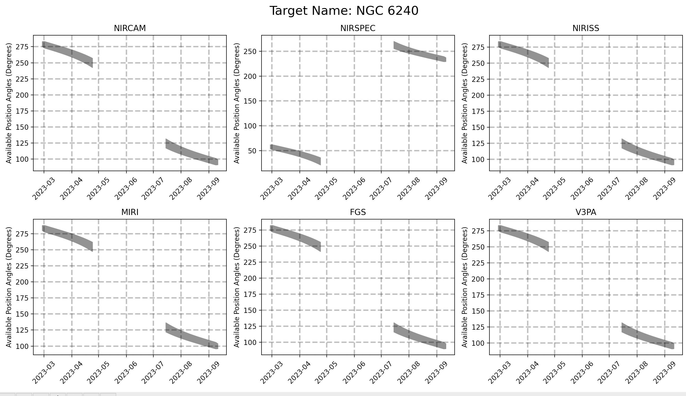
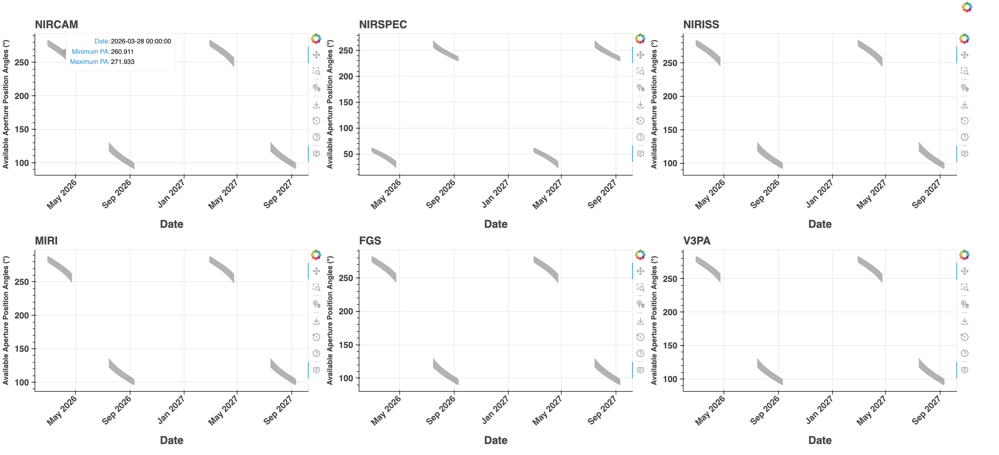
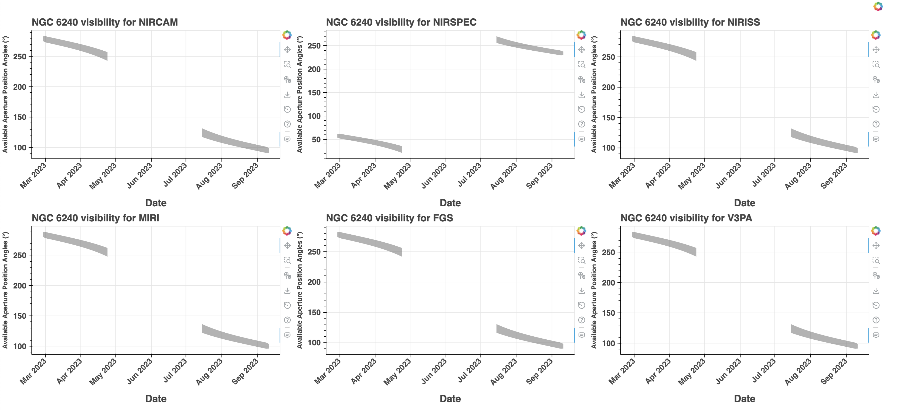

# JWST General Target Visibility Tool (jwst_gtvt)

JWST requires shielding from the Sun for operation, which limits the available position angles observable at a given time. This script calculates the allowed position angles for a given Right Ascension and Declination for each instrument on the telescope. To report any issues, please use the JWST help portal https://jwsthelp.stsci.edu or feel free to open a github issue https://github.com/spacetelescope/jwst_gtvt/issues.

# Dependencies

This tool requires a few packages, all of which are included in the Anaconda Python distribution:

* astropy

* astroquery (for moving target support)

* docopt

* maplotlib

* numpy

* pysiaf

* pandas

* tabulate

# Installation

You can install the tool using `pip` with 
`pip install jwst-gtvt`

Alternatively, you can clone the respository from GitHub and install the tool from inside the resulting directory with:

	$ conda create -n jwst-gtvt-3.12 python=3.12
	$ conda activate jwst-gtvt-3.12
	$ pip install -e .

(The period in the last command is required and is not punctuation.)

# Usage

There are two scripts available: `jwst_gtvt` for fixed targets and `jwst_mtvt` for moving targets. To see the help info use:

    Driver for JWST GTVT fixed target tool.
    Usage:
    jwst_gtvt --ra=<ra> --dec=<dec> [--start_date=<obs_start>] [--end_date=<obs_end>] [--instrument=<inst>] [--target_name=<name>] [--write_ephemeris=<write_path>] [--write_plot=<plot_path>] [--silent] [--interactive]

    Arguments:
    --ra=<ra>     Right ascension of target in degrees
    --dec=<dec>   Declination of target in degrees

    Options:
    [--start_date]         Start date for plot (YYYY-MM-DD)
    [--end_date]           End date for plot (YYYY-MM-DD)
    [--instrument]         Instrument (fgs, miri, nircam, niriss, nirspec, default=all)
    [--target_name]        User provided name for target (name for output, double-quoted if there are spaces)
    [--write_ephemeris]    File name to write ephemeris to
    [--write_plot]         File name to write plot out to
    [--silent]             Boolean to print results to screen [default: False]
    [--interactive]        Option to display interactive plot
    --help                 Show this screen.
    --version              Show version.

The default start date is the local date for the user and the default end date is 2 years after the start date. This range can be updated by specifying both `--start_date` and `--end_date` values. Note that both `--start_date` and `--end_date` must be supplied in order to modify the date range; specifying either a start or end date will result in the default window being used instead. The JWST ephemeris extends roughly 5 years into the future from the current date but results for later dates are likely to be less accurate due to future station-keeping maneuvers.

The `--interactive` plan will display the same data seen in previous versions of the JWST GTVT but will provide and interactive plot in the web browser. This interactive plot can be saved using the `--write_plot` arguement and should be saved with a `.html` extension (example: `interactive_plot.html`).

Note: The `--version flag` is currently subject to a bug where the version output is that of the docopt package, rather than the version of the GTVT itself. If you type `jwst_gtvt --version` and you do not receive an error, you are using version 1.0 or greater, since the `--version` flag was not available previously. This issue will be fixed in a future update.

# Example

By default you need only specify R.A. and Dec. in either sexigesimal or degrees.
The observability windows will be printed to the terminal and a plot showing the windows for each instrument will pop up.

`$ jwst_gtvt --ra=16:52:58.9 --dec=02:24:03`

`$ jwst_gtvt --ra=253.2458 --dec=2.4008`

For moving targets, use `jwst_mtvt`:

`$ jwst_mtvt Ceres`

You can achieve the same result above using the `--smallbody` flag and the HORIZONS Target designation ID:

`$ jwst_mtvt 1 --smallbody`

Periodic comets and most asteroids benefit from using the `--smallbody` flag.

`$ jwst_mtvt 2`  # Venus (no windows)

`$ jwst_mtvt 2 --smallbody`

Occasionally there will be too many matching designations entries for a single target

`$ jwst_mtvt 2P --smallbody`  # Comet Encke

    Record #  Epoch-yr  >MATCH DESIG<  Primary Desig  Name  
    --------  --------  -------------  -------------  -------------------------
    90000031    1786    2P             2P              Encke
    90000032    1796    2P             2P              Encke
    90000033    1805    2P             2P              Encke
    90000034    1819    2P             2P              Encke
    ........    ....    ..             ..              .....
    ........    ....    ..             ..              .....
    90000090    2016    2P             2P              Encke

`$ jwst_mtvt 90000090`  # Comet Encke

`$ jwst_mtvt 'C/2016 M1'`  # works with or without --smallbody

You can specify the instrument via the `--instrument` flag.

`$ jwst_gtvt --ra=16:52:58.9 --dec=02:24:03 --instrument nircam`,

and the resulting plot will only contain the windows for the specified instrument.
The allowed values for `--instrument` are 'nircam', 'nirspec', 'niriss', 'miri', 'fgs', and 'v3pa' (case insensitive).

You can save the text and figure ouput to a file instead of having it output to terminal with `--write_ephemeris` and `--write_plot`.

`$ jwst_gtvt --ra=16:52:58.9 --dec=02:24:03 --write_ephemeris visibility.csv --write_plot visibility.png`

Sharing output and reading data back in is easy:

    $ python
    >>> import pandas as pd
    >>> data = pd.read_csv('visibility.csv')
    >>> print(data[['MJD', ''NIRCAM_max_pa_angle']])
              MJD  NIRCAM_max_pa_angle
    0     59574.0                  NaN
    1     59575.0           232.359648
    2     59576.0           230.923010
    3     59577.0           229.540568
    4     59578.0           228.208743
    ...       ...                  ...
    1008  60582.0            79.433611
    1009  60583.0            78.278362
    1010  60584.0            77.103145
    1011  60585.0            75.906550
    1012  60586.0            74.687072

If you only want to plot a specific range of dates, rather than the next 2 years, specify a `--start_date` and `--end_date` in ISO format (YYYY-MM-DD).
For example:

`$ jwst_gtvt --ra=16:52:58.9 --dec=02:24:03 --target_name "NGC 6240" --start_date 2023-01-01 --end_date 2024-01-01`

Below is an example of a generic `jwst_gtvt` call:

    $ jwst_gtvt --ra=16:52:58.9 --dec=02:24:03

    +------------------------------------------+
    | JWST General Target Visibility Tool      |
    +------------------------------------------+
    | Runtime/Date: YYYY-MM-DD   HR:MIN:SS     |
    +------------------------------------------+
    | Version Number: X.Y.Z                    |
    +------------------------------------------+
    
    RA: 253.24541666666664  Dec: 2.4008333333333334  Ecliptic Latitude: 24.770795580708906
    --------------------------------------------------------------------------------------
    
    Checked Interval [2021-12-26 00:00:00.000, 2024-10-03 00:00:00.000]
    
    +----------------+--------------+-------------------+------------------+----------------+
    | Window Start   | Window End   |   Window Duration |   V3 Angle Start |   V3 Angle End |
    |----------------+--------------+-------------------+------------------+----------------|
    | 2022-02-27     | 2022-04-23   |                55 |          279.221 |       250.7    |
    | 2022-07-14     | 2022-09-11   |                59 |          125.026 |        95.0131 |
    | 2023-02-27     | 2023-04-24   |                56 |          279.351 |       250.021  |
    | 2023-07-15     | 2023-09-11   |                58 |          124.475 |        95.0866 |
    | 2024-02-27     | 2024-04-23   |                56 |          279.472 |       250.165  |
    | 2024-07-14     | 2024-09-10   |                58 |          124.7   |        95.1622 |
    +----------------+--------------+-------------------+------------------+----------------+
    +------------+--------------+--------------+--------------+--------------+--------------+--------------+--------------+--------------+--------------+--------------+-------------+-------------+
    | Date       |   NRC Max PA |   NRC Min PA |   NRS Max PA |   NRS Min PA |   NIS Max PA |   NIS Min PA |   MIR Max PA |   MIR Min PA |   FGS Max PA |   FGS Min PA |   V3 Max PA |   V3 Min PA |
    |------------+--------------+--------------+--------------+--------------+--------------+--------------+--------------+--------------+--------------+--------------+-------------+-------------|
    | 2022-02-27 |     283.105  |     275.188  |      61.7538 |      53.8375 |     283.741  |     275.824  |      288.015 |     280.098  |     281.938  |     274.022  |    283.179  |    275.263  |
    | 2022-02-28 |     283.26   |     274.197  |      61.9087 |      52.846  |     283.895  |     274.833  |      288.17  |     279.107  |     282.093  |     273.03   |    283.334  |    274.271  |
    | 2022-03-01 |     283.416  |     273.206  |      62.0647 |      51.855  |     284.051  |     273.842  |      288.326 |     278.116  |     282.249  |     272.039  |    283.49   |    273.28   |
    | 2022-03-02 |     282.996  |     272.792  |      61.645  |      51.4411 |     283.632  |     273.428  |      287.906 |     277.702  |     281.829  |     271.625  |    283.07   |    272.867  |
    | 2022-03-03 |     282.578  |     272.377  |      61.227  |      51.0263 |     283.214  |     273.013  |      287.488 |     277.287  |     281.411  |     271.211  |    282.652  |    272.452  |
    | 2022-03-04 |     282.161  |     271.961  |      60.8106 |      50.6105 |     282.797  |     272.597  |      287.071 |     276.871  |     280.995  |     270.795  |    282.236  |    272.036  |
    | 2022-03-05 |     281.746  |     271.544  |      60.3954 |      50.1933 |     282.382  |     272.18   |      286.656 |     276.454  |     280.58   |     270.378  |    281.821  |    271.619  |
    | 2022-03-06 |     281.332  |     271.125  |      59.9814 |      49.7746 |     281.968  |     271.761  |      286.242 |     276.035  |     280.166  |     269.959  |    281.407  |    271.2    |
    | 2022-03-07 |     280.919  |     270.705  |      59.5682 |      49.3541 |     281.555  |     271.341  |      285.829 |     275.615  |     279.752  |     269.538  |    280.994  |    270.78   |
    | 2022-03-08 |     280.507  |     270.283  |      59.1557 |      48.9317 |     281.142  |     270.918  |      285.417 |     275.193  |     279.34   |     269.116  |    280.581  |    270.357  |
    | 2022-03-09 |     280.095  |     269.858  |      58.7436 |      48.5071 |     280.73   |     270.494  |      285.005 |     274.768  |     278.928  |     268.691  |    280.169  |    269.933  |
    | 2022-03-10 |     279.683  |     269.431  |      58.3318 |      48.0801 |     280.319  |     270.067  |      284.593 |     274.341  |     278.516  |     268.264  |    279.757  |    269.506  |
    | 2022-03-11 |     279.271  |     269.001  |      57.92   |      47.6505 |     279.907  |     269.637  |      284.181 |     273.911  |     278.104  |     267.835  |    279.345  |    269.076  |
    | 2022-03-12 |     278.859  |     268.569  |      57.508  |      47.218  |     279.495  |     269.205  |      283.769 |     273.479  |     277.692  |     267.402  |    278.933  |    268.643  |
    | 2022-03-13 |     278.446  |     268.133  |      57.0956 |      46.7824 |     279.082  |     268.769  |      283.356 |     273.043  |     277.28   |     266.967  |    278.521  |    268.208  |
    | 2022-03-14 |     278.033  |     267.694  |      56.6826 |      46.3434 |     278.669  |     268.33   |      282.943 |     272.604  |     276.867  |     266.528  |    278.108  |    267.769  |
    | 2022-03-15 |     277.62   |     267.252  |      56.2687 |      45.9008 |     278.255  |     267.888  |      282.53  |     272.162  |     276.453  |     266.085  |    277.694  |    267.326  |
    | 2022-03-16 |     277.205  |     266.805  |      55.8537 |      45.4544 |     277.84   |     267.441  |      282.115 |     271.715  |     276.038  |     265.639  |    277.279  |    266.88   |
    | 2022-03-17 |     276.788  |     266.355  |      55.4374 |      45.0039 |     277.424  |     266.991  |      281.698 |     271.265  |     275.622  |     265.188  |    276.863  |    266.429  |
    | 2022-03-18 |     276.37   |     265.9    |      55.0196 |      44.549  |     277.006  |     266.536  |      281.28  |     270.81   |     275.204  |     264.733  |    276.445  |    265.974  |
    | 2022-03-19 |     275.951  |     265.44   |      54.6    |      44.0894 |     276.587  |     266.076  |      280.861 |     270.35   |     274.784  |     264.274  |    276.025  |    265.515  |
    | 2022-03-20 |     275.529  |     264.976  |      54.1785 |      43.625  |     276.165  |     265.612  |      280.439 |     269.886  |     274.363  |     263.809  |    275.604  |    265.05   |
    | 2022-03-21 |     275.106  |     264.506  |      53.7547 |      43.1553 |     275.741  |     265.142  |      280.016 |     269.416  |     273.939  |     263.34   |    275.18   |    264.581  |
    | 2022-03-22 |     274.679  |     264.031  |      53.3284 |      42.6801 |     275.315  |     264.667  |      279.589 |     268.941  |     273.513  |     262.864  |    274.754  |    264.106  |
    | 2022-03-23 |     274.25   |     263.55   |      52.8993 |      42.1992 |     274.886  |     264.186  |      279.16  |     268.46   |     273.084  |     262.383  |    274.325  |    263.625  |
    | 2022-03-24 |     273.818  |     263.063  |      52.4673 |      41.7121 |     274.454  |     263.699  |      278.728 |     267.973  |     272.652  |     261.896  |    273.893  |    263.138  |
    | 2022-03-25 |     273.383  |     262.569  |      52.032  |      41.2186 |     274.019  |     263.205  |      278.293 |     267.479  |     272.216  |     261.403  |    273.457  |    262.644  |
    | 2022-03-26 |     272.944  |     262.069  |      51.5931 |      40.7183 |     273.58   |     262.705  |      277.854 |     266.979  |     271.777  |     260.903  |    273.019  |    262.144  |
    | 2022-03-27 |     272.501  |     261.562  |      51.1505 |      40.211  |     273.137  |     262.198  |      277.411 |     266.472  |     271.335  |     260.395  |    272.576  |    261.636  |
    | 2022-03-28 |     272.055  |     261.047  |      50.7037 |      39.6961 |     272.69   |     261.683  |      276.965 |     265.957  |     270.888  |     259.88   |    272.129  |    261.122  |
    | 2022-03-29 |     271.603  |     260.524  |      50.2526 |      39.1735 |     272.239  |     261.16   |      276.513 |     265.434  |     270.437  |     259.358  |    271.678  |    260.599  |
    | 2022-03-30 |     271.148  |     259.993  |      49.7968 |      38.6426 |     271.783  |     260.629  |      276.058 |     264.903  |     269.981  |     258.827  |    271.222  |    260.068  |
    | 2022-03-31 |     270.687  |     259.454  |      49.3359 |      38.1031 |     271.323  |     260.09   |      275.597 |     264.364  |     269.52   |     258.287  |    270.761  |    259.529  |
    | 2022-04-01 |     270.221  |     258.906  |      48.8697 |      37.5547 |     270.856  |     259.541  |      275.131 |     263.816  |     269.054  |     257.739  |    270.295  |    258.98   |
    | 2022-04-02 |     269.749  |     258.348  |      48.3978 |      36.9968 |     270.385  |     258.983  |      274.659 |     263.258  |     268.582  |     257.181  |    269.823  |    258.422  |
    | 2022-04-03 |     269.271  |     257.78   |      47.9199 |      36.429  |     269.907  |     258.416  |      274.181 |     262.69   |     268.104  |     256.613  |    269.345  |    257.854  |
    | 2022-04-04 |     268.786  |     257.202  |      47.4356 |      35.8509 |     269.422  |     257.838  |      273.697 |     262.112  |     267.62   |     256.035  |    268.861  |    257.276  |
    | 2022-04-05 |     268.295  |     256.613  |      46.9446 |      35.262  |     268.931  |     257.249  |      273.205 |     261.523  |     267.129  |     255.446  |    268.37   |    256.687  |
    | 2022-04-06 |     267.797  |     256.013  |      46.4464 |      34.6618 |     268.433  |     256.649  |      272.707 |     260.923  |     266.631  |     254.846  |    267.872  |    256.087  |
    | 2022-04-07 |     267.291  |     255.401  |      45.9406 |      34.0499 |     267.927  |     256.037  |      272.201 |     260.311  |     266.125  |     254.234  |    267.366  |    255.475  |
    | 2022-04-08 |     266.778  |     254.776  |      45.4268 |      33.4256 |     267.414  |     255.412  |      271.688 |     259.686  |     265.611  |     253.61   |    266.852  |    254.851  |
    | 2022-04-09 |     266.256  |     254.139  |      44.9046 |      32.7884 |     266.891  |     254.775  |      271.166 |     259.049  |     265.089  |     252.973  |    266.33   |    254.214  |
    | 2022-04-10 |     265.724  |     253.489  |      44.3736 |      32.1377 |     266.36   |     254.124  |      270.634 |     258.399  |     264.558  |     252.322  |    265.799  |    253.563  |
    | 2022-04-11 |     265.184  |     252.824  |      43.8332 |      31.473  |     265.82   |     253.46   |      270.094 |     257.734  |     264.017  |     251.657  |    265.259  |    252.898  |
    | 2022-04-12 |     264.634  |     252.144  |      43.2829 |      30.7935 |     265.27   |     252.78   |      269.544 |     257.054  |     263.467  |     250.978  |    264.708  |    252.219  |
    | 2022-04-13 |     264.073  |     251.45   |      42.7222 |      30.0987 |     264.709  |     252.085  |      268.983 |     256.36   |     262.906  |     250.283  |    264.148  |    251.524  |
    | 2022-04-14 |     263.501  |     250.739  |      42.1506 |      29.3879 |     264.137  |     251.375  |      268.411 |     255.649  |     262.335  |     249.572  |    263.576  |    250.813  |
    | 2022-04-15 |     262.918  |     250.011  |      41.5675 |      28.6603 |     263.554  |     250.647  |      267.828 |     254.921  |     261.752  |     248.845  |    262.993  |    250.086  |
    | 2022-04-16 |     262.323  |     249.266  |      40.9722 |      27.9152 |     262.959  |     249.902  |      267.233 |     254.176  |     261.156  |     248.099  |    262.398  |    249.341  |
    | 2022-04-17 |     261.715  |     248.503  |      40.3642 |      27.1519 |     262.351  |     249.139  |      266.625 |     253.413  |     260.548  |     247.336  |    261.79   |    248.577  |
    | 2022-04-18 |     261.094  |     247.72   |      39.7428 |      26.3694 |     261.73   |     248.356  |      266.004 |     252.63   |     259.927  |     246.554  |    261.168  |    247.795  |
    | 2022-04-19 |     260.458  |     246.918  |      39.1073 |      25.5671 |     261.094  |     247.554  |      265.368 |     251.828  |     259.292  |     245.751  |    260.533  |    246.992  |
    | 2022-04-20 |     259.808  |     246.095  |      38.4569 |      24.7439 |     260.444  |     246.731  |      264.718 |     251.005  |     258.641  |     244.928  |    259.882  |    246.169  |
    | 2022-04-21 |     259.142  |     245.25   |      37.7909 |      23.8989 |     259.778  |     245.886  |      264.052 |     250.16   |     257.975  |     244.083  |    259.216  |    245.324  |
    | 2022-04-22 |     258.459  |     244.382  |      37.1085 |      23.0313 |     259.095  |     245.018  |      263.369 |     249.292  |     257.293  |     243.216  |    258.534  |    244.457  |
    | 2022-04-23 |     257.76   |     243.491  |      36.4088 |      22.14   |     258.395  |     244.127  |      262.67  |     248.401  |     256.593  |     242.324  |    257.834  |    243.565  |
    | 2022-07-14 |     132.172  |     117.731  |     270.821  |     256.38   |     132.807  |     118.367  |      137.082 |     122.641  |     131.005  |     116.565  |    132.246  |    117.806  |
    | 2022-07-15 |     131.291  |     117.04   |     269.941  |     255.689  |     131.927  |     117.676  |      136.201 |     121.95   |     130.125  |     115.873  |    131.366  |    117.115  |
    | 2022-07-16 |     130.434  |     116.366  |     269.083  |     255.015  |     131.07   |     117.002  |      135.344 |     121.276  |     129.268  |     115.199  |    130.509  |    116.44   |
    | 2022-07-17 |     129.599  |     115.708  |     268.248  |     254.357  |     130.235  |     116.343  |      134.509 |     120.618  |     128.432  |     114.541  |    129.674  |    115.782  |
    | 2022-07-18 |     128.785  |     115.065  |     267.434  |     253.714  |     129.421  |     115.7    |      133.695 |     119.975  |     127.618  |     113.898  |    128.859  |    115.139  |
    | 2022-07-19 |     127.991  |     114.436  |     266.64   |     253.085  |     128.627  |     115.072  |      132.901 |     119.346  |     126.824  |     113.269  |    128.065  |    114.511  |
    | 2022-07-20 |     127.216  |     113.821  |     265.865  |     252.47   |     127.852  |     114.457  |      132.126 |     118.731  |     126.05   |     112.655  |    127.291  |    113.896  |
    | 2022-07-21 |     126.46   |     113.219  |     265.109  |     251.869  |     127.096  |     113.855  |      131.37  |     118.129  |     125.293  |     112.053  |    126.535  |    113.294  |
    | 2022-07-22 |     125.722  |     112.63   |     264.371  |     251.279  |     126.357  |     113.266  |      130.632 |     117.54   |     124.555  |     111.463  |    125.796  |    112.705  |
    | 2022-07-23 |     125      |     112.053  |     263.649  |     250.702  |     125.636  |     112.688  |      129.91  |     116.963  |     123.833  |     110.886  |    125.074  |    112.127  |
    | 2022-07-24 |     124.295  |     111.486  |     262.944  |     250.135  |     124.93   |     112.122  |      129.205 |     116.396  |     123.128  |     110.32   |    124.369  |    111.561  |
    | 2022-07-25 |     123.605  |     110.931  |     262.254  |     249.58   |     124.24   |     111.566  |      128.515 |     115.841  |     122.438  |     109.764  |    123.679  |    111.005  |
    | 2022-07-26 |     122.93   |     110.385  |     261.579  |     249.034  |     123.565  |     111.021  |      127.84  |     115.295  |     121.763  |     109.218  |    123.004  |    110.46   |
    | 2022-07-27 |     122.269  |     109.849  |     260.918  |     248.498  |     122.904  |     110.485  |      127.179 |     114.759  |     121.102  |     108.682  |    122.343  |    109.924  |
    | 2022-07-28 |     121.621  |     109.322  |     260.271  |     247.971  |     122.257  |     109.958  |      126.531 |     114.232  |     120.455  |     108.156  |    121.696  |    109.397  |
    | 2022-07-29 |     120.987  |     108.804  |     259.636  |     247.453  |     121.623  |     109.44   |      125.897 |     113.714  |     119.82   |     107.637  |    121.062  |    108.879  |
    | 2022-07-30 |     120.365  |     108.294  |     259.014  |     246.943  |     121.001  |     108.93   |      125.275 |     113.204  |     119.199  |     107.127  |    120.44   |    108.369  |
    | 2022-07-31 |     119.755  |     107.792  |     258.404  |     246.441  |     120.391  |     108.428  |      124.665 |     112.702  |     118.589  |     106.625  |    119.83   |    107.866  |
    | 2022-08-01 |     119.157  |     107.297  |     257.806  |     245.946  |     119.793  |     107.933  |      124.067 |     112.207  |     117.99   |     106.13   |    119.231  |    107.372  |
    | 2022-08-02 |     118.569  |     106.809  |     257.218  |     245.458  |     119.205  |     107.445  |      123.479 |     111.719  |     117.402  |     105.643  |    118.644  |    106.884  |
    | 2022-08-03 |     117.992  |     106.328  |     256.641  |     244.977  |     118.628  |     106.964  |      122.902 |     111.238  |     116.825  |     105.161  |    118.066  |    106.403  |
    | 2022-08-04 |     117.425  |     105.853  |     256.074  |     244.502  |     118.06   |     106.489  |      122.335 |     110.763  |     116.258  |     104.686  |    117.499  |    105.928  |
    | 2022-08-05 |     116.867  |     105.384  |     255.516  |     244.033  |     117.503  |     106.02   |      121.777 |     110.294  |     115.7    |     104.217  |    116.941  |    105.459  |
    | 2022-08-06 |     116.318  |     104.921  |     254.967  |     243.57   |     116.954  |     105.556  |      121.228 |     109.831  |     115.152  |     103.754  |    116.393  |    104.995  |
    | 2022-08-07 |     115.778  |     104.462  |     254.428  |     243.111  |     116.414  |     105.098  |      120.688 |     109.372  |     114.612  |     103.296  |    115.853  |    104.537  |
    | 2022-08-08 |     115.247  |     104.009  |     253.896  |     242.658  |     115.883  |     104.645  |      120.157 |     108.919  |     114.08   |     102.842  |    115.321  |    104.084  |
    | 2022-08-09 |     114.723  |     103.56   |     253.372  |     242.21   |     115.359  |     104.196  |      119.633 |     108.47   |     113.557  |     102.394  |    114.798  |    103.635  |
    | 2022-08-10 |     114.207  |     103.116  |     252.856  |     241.765  |     114.843  |     103.752  |      119.117 |     108.026  |     113.041  |     101.95   |    114.282  |    103.191  |
    | 2022-08-11 |     113.699  |     102.676  |     252.348  |     241.325  |     114.334  |     103.312  |      118.609 |     107.586  |     112.532  |     101.509  |    113.773  |    102.751  |
    | 2022-08-12 |     113.197  |     102.24   |     251.846  |     240.889  |     113.833  |     102.876  |      118.107 |     107.15   |     112.03   |     101.073  |    113.271  |    102.314  |
    | 2022-08-13 |     112.702  |     101.807  |     251.351  |     240.456  |     113.337  |     102.443  |      117.612 |     106.717  |     111.535  |     100.64   |    112.776  |    101.882  |
    | 2022-08-14 |     112.213  |     101.377  |     250.862  |     240.027  |     112.849  |     102.013  |      117.123 |     106.288  |     111.046  |     100.211  |    112.287  |    101.452  |
    | 2022-08-15 |     111.73   |     100.951  |     250.379  |     239.6    |     112.366  |     101.587  |      116.64  |     105.861  |     110.563  |      99.7845 |    111.804  |    101.026  |
    | 2022-08-16 |     111.253  |     100.528  |     249.902  |     239.177  |     111.888  |     101.163  |      116.163 |     105.438  |     110.086  |      99.3609 |    111.327  |    100.602  |
    | 2022-08-17 |     110.781  |     100.107  |     249.43   |     238.756  |     111.417  |     100.742  |      115.691 |     105.017  |     109.614  |      98.9399 |    110.855  |    100.181  |
    | 2022-08-18 |     110.314  |      99.6879 |     248.963  |     238.337  |     110.95   |     100.324  |      115.224 |     104.598  |     109.147  |      98.5213 |    110.389  |     99.7625 |
    | 2022-08-19 |     109.852  |      99.2715 |     248.501  |     237.921  |     110.488  |      99.9073 |      114.762 |     104.182  |     108.686  |      98.1049 |    109.927  |     99.3461 |
    | 2022-08-20 |     109.395  |      98.857  |     248.044  |     237.506  |     110.031  |      99.4928 |      114.305 |     103.767  |     108.229  |      97.6903 |    109.47   |     98.9315 |
    | 2022-08-21 |     108.942  |      98.4441 |     247.592  |     237.093  |     109.578  |      99.08   |      113.852 |     103.354  |     107.776  |      97.2775 |    109.017  |     98.5187 |
    | 2022-08-22 |     108.494  |      98.0328 |     247.143  |     236.682  |     109.13   |      98.6687 |      113.404 |     102.943  |     107.327  |      96.8662 |    108.568  |     98.1074 |
    | 2022-08-23 |     108.049  |      97.6229 |     246.698  |     236.272  |     108.685  |      98.2587 |      112.959 |     102.533  |     106.882  |      96.4562 |    108.124  |     97.6974 |
    | 2022-08-24 |     107.608  |      97.214  |     246.257  |     235.863  |     108.244  |      97.8498 |      112.518 |     102.124  |     106.441  |      96.0473 |    107.682  |     97.2885 |
    | 2022-08-25 |     107.17   |      96.806  |     245.819  |     235.455  |     107.806  |      97.4418 |      112.08  |     101.716  |     106.004  |      95.6393 |    107.245  |     96.8805 |
    | 2022-08-26 |     106.736  |      96.3987 |     245.385  |     235.048  |     107.372  |      97.0345 |      111.646 |     101.309  |     105.569  |      95.232  |    106.81   |     96.4733 |
    | 2022-08-27 |     106.304  |      95.9919 |     244.954  |     234.641  |     106.94   |      96.6277 |      111.214 |     100.902  |     105.138  |      94.8253 |    106.379  |     96.0665 |
    | 2022-08-28 |     105.876  |      95.5854 |     244.525  |     234.235  |     106.512  |      96.2213 |      110.786 |     100.495  |     104.709  |      94.4188 |    105.95   |     95.66   |
    | 2022-08-29 |     105.45   |      95.1791 |     244.099  |     233.828  |     106.086  |      95.815  |      110.36  |     100.089  |     104.283  |      94.0125 |    105.524  |     95.2537 |
    | 2022-08-30 |     105.026  |      94.7727 |     243.675  |     233.422  |     105.662  |      95.4086 |      109.936 |      99.6827 |     103.859  |      93.6061 |    105.101  |     94.8473 |
    | 2022-08-31 |     104.605  |      94.3661 |     243.254  |     233.015  |     105.24   |      95.0019 |      109.515 |      99.2761 |     103.438  |      93.1994 |    104.679  |     94.4406 |
    | 2022-09-01 |     104.185  |      93.9589 |     242.834  |     232.608  |     104.821  |      94.5948 |      109.095 |      98.869  |     103.018  |      92.7923 |    104.26   |     94.0335 |
    | 2022-09-02 |     103.767  |      93.5512 |     242.416  |     232.2    |     104.403  |      94.187  |      108.677 |      98.4612 |     102.601  |      92.3846 |    103.842  |     93.6258 |
    | 2022-09-03 |     103.351  |      93.1426 |     242      |     231.792  |     103.987  |      93.7785 |      108.261 |      98.0527 |     102.184  |      91.976  |    103.426  |     93.2172 |
    | 2022-09-04 |     102.936  |      92.733  |     241.585  |     231.382  |     103.572  |      93.3689 |      107.846 |      97.6431 |     101.77   |      91.5664 |    103.011  |     92.8076 |
    | 2022-09-05 |     102.523  |      92.3222 |     241.172  |     230.971  |     103.159  |      92.9581 |      107.433 |      97.2323 |     101.356  |      91.1556 |    102.597  |     92.3968 |
    | 2022-09-06 |     102.11   |      91.91   |     240.759  |     230.559  |     102.746  |      92.5459 |      107.02  |      96.8201 |     100.944  |      90.7434 |    102.185  |     91.9846 |
    | 2022-09-07 |     101.698  |      91.4962 |     240.348  |     230.145  |     102.334  |      92.1321 |      106.608 |      96.4063 |     100.532  |      90.3296 |    101.773  |     91.5708 |
    | 2022-09-08 |     101.287  |      91.0807 |     239.937  |     229.73   |     101.923  |      91.7165 |      106.197 |      95.9907 |     100.121  |      89.914  |    101.362  |     91.1552 |
    | 2022-09-09 |     100.581  |      90.9583 |     239.231  |     229.607  |     101.217  |      91.5941 |      105.492 |      95.8683 |      99.4149 |      89.7917 |    100.656  |     91.0329 |
    | 2022-09-10 |      99.6132 |      91.0964 |     238.262  |     229.746  |     100.249  |      91.7323 |      104.523 |      96.0065 |      98.4465 |      89.9298 |     99.6877 |     91.171  |
    | 2022-09-11 |      98.6437 |      91.2334 |     237.293  |     229.883  |      99.2796 |      91.8692 |      103.554 |      96.1434 |      97.4771 |      90.0667 |     98.7183 |     91.3079 |
    | 2023-02-27 |     283.106  |     275.446  |      61.7551 |      54.0956 |     283.742  |     276.082  |      288.016 |     280.356  |     281.939  |     274.28   |    283.18   |    275.521  |
    | 2023-02-28 |     283.26   |     274.452  |      61.9096 |      53.1016 |     283.896  |     275.088  |      288.17  |     279.362  |     282.094  |     273.286  |    283.335  |    274.527  |
    | 2023-03-01 |     283.417  |     273.459  |      62.0657 |      52.1078 |     284.052  |     274.095  |      288.327 |     278.369  |     282.25   |     272.292  |    283.491  |    273.533  |
    | 2023-03-02 |     283.122  |     272.917  |      61.771  |      51.5661 |     283.758  |     273.553  |      288.032 |     277.827  |     281.955  |     271.75   |    283.196  |    272.992  |
    | 2023-03-03 |     282.702  |     272.501  |      61.3514 |      51.1503 |     283.338  |     273.137  |      287.612 |     277.411  |     281.536  |     271.335  |    282.777  |    272.576  |
    | 2023-03-04 |     282.284  |     272.084  |      60.9334 |      50.7334 |     282.92   |     272.72   |      287.194 |     276.994  |     281.118  |     270.918  |    282.359  |    272.159  |
    | 2023-03-05 |     281.868  |     271.666  |      60.5167 |      50.3152 |     282.503  |     272.302  |      286.778 |     276.576  |     280.701  |     270.499  |    281.942  |    271.741  |
    | 2023-03-06 |     281.452  |     271.246  |      60.1011 |      49.8954 |     282.088  |     271.882  |      286.362 |     276.156  |     280.285  |     270.08   |    281.526  |    271.321  |
    | 2023-03-07 |     281.037  |     270.825  |      59.6863 |      49.474  |     281.673  |     271.461  |      285.947 |     275.735  |     279.871  |     269.658  |    281.112  |    270.899  |
    | 2023-03-08 |     280.623  |     270.401  |      59.2723 |      49.0506 |     281.259  |     271.037  |      285.533 |     275.311  |     279.457  |     269.235  |    280.698  |    270.476  |
    | 2023-03-09 |     280.21   |     269.976  |      58.8588 |      48.625  |     280.845  |     270.612  |      285.12  |     274.886  |     279.043  |     268.809  |    280.284  |    270.05   |
    | 2023-03-10 |     279.796  |     269.548  |      58.4455 |      48.1971 |     280.432  |     270.184  |      284.706 |     274.458  |     278.63   |     268.381  |    279.871  |    269.622  |
    | 2023-03-11 |     279.383  |     269.117  |      58.0322 |      47.7665 |     280.019  |     269.753  |      284.293 |     274.027  |     278.216  |     267.951  |    279.458  |    269.192  |
    | 2023-03-12 |     278.97   |     268.684  |      57.6187 |      47.333  |     279.605  |     269.32   |      283.88  |     273.594  |     277.803  |     267.517  |    279.044  |    268.758  |
    | 2023-03-13 |     278.556  |     268.247  |      57.2049 |      46.8964 |     279.192  |     268.883  |      283.466 |     273.157  |     277.389  |     267.081  |    278.63   |    268.322  |
    | 2023-03-14 |     278.141  |     267.807  |      56.7904 |      46.4566 |     278.777  |     268.443  |      283.051 |     272.717  |     276.975  |     266.641  |    278.216  |    267.882  |
    | 2023-03-15 |     277.726  |     267.364  |      56.3752 |      46.0131 |     278.362  |     268      |      282.636 |     272.274  |     276.559  |     266.197  |    277.801  |    267.439  |
    | 2023-03-16 |     277.31   |     266.917  |      55.9588 |      45.5658 |     277.946  |     267.552  |      282.22  |     271.827  |     276.143  |     265.75   |    277.384  |    266.991  |
    | 2023-03-17 |     276.892  |     266.465  |      55.5412 |      45.1144 |     277.528  |     267.101  |      281.802 |     271.375  |     275.725  |     265.299  |    276.967  |    266.54   |
    | 2023-03-18 |     276.473  |     266.01   |      55.1221 |      44.6587 |     277.109  |     266.645  |      281.383 |     270.92   |     275.306  |     264.843  |    276.548  |    266.084  |
    | 2023-03-19 |     276.052  |     265.549  |      54.7012 |      44.1983 |     276.688  |     266.185  |      280.962 |     270.459  |     274.885  |     264.383  |    276.127  |    265.624  |
    | 2023-03-20 |     275.629  |     265.084  |      54.2784 |      43.7331 |     276.265  |     265.72   |      280.539 |     269.994  |     274.463  |     263.917  |    275.704  |    265.159  |
    | 2023-03-21 |     275.204  |     264.614  |      53.8533 |      43.2627 |     275.84   |     265.249  |      280.114 |     269.524  |     274.038  |     263.447  |    275.279  |    264.688  |
    | 2023-03-22 |     274.777  |     264.138  |      53.4258 |      42.7868 |     275.413  |     264.774  |      279.687 |     269.048  |     273.61   |     262.971  |    274.851  |    264.212  |
    | 2023-03-23 |     274.346  |     263.656  |      52.9956 |      42.3052 |     274.982  |     264.292  |      279.256 |     268.566  |     273.18   |     262.489  |    274.421  |    263.731  |
    | 2023-03-24 |     273.913  |     263.168  |      52.5624 |      41.8175 |     274.549  |     263.804  |      278.823 |     268.078  |     272.747  |     262.002  |    273.988  |    263.243  |
    | 2023-03-25 |     273.477  |     262.674  |      52.126  |      41.3234 |     274.113  |     263.31   |      278.387 |     267.584  |     272.31   |     261.508  |    273.551  |    262.749  |
    | 2023-03-26 |     273.037  |     262.174  |      51.6861 |      40.8227 |     273.673  |     262.809  |      277.947 |     267.084  |     271.87   |     261.007  |    273.112  |    262.248  |
    | 2023-03-27 |     272.593  |     261.666  |      51.2424 |      40.3148 |     273.229  |     262.302  |      277.503 |     266.576  |     271.427  |     260.499  |    272.668  |    261.74   |
    | 2023-03-28 |     272.146  |     261.15   |      50.7947 |      39.7996 |     272.781  |     261.786  |      277.056 |     266.061  |     270.979  |     259.984  |    272.22   |    261.225  |
    | 2023-03-29 |     271.694  |     260.628  |      50.3427 |      39.2767 |     272.329  |     261.263  |      276.604 |     265.538  |     270.527  |     259.461  |    271.768  |    260.702  |
    | 2023-03-30 |     271.237  |     260.096  |      49.886  |      38.7456 |     271.873  |     260.732  |      276.147 |     265.006  |     270.07   |     258.93   |    271.311  |    260.171  |
    | 2023-03-31 |     270.775  |     259.557  |      49.4244 |      38.2061 |     271.411  |     260.193  |      275.685 |     264.467  |     269.609  |     258.39   |    270.85   |    259.631  |
    | 2023-04-01 |     270.308  |     259.008  |      48.9575 |      37.6576 |     270.944  |     259.644  |      275.218 |     263.918  |     269.142  |     257.842  |    270.383  |    259.083  |
    | 2023-04-02 |     269.836  |     258.451  |      48.4851 |      37.0998 |     270.472  |     259.087  |      274.746 |     263.361  |     268.669  |     257.284  |    269.91   |    258.525  |
    | 2023-04-03 |     269.358  |     257.883  |      48.0067 |      36.5323 |     269.993  |     258.519  |      274.268 |     262.793  |     268.191  |     256.717  |    269.432  |    257.958  |
    | 2023-04-04 |     268.873  |     257.305  |      47.522  |      35.9546 |     269.509  |     257.941  |      273.783 |     262.215  |     267.706  |     256.139  |    268.947  |    257.38   |
    | 2023-04-05 |     268.382  |     256.717  |      47.0307 |      35.3663 |     269.017  |     257.353  |      273.292 |     261.627  |     267.215  |     255.55   |    268.456  |    256.792  |
    | 2023-04-06 |     267.883  |     256.118  |      46.5323 |      34.7668 |     268.519  |     256.753  |      272.793 |     261.028  |     266.717  |     254.951  |    267.958  |    256.192  |
    | 2023-04-07 |     267.377  |     255.507  |      46.0266 |      34.1557 |     268.013  |     256.142  |      272.287 |     260.417  |     266.211  |     254.34   |    267.452  |    255.581  |
    | 2023-04-08 |     266.864  |     254.883  |      45.513  |      33.5325 |     267.5    |     255.519  |      271.774 |     259.793  |     265.697  |     253.717  |    266.938  |    254.958  |
    | 2023-04-09 |     266.342  |     254.247  |      44.9911 |      32.8965 |     266.978  |     254.883  |      271.252 |     259.157  |     265.175  |     253.081  |    266.417  |    254.322  |
    | 2023-04-10 |     265.811  |     253.598  |      44.4605 |      32.2473 |     266.447  |     254.234  |      270.721 |     258.508  |     264.645  |     252.432  |    265.886  |    253.673  |
    | 2023-04-11 |     265.272  |     252.935  |      43.9207 |      31.5843 |     265.907  |     253.571  |      270.182 |     257.845  |     264.105  |     251.769  |    265.346  |    253.01   |
    | 2023-04-12 |     264.722  |     252.258  |      43.3712 |      30.9068 |     265.358  |     252.893  |      269.632 |     257.168  |     263.555  |     251.091  |    264.797  |    252.332  |
    | 2023-04-13 |     264.162  |     251.565  |      42.8115 |      30.2142 |     264.798  |     252.201  |      269.072 |     256.475  |     262.996  |     250.398  |    264.237  |    251.64   |
    | 2023-04-14 |     263.592  |     250.857  |      42.2411 |      29.5058 |     264.228  |     251.493  |      268.502 |     255.767  |     262.425  |     249.69   |    263.667  |    250.931  |
    | 2023-04-15 |     263.01   |     250.132  |      41.6594 |      28.7809 |     263.646  |     250.768  |      267.92  |     255.042  |     261.844  |     248.965  |    263.085  |    250.206  |
    | 2023-04-16 |     262.417  |     249.39   |      41.0658 |      28.0389 |     263.052  |     250.026  |      267.327 |     254.3    |     261.25   |     248.223  |    262.491  |    249.464  |
    | 2023-04-17 |     261.811  |     248.63   |      40.4597 |      27.2788 |     262.446  |     249.266  |      266.721 |     253.54   |     260.644  |     247.463  |    261.885  |    248.704  |
    | 2023-04-18 |     261.191  |     247.851  |      39.8404 |      26.5    |     261.827  |     248.487  |      266.101 |     252.761  |     260.025  |     246.684  |    261.266  |    247.925  |
    | 2023-04-19 |     260.558  |     247.052  |      39.2073 |      25.7016 |     261.194  |     247.688  |      265.468 |     251.963  |     259.391  |     245.886  |    260.633  |    247.127  |
    | 2023-04-20 |     259.91   |     246.234  |      38.5596 |      24.8828 |     260.546  |     246.869  |      264.82  |     251.144  |     258.744  |     245.067  |    259.985  |    246.308  |
    | 2023-04-21 |     259.247  |     245.393  |      37.8965 |      24.0425 |     259.883  |     246.029  |      264.157 |     250.303  |     258.081  |     244.227  |    259.322  |    245.468  |
    | 2023-04-22 |     258.568  |     244.531  |      37.2174 |      23.18   |     259.204  |     245.167  |      263.478 |     249.441  |     257.402  |     243.364  |    258.643  |    244.605  |
    | 2023-04-23 |     257.872  |     243.645  |      36.5213 |      22.2941 |     258.508  |     244.281  |      262.782 |     248.555  |     256.705  |     242.478  |    257.947  |    243.72   |
    | 2023-04-24 |     257.158  |     242.735  |      35.8073 |      21.3839 |     257.794  |     243.371  |      262.068 |     247.645  |     255.992  |     241.568  |    257.233  |    242.809  |
    | 2023-07-15 |     131.557  |     117.244  |     270.206  |     255.893  |     132.193  |     117.88   |      136.467 |     122.154  |     130.391  |     116.077  |    131.632  |    117.318  |
    | 2023-07-16 |     130.692  |     116.563  |     269.341  |     255.212  |     131.328  |     117.199  |      135.602 |     121.473  |     129.525  |     115.397  |    130.766  |    116.638  |
    | 2023-07-17 |     129.849  |     115.899  |     268.498  |     254.548  |     130.484  |     116.535  |      134.759 |     120.809  |     128.682  |     114.732  |    129.923  |    115.974  |
    | 2023-07-18 |     129.027  |     115.25   |     267.676  |     253.899  |     129.663  |     115.886  |      133.937 |     120.16   |     127.86   |     114.084  |    129.101  |    115.325  |
    | 2023-07-19 |     128.225  |     114.616  |     266.874  |     253.265  |     128.861  |     115.252  |      133.135 |     119.526  |     127.059  |     113.449  |    128.3    |    114.691  |
    | 2023-07-20 |     127.443  |     113.996  |     266.092  |     252.645  |     128.079  |     114.632  |      132.353 |     118.906  |     126.277  |     112.829  |    127.518  |    114.071  |
    | 2023-07-21 |     126.68   |     113.389  |     265.329  |     252.038  |     127.316  |     114.025  |      131.59  |     118.299  |     125.514  |     112.223  |    126.755  |    113.464  |
    | 2023-07-22 |     125.935  |     112.795  |     264.584  |     251.444  |     126.571  |     113.431  |      130.845 |     117.705  |     124.768  |     111.628  |    126.01   |    112.87   |
    | 2023-07-23 |     125.207  |     112.213  |     263.856  |     250.862  |     125.843  |     112.849  |      130.117 |     117.123  |     124.04   |     111.046  |    125.281  |    112.287  |
    | 2023-07-24 |     124.495  |     111.642  |     263.144  |     250.291  |     125.131  |     112.278  |      129.405 |     116.552  |     123.329  |     110.475  |    124.57   |    111.717  |
    | 2023-07-25 |     123.799  |     111.082  |     262.449  |     249.731  |     124.435  |     111.718  |      128.709 |     115.992  |     122.633  |     109.915  |    123.874  |    111.157  |
    | 2023-07-26 |     123.119  |     110.532  |     261.768  |     249.182  |     123.754  |     111.168  |      128.029 |     115.442  |     121.952  |     109.366  |    123.193  |    110.607  |
    | 2023-07-27 |     122.452  |     109.992  |     261.101  |     248.642  |     123.088  |     110.628  |      127.362 |     114.903  |     121.285  |     108.826  |    122.527  |    110.067  |
    | 2023-07-28 |     121.799  |     109.462  |     260.449  |     248.111  |     122.435  |     110.098  |      126.71  |     114.372  |     120.633  |     108.295  |    121.874  |    109.536  |
    | 2023-07-29 |     121.16   |     108.94   |     259.809  |     247.589  |     121.796  |     109.576  |      126.07  |     113.85   |     119.993  |     107.773  |    121.235  |    109.015  |
    | 2023-07-30 |     120.533  |     108.427  |     259.182  |     247.076  |     121.169  |     109.062  |      125.443 |     113.337  |     119.367  |     107.26   |    120.608  |    108.501  |
    | 2023-07-31 |     119.919  |     107.921  |     258.568  |     246.57   |     120.554  |     108.557  |      124.829 |     112.831  |     118.752  |     106.755  |    119.993  |    107.996  |
    | 2023-08-01 |     119.315  |     107.423  |     257.965  |     246.072  |     119.951  |     108.059  |      124.225 |     112.333  |     118.149  |     106.257  |    119.39   |    107.498  |
    | 2023-08-02 |     118.723  |     106.932  |     257.372  |     245.581  |     119.359  |     107.568  |      123.633 |     111.842  |     117.557  |     105.766  |    118.798  |    107.007  |
    | 2023-08-03 |     118.142  |     106.448  |     256.791  |     245.097  |     118.778  |     107.084  |      123.052 |     111.358  |     116.975  |     105.281  |    118.216  |    106.523  |
    | 2023-08-04 |     117.57   |     105.97   |     256.22   |     244.619  |     118.206  |     106.606  |      122.48  |     110.88   |     116.404  |     104.804  |    117.645  |    106.045  |
    | 2023-08-05 |     117.009  |     105.499  |     255.658  |     244.148  |     117.645  |     106.134  |      121.919 |     110.409  |     115.842  |     104.332  |    117.083  |    105.573  |
    | 2023-08-06 |     116.456  |     105.033  |     255.106  |     243.682  |     117.092  |     105.668  |      121.366 |     109.943  |     115.29   |     103.866  |    116.531  |    105.107  |
    | 2023-08-07 |     115.913  |     104.572  |     254.562  |     243.221  |     116.549  |     105.208  |      120.823 |     109.482  |     114.746  |     103.405  |    115.987  |    104.646  |
    | 2023-08-08 |     115.378  |     104.116  |     254.027  |     242.765  |     116.014  |     104.752  |      120.288 |     109.026  |     114.211  |     102.95   |    115.452  |    104.191  |
    | 2023-08-09 |     114.851  |     103.665  |     253.5    |     242.315  |     115.487  |     104.301  |      119.761 |     108.575  |     113.684  |     102.499  |    114.925  |    103.74   |
    | 2023-08-10 |     114.332  |     103.219  |     252.981  |     241.868  |     114.967  |     103.855  |      119.242 |     108.129  |     113.165  |     102.052  |    114.406  |    103.294  |
    | 2023-08-11 |     113.82   |     102.777  |     252.469  |     241.426  |     114.456  |     103.413  |      118.73  |     107.687  |     112.653  |     101.61   |    113.894  |    102.851  |
    | 2023-08-12 |     113.315  |     102.338  |     251.964  |     240.988  |     113.951  |     102.974  |      118.225 |     107.249  |     112.148  |     101.172  |    113.389  |    102.413  |
    | 2023-08-13 |     112.817  |     101.904  |     251.466  |     240.553  |     113.453  |     102.54   |      117.727 |     106.814  |     111.65   |     100.737  |    112.891  |    101.978  |
    | 2023-08-14 |     112.325  |     101.473  |     250.974  |     240.122  |     112.961  |     102.108  |      117.235 |     106.383  |     111.158  |     100.306  |    112.4    |    101.547  |
    | 2023-08-15 |     111.839  |     101.044  |     250.489  |     239.694  |     112.475  |     101.68   |      116.749 |     105.955  |     110.673  |      99.8779 |    111.914  |    101.119  |
    | 2023-08-16 |     111.36   |     100.619  |     250.009  |     239.268  |     111.995  |     101.255  |      116.27  |     105.529  |     110.193  |      99.4527 |    111.434  |    100.694  |
    | 2023-08-17 |     110.885  |     100.197  |     249.535  |     238.846  |     111.521  |     100.833  |      115.795 |     105.107  |     109.719  |      99.0302 |    110.96   |    100.271  |
    | 2023-08-18 |     110.416  |      99.7767 |     249.065  |     238.426  |     111.052  |     100.413  |      115.326 |     104.687  |     109.25   |      98.6101 |    110.491  |     99.8513 |
    | 2023-08-19 |     109.952  |      99.3589 |     248.601  |     238.008  |     110.588  |      99.9947 |      114.862 |     104.269  |     108.786  |      98.1923 |    110.027  |     99.4335 |
    | 2023-08-20 |     109.493  |      98.9431 |     248.142  |     237.592  |     110.129  |      99.5789 |      114.403 |     103.853  |     108.326  |      97.7764 |    109.568  |     99.0176 |
    | 2023-08-21 |     109.038  |      98.529  |     247.687  |     237.178  |     109.674  |      99.1649 |      113.948 |     103.439  |     107.872  |      97.3624 |    109.113  |     98.6036 |
    | 2023-08-22 |     108.588  |      98.1166 |     247.237  |     236.766  |     109.223  |      98.7524 |      113.498 |     103.027  |     107.421  |      96.9499 |    108.662  |     98.1911 |
    | 2023-08-23 |     108.141  |      97.7055 |     246.79   |     236.355  |     108.777  |      98.3413 |      113.051 |     102.615  |     106.974  |      96.5388 |    108.215  |     97.78   |
    | 2023-08-24 |     107.698  |      97.2956 |     246.347  |     235.945  |     108.334  |      97.9314 |      112.608 |     102.206  |     106.531  |      96.1289 |    107.773  |     97.3701 |
    | 2023-08-25 |     107.259  |      96.8866 |     245.908  |     235.536  |     107.895  |      97.5225 |      112.169 |     101.797  |     106.092  |      95.72   |    107.333  |     96.9612 |
    | 2023-08-26 |     106.823  |      96.4784 |     245.472  |     235.128  |     107.458  |      97.1143 |      111.733 |     101.388  |     105.656  |      95.3118 |    106.897  |     96.553  |
    | 2023-08-27 |     106.39   |      96.0709 |     245.039  |     234.72   |     107.025  |      96.7067 |      111.3   |     100.981  |     105.223  |      94.9042 |    106.464  |     96.1454 |
    | 2023-08-28 |     105.96   |      95.6636 |     244.609  |     234.313  |     106.595  |      96.2995 |      110.87  |     100.574  |     104.793  |      94.497  |    106.034  |     95.7382 |
    | 2023-08-29 |     105.532  |      95.2566 |     244.181  |     233.906  |     106.168  |      95.8925 |      110.442 |     100.167  |     104.366  |      94.09   |    105.607  |     95.3312 |
    | 2023-08-30 |     105.107  |      94.8496 |     243.756  |     233.499  |     105.743  |      95.4855 |      110.017 |      99.7596 |     103.941  |      93.683  |    105.182  |     94.9242 |
    | 2023-08-31 |     104.684  |      94.4424 |     243.334  |     233.092  |     105.32   |      95.0783 |      109.594 |      99.3524 |     103.518  |      93.2758 |    104.759  |     94.517  |
    | 2023-09-01 |     104.264  |      94.0348 |     242.913  |     232.684  |     104.9    |      94.6707 |      109.174 |      98.9449 |     103.097  |      92.8682 |    104.338  |     94.1094 |
    | 2023-09-02 |     103.845  |      93.6267 |     242.494  |     232.276  |     104.481  |      94.2625 |      108.755 |      98.5367 |     102.678  |      92.4601 |    103.92   |     93.7013 |
    | 2023-09-03 |     103.428  |      93.2178 |     242.077  |     231.867  |     104.064  |      93.8536 |      108.338 |      98.1278 |     102.261  |      92.0511 |    103.502  |     93.2923 |
    | 2023-09-04 |     103.012  |      92.8079 |     241.661  |     231.457  |     103.648  |      93.4438 |      107.922 |      97.7179 |     101.846  |      91.6413 |    103.087  |     92.8825 |
    | 2023-09-05 |     102.598  |      92.3969 |     241.247  |     231.046  |     103.234  |      93.0327 |      107.508 |      97.3069 |     101.431  |      91.2303 |    102.672  |     92.4715 |
    | 2023-09-06 |     102.185  |      91.9846 |     240.834  |     230.634  |     102.82   |      92.6204 |      107.095 |      96.8946 |     101.018  |      90.8179 |    102.259  |     92.0591 |
    | 2023-09-07 |     101.772  |      91.5707 |     240.421  |     230.22   |     102.408  |      92.2066 |      106.682 |      96.4807 |     100.606  |      90.4041 |    101.847  |     91.6453 |
    | 2023-09-08 |     101.361  |      91.1551 |     240.01   |     229.804  |     101.996  |      91.791  |      106.271 |      96.0652 |     100.194  |      89.9885 |    101.435  |     91.2297 |
    | 2023-09-09 |     100.785  |      90.9024 |     239.434  |     229.552  |     101.42   |      91.5383 |      105.695 |      95.8125 |      99.618  |      89.7358 |    100.859  |     90.977  |
    | 2023-09-10 |      99.8147 |      91.0419 |     238.464  |     229.691  |     100.451  |      91.6778 |      104.725 |      95.952  |      98.6481 |      89.8753 |     99.8893 |     91.1165 |
    | 2023-09-11 |      98.844  |      91.1801 |     237.493  |     229.829  |      99.4798 |      91.816  |      103.754 |      96.0902 |      97.6773 |      90.0135 |     98.9185 |     91.2547 |
    | 2024-02-27 |     283.098  |     275.696  |      61.7474 |      54.3448 |     283.734  |     276.331  |      288.008 |     280.606  |     281.932  |     274.529  |    283.173  |    275.77   |
    | 2024-02-28 |     283.252  |     274.699  |      61.9014 |      53.3482 |     283.888  |     275.335  |      288.162 |     279.609  |     282.086  |     273.532  |    283.327  |    274.774  |
    | 2024-02-29 |     283.408  |     273.703  |      62.0568 |      52.352  |     284.044  |     274.339  |      288.318 |     278.613  |     282.241  |     272.536  |    283.482  |    273.777  |
    | 2024-03-01 |     283.239  |     273.033  |      61.8877 |      51.6817 |     283.874  |     273.668  |      288.149 |     277.943  |     282.072  |     271.866  |    283.313  |    273.107  |
    | 2024-03-02 |     282.817  |     272.615  |      61.4664 |      51.2646 |     283.453  |     273.251  |      287.727 |     277.526  |     281.651  |     271.449  |    282.892  |    272.69   |
    | 2024-03-03 |     282.397  |     272.197  |      61.0466 |      50.8465 |     283.033  |     272.833  |      287.307 |     277.107  |     281.231  |     271.031  |    282.472  |    272.272  |
    | 2024-03-04 |     281.979  |     271.778  |      60.6281 |      50.4272 |     282.615  |     272.414  |      286.889 |     276.688  |     280.812  |     270.611  |    282.054  |    271.853  |
    | 2024-03-05 |     281.562  |     271.357  |      60.2108 |      50.0063 |     282.198  |     271.993  |      286.472 |     276.267  |     280.395  |     270.191  |    281.636  |    271.432  |
    | 2024-03-06 |     281.145  |     270.935  |      59.7945 |      49.5837 |     281.781  |     271.57   |      286.055 |     275.845  |     279.979  |     269.768  |    281.22   |    271.009  |
    | 2024-03-07 |     280.73   |     270.51   |      59.3788 |      49.1593 |     281.366  |     271.146  |      285.64  |     275.42   |     279.563  |     269.343  |    280.804  |    270.585  |
    | 2024-03-08 |     280.315  |     270.083  |      58.9637 |      48.7326 |     280.95   |     270.719  |      285.225 |     274.994  |     279.148  |     268.917  |    280.389  |    270.158  |
    | 2024-03-09 |     279.9    |     269.654  |      58.5488 |      48.3036 |     280.535  |     270.29   |      284.81  |     274.564  |     278.733  |     268.488  |    279.974  |    269.729  |
    | 2024-03-10 |     279.485  |     269.223  |      58.134  |      47.872  |     280.121  |     269.859  |      284.395 |     274.133  |     278.318  |     268.056  |    279.559  |    269.297  |
    | 2024-03-11 |     279.07   |     268.788  |      57.719  |      47.4376 |     279.706  |     269.424  |      283.98  |     273.698  |     277.903  |     267.622  |    279.144  |    268.863  |
    | 2024-03-12 |     278.655  |     268.351  |      57.3037 |      47      |     279.29   |     268.987  |      283.565 |     273.261  |     277.488  |     267.184  |    278.729  |    268.425  |
    | 2024-03-13 |     278.239  |     267.91   |      56.8878 |      46.5592 |     278.875  |     268.546  |      283.149 |     272.82   |     277.072  |     266.743  |    278.313  |    267.985  |
    | 2024-03-14 |     277.822  |     267.466  |      56.4711 |      46.1148 |     278.458  |     268.102  |      282.732 |     272.376  |     276.655  |     266.299  |    277.897  |    267.54   |
    | 2024-03-15 |     277.404  |     267.018  |      56.0534 |      45.6667 |     278.04   |     267.653  |      282.314 |     271.928  |     276.238  |     265.851  |    277.479  |    267.092  |
    | 2024-03-16 |     276.985  |     266.565  |      55.6344 |      45.2145 |     277.621  |     267.201  |      281.895 |     271.475  |     275.819  |     265.399  |    277.06   |    266.64   |
    | 2024-03-17 |     276.565  |     266.109  |      55.214  |      44.7579 |     277.201  |     266.745  |      281.475 |     271.019  |     275.398  |     264.942  |    276.639  |    266.183  |
    | 2024-03-18 |     276.143  |     265.648  |      54.7918 |      44.2968 |     276.779  |     266.284  |      281.053 |     270.558  |     274.976  |     264.481  |    276.217  |    265.722  |
    | 2024-03-19 |     275.719  |     265.182  |      54.3678 |      43.8309 |     276.354  |     265.818  |      280.629 |     270.092  |     274.552  |     264.015  |    275.793  |    265.256  |
    | 2024-03-20 |     275.292  |     264.711  |      53.9415 |      43.3598 |     275.928  |     265.347  |      280.202 |     269.621  |     274.126  |     263.544  |    275.367  |    264.785  |
    | 2024-03-21 |     274.864  |     264.234  |      53.5129 |      42.8834 |     275.5    |     264.87   |      279.774 |     269.144  |     273.697  |     263.068  |    274.938  |    264.309  |
    | 2024-03-22 |     274.432  |     263.752  |      53.0816 |      42.4013 |     275.068  |     264.388  |      279.342 |     268.662  |     273.266  |     262.585  |    274.507  |    263.827  |
    | 2024-03-23 |     273.998  |     263.264  |      52.6474 |      41.9131 |     274.634  |     263.9    |      278.908 |     268.174  |     272.832  |     262.097  |    274.073  |    263.339  |
    | 2024-03-24 |     273.561  |     262.77   |      52.21   |      41.4187 |     274.197  |     263.405  |      278.471 |     267.68   |     272.394  |     261.603  |    273.635  |    262.844  |
    | 2024-03-25 |     273.12   |     262.269  |      51.7692 |      40.9177 |     273.756  |     262.904  |      278.03  |     267.179  |     271.953  |     261.102  |    273.195  |    262.343  |
    | 2024-03-26 |     272.676  |     261.761  |      51.3247 |      40.4097 |     273.311  |     262.396  |      277.586 |     266.671  |     271.509  |     260.594  |    272.75   |    261.835  |
    | 2024-03-27 |     272.227  |     261.245  |      50.8763 |      39.8944 |     272.863  |     261.881  |      277.137 |     266.155  |     271.061  |     260.079  |    272.302  |    261.32   |
    | 2024-03-28 |     271.774  |     260.722  |      50.4236 |      39.3715 |     272.41   |     261.358  |      276.685 |     265.632  |     270.608  |     259.556  |    271.849  |    260.797  |
    | 2024-03-29 |     271.317  |     260.191  |      49.9664 |      38.8406 |     271.953  |     260.827  |      276.227 |     265.101  |     270.151  |     259.025  |    271.392  |    260.266  |
    | 2024-03-30 |     270.855  |     259.652  |      49.5044 |      38.3013 |     271.491  |     260.288  |      275.765 |     264.562  |     269.689  |     258.486  |    270.93   |    259.727  |
    | 2024-03-31 |     270.388  |     259.104  |      49.0371 |      37.7533 |     271.024  |     259.74   |      275.298 |     264.014  |     269.221  |     257.937  |    270.463  |    259.179  |
    | 2024-04-01 |     269.915  |     258.547  |      48.5645 |      37.1961 |     270.551  |     259.183  |      274.825 |     263.457  |     268.749  |     257.38   |    269.99   |    258.621  |
    | 2024-04-02 |     269.437  |     257.98   |      48.086  |      36.6293 |     270.073  |     258.616  |      274.347 |     262.89   |     268.27   |     256.814  |    269.511  |    258.055  |
    | 2024-04-03 |     268.952  |     257.403  |      47.6013 |      36.0525 |     269.588  |     258.039  |      273.862 |     262.313  |     267.786  |     256.237  |    269.027  |    257.478  |
    | 2024-04-04 |     268.461  |     256.816  |      47.1102 |      35.4652 |     269.097  |     257.452  |      273.371 |     261.726  |     267.294  |     255.649  |    268.536  |    256.891  |
    | 2024-04-05 |     267.963  |     256.218  |      46.6122 |      34.867  |     268.599  |     256.854  |      272.873 |     261.128  |     266.796  |     255.051  |    268.038  |    256.292  |
    | 2024-04-06 |     267.458  |     255.608  |      46.1069 |      34.2574 |     268.094  |     256.244  |      272.368 |     260.518  |     266.291  |     254.442  |    267.532  |    255.683  |
    | 2024-04-07 |     266.945  |     254.987  |      45.5939 |      33.6359 |     267.581  |     255.623  |      271.855 |     259.897  |     265.778  |     253.82   |    267.019  |    255.061  |
    | 2024-04-08 |     266.424  |     254.353  |      45.0728 |      33.0018 |     267.06   |     254.989  |      271.334 |     259.263  |     265.257  |     253.186  |    266.498  |    254.427  |
    | 2024-04-09 |     265.894  |     253.706  |      44.5432 |      32.3548 |     266.53   |     254.341  |      270.804 |     258.616  |     264.727  |     252.539  |    265.969  |    253.78   |
    | 2024-04-10 |     265.355  |     253.045  |      44.0046 |      31.6941 |     265.991  |     253.681  |      270.266 |     257.955  |     264.189  |     251.878  |    265.43   |    253.12   |
    | 2024-04-11 |     264.807  |     252.37   |      43.4565 |      31.0192 |     265.443  |     253.006  |      269.717 |     257.28   |     263.641  |     251.203  |    264.882  |    252.445  |
    | 2024-04-12 |     264.249  |     251.68   |      42.8985 |      30.3295 |     264.885  |     252.316  |      269.159 |     256.59   |     263.083  |     250.514  |    264.324  |    251.755  |
    | 2024-04-13 |     263.681  |     250.975  |      42.3299 |      29.6243 |     264.317  |     251.611  |      268.591 |     255.885  |     262.514  |     249.809  |    263.755  |    251.05   |
    | 2024-04-14 |     263.101  |     250.254  |      41.7502 |      28.9029 |     263.737  |     250.89   |      268.011 |     255.164  |     261.934  |     249.087  |    263.176  |    250.328  |
    | 2024-04-15 |     262.51   |     249.515  |      41.1588 |      28.1646 |     263.146  |     250.151  |      267.42  |     254.425  |     261.343  |     248.349  |    262.584  |    249.59   |
    | 2024-04-16 |     261.906  |     248.759  |      40.5552 |      27.4086 |     262.542  |     249.395  |      266.816 |     253.669  |     260.739  |     247.593  |    261.981  |    248.834  |
    | 2024-04-17 |     261.29   |     247.985  |      39.9387 |      26.6341 |     261.925  |     248.621  |      266.2   |     252.895  |     260.123  |     246.818  |    261.364  |    248.06   |
    | 2024-04-18 |     260.659  |     247.191  |      39.3086 |      25.8404 |     261.295  |     247.827  |      265.57  |     252.101  |     259.493  |     246.025  |    260.734  |    247.266  |
    | 2024-04-19 |     260.015  |     246.377  |      38.6642 |      25.0266 |     260.651  |     247.013  |      264.925 |     251.287  |     258.848  |     245.211  |    260.09   |    246.452  |
    | 2024-04-20 |     259.356  |     245.543  |      38.0048 |      24.1918 |     259.992  |     246.178  |      264.266 |     250.453  |     258.189  |     244.376  |    259.43   |    245.617  |
    | 2024-04-21 |     258.68   |     244.686  |      37.3296 |      23.335  |     259.316  |     245.322  |      263.59  |     249.596  |     257.514  |     243.519  |    258.755  |    244.76   |
    | 2024-04-22 |     257.989  |     243.806  |      36.6377 |      22.4553 |     258.624  |     244.442  |      262.899 |     248.716  |     256.822  |     242.64   |    258.063  |    243.881  |
    | 2024-04-23 |     257.279  |     242.903  |      35.9283 |      21.5517 |     257.915  |     243.538  |      262.189 |     247.813  |     256.113  |     241.736  |    257.354  |    242.977  |
    | 2024-07-14 |     131.813  |     117.437  |     270.463  |     256.087  |     132.449  |     118.073  |      136.723 |     122.347  |     130.647  |     116.271  |    131.888  |    117.512  |
    | 2024-07-15 |     130.939  |     116.75   |     269.589  |     255.4    |     131.575  |     117.386  |      135.85  |     121.661  |     129.773  |     115.584  |    131.014  |    116.825  |
    | 2024-07-16 |     130.088  |     116.08   |     268.737  |     254.729  |     130.724  |     116.716  |      134.998 |     120.99   |     128.921  |     114.914  |    130.163  |    116.155  |
    | 2024-07-17 |     129.258  |     115.426  |     267.908  |     254.075  |     129.894  |     116.061  |      134.168 |     120.336  |     128.092  |     114.259  |    129.333  |    115.5    |
    | 2024-07-18 |     128.449  |     114.786  |     267.099  |     253.435  |     129.085  |     115.422  |      133.359 |     119.696  |     127.283  |     113.619  |    128.524  |    114.861  |
    | 2024-07-19 |     127.66   |     114.161  |     266.309  |     252.81   |     128.296  |     114.797  |      132.57  |     119.071  |     126.494  |     112.994  |    127.735  |    114.235  |
    | 2024-07-20 |     126.89   |     113.549  |     265.539  |     252.198  |     127.526  |     114.185  |      131.8   |     118.459  |     125.724  |     112.382  |    126.965  |    113.623  |
    | 2024-07-21 |     126.138  |     112.95   |     264.787  |     251.599  |     126.774  |     113.586  |      131.048 |     117.86   |     124.972  |     111.783  |    126.213  |    113.024  |
    | 2024-07-22 |     125.404  |     112.363  |     264.053  |     251.012  |     126.04   |     112.999  |      130.314 |     117.273  |     124.237  |     111.196  |    125.478  |    112.438  |
    | 2024-07-23 |     124.686  |     111.788  |     263.335  |     250.437  |     125.322  |     112.424  |      129.596 |     116.698  |     123.519  |     110.621  |    124.761  |    111.862  |
    | 2024-07-24 |     123.984  |     111.224  |     262.633  |     249.873  |     124.62   |     111.86   |      128.894 |     116.134  |     122.818  |     110.057  |    124.059  |    111.298  |
    | 2024-07-25 |     123.298  |     110.67   |     261.947  |     249.319  |     123.934  |     111.306  |      128.208 |     115.58   |     122.131  |     109.503  |    123.372  |    110.745  |
    | 2024-07-26 |     122.626  |     110.126  |     261.275  |     248.775  |     123.262  |     110.762  |      127.536 |     115.036  |     121.459  |     108.96   |    122.7    |    110.201  |
    | 2024-07-27 |     121.968  |     109.592  |     260.617  |     248.241  |     122.604  |     110.228  |      126.878 |     114.502  |     120.801  |     108.425  |    122.042  |    109.667  |
    | 2024-07-28 |     121.323  |     109.067  |     259.973  |     247.716  |     121.959  |     109.703  |      126.233 |     113.977  |     120.157  |     107.9    |    121.398  |    109.141  |
    | 2024-07-29 |     120.692  |     108.55   |     259.341  |     247.199  |     121.328  |     109.186  |      125.602 |     113.46   |     119.525  |     107.383  |    120.766  |    108.625  |
    | 2024-07-30 |     120.072  |     108.041  |     258.722  |     246.69   |     120.708  |     108.677  |      124.982 |     112.951  |     118.906  |     106.875  |    120.147  |    108.116  |
    | 2024-07-31 |     119.465  |     107.54   |     258.114  |     246.189  |     120.101  |     108.176  |      124.375 |     112.45   |     118.298  |     106.374  |    119.539  |    107.615  |
    | 2024-08-01 |     118.868  |     107.046  |     257.518  |     245.696  |     119.504  |     107.682  |      123.778 |     111.957  |     117.702  |     105.88   |    118.943  |    107.121  |
    | 2024-08-02 |     118.283  |     106.56   |     256.932  |     245.209  |     118.919  |     107.195  |      123.193 |     111.47   |     117.116  |     105.393  |    118.357  |    106.634  |
    | 2024-08-03 |     117.707  |     106.079  |     256.357  |     244.728  |     118.343  |     106.715  |      122.618 |     110.989  |     116.541  |     104.913  |    117.782  |    106.154  |
    | 2024-08-04 |     117.142  |     105.605  |     255.791  |     244.254  |     117.778  |     106.241  |      122.052 |     110.515  |     115.975  |     104.438  |    117.217  |    105.68   |
    | 2024-08-05 |     116.586  |     105.136  |     255.235  |     243.786  |     117.222  |     105.772  |      121.496 |     110.047  |     115.419  |     103.97   |    116.661  |    105.211  |
    | 2024-08-06 |     116.039  |     104.674  |     254.688  |     243.323  |     116.675  |     105.309  |      120.949 |     109.584  |     114.872  |     103.507  |    116.114  |    104.748  |
    | 2024-08-07 |     115.501  |     104.216  |     254.15   |     242.865  |     116.136  |     104.852  |      120.411 |     109.126  |     114.334  |     103.049  |    115.575  |    104.29   |
    | 2024-08-08 |     114.97   |     103.763  |     253.62   |     242.412  |     115.606  |     104.399  |      119.88  |     108.673  |     113.804  |     102.596  |    115.045  |    103.837  |
    | 2024-08-09 |     114.448  |     103.314  |     253.097  |     241.964  |     115.084  |     103.95   |      119.358 |     108.225  |     113.281  |     102.148  |    114.523  |    103.389  |
    | 2024-08-10 |     113.933  |     102.87   |     252.582  |     241.52   |     114.569  |     103.506  |      118.843 |     107.78   |     112.767  |     101.704  |    114.008  |    102.945  |
    | 2024-08-11 |     113.426  |     102.43   |     252.075  |     241.08   |     114.062  |     103.066  |      118.336 |     107.34   |     112.259  |     101.264  |    113.5    |    102.505  |
    | 2024-08-12 |     112.925  |     101.994  |     251.574  |     240.643  |     113.561  |     102.63   |      117.835 |     106.904  |     111.758  |     100.827  |    113      |    102.069  |
    | 2024-08-13 |     112.431  |     101.561  |     251.08   |     240.21   |     113.067  |     102.197  |      117.341 |     106.471  |     111.264  |     100.395  |    112.505  |    101.636  |
    | 2024-08-14 |     111.943  |     101.132  |     250.592  |     239.781  |     112.578  |     101.768  |      116.853 |     106.042  |     110.776  |      99.965  |    112.017  |    101.206  |
    | 2024-08-15 |     111.461  |     100.705  |     250.11   |     239.354  |     112.096  |     101.341  |      116.371 |     105.615  |     110.294  |      99.5385 |    111.535  |    100.78   |
    | 2024-08-16 |     110.984  |     100.281  |     249.633  |     238.93   |     111.62   |     100.917  |      115.894 |     105.191  |     109.817  |      99.1147 |    111.059  |    100.356  |
    | 2024-08-17 |     110.513  |      99.86   |     249.162  |     238.509  |     111.149  |     100.496  |      115.423 |     104.77   |     109.346  |      98.6934 |    110.587  |     99.9346 |
    | 2024-08-18 |     110.047  |      99.441  |     248.696  |     238.09   |     110.683  |     100.077  |      114.957 |     104.351  |     108.88   |      98.2744 |    110.121  |     99.5156 |
    | 2024-08-19 |     109.586  |      99.0242 |     248.235  |     237.673  |     110.222  |      99.66   |      114.496 |     103.934  |     108.419  |      97.8575 |    109.66   |     99.0987 |
    | 2024-08-20 |     109.129  |      98.6091 |     247.778  |     237.258  |     109.765  |      99.245  |      114.039 |     103.519  |     107.962  |      97.4425 |    109.204  |     98.6837 |
    | 2024-08-21 |     108.677  |      98.1958 |     247.326  |     236.845  |     109.313  |      98.8316 |      113.587 |     103.106  |     107.51   |      97.0291 |    108.751  |     98.2703 |
    | 2024-08-22 |     108.228  |      97.7839 |     246.878  |     236.433  |     108.864  |      98.4197 |      113.139 |     102.694  |     107.062  |      96.6172 |    108.303  |     97.8584 |
    | 2024-08-23 |     107.784  |      97.3732 |     246.433  |     236.022  |     108.42   |      98.009  |      112.694 |     102.283  |     106.617  |      96.2066 |    107.859  |     97.4478 |
    | 2024-08-24 |     107.343  |      96.9636 |     245.992  |     235.613  |     107.979  |      97.5994 |      112.253 |     101.874  |     106.177  |      95.797  |    107.418  |     97.0382 |
    | 2024-08-25 |     106.906  |      96.5548 |     245.555  |     235.204  |     107.542  |      97.1907 |      111.816 |     101.465  |     105.739  |      95.3882 |    106.981  |     96.6294 |
    | 2024-08-26 |     106.472  |      96.1467 |     245.121  |     234.796  |     107.108  |      96.7825 |      111.382 |     101.057  |     105.305  |      94.9801 |    106.546  |     96.2213 |
    | 2024-08-27 |     106.041  |      95.739  |     244.69   |     234.388  |     106.676  |      96.3749 |      110.951 |     100.649  |     104.874  |      94.5724 |    106.115  |     95.8136 |
    | 2024-08-28 |     105.612  |      95.3316 |     244.261  |     233.981  |     106.248  |      95.9675 |      110.522 |     100.242  |     104.445  |      94.165  |    105.687  |     95.4062 |
    | 2024-08-29 |     105.186  |      94.9243 |     243.835  |     233.573  |     105.822  |      95.5602 |      110.096 |      99.8343 |     104.019  |      93.7577 |    105.261  |     94.9989 |
    | 2024-08-30 |     104.763  |      94.5169 |     243.412  |     233.166  |     105.398  |      95.1527 |      109.673 |      99.4269 |     103.596  |      93.3503 |    104.837  |     94.5915 |
    | 2024-08-31 |     104.341  |      94.1091 |     242.99   |     232.758  |     104.977  |      94.745  |      109.251 |      99.0192 |     103.174  |      92.9425 |    104.416  |     94.1837 |
    | 2024-09-01 |     103.922  |      93.7009 |     242.571  |     232.35   |     104.557  |      94.3367 |      108.832 |      98.6109 |     102.755  |      92.5343 |    103.996  |     93.7755 |
    | 2024-09-02 |     103.504  |      93.292  |     242.153  |     231.941  |     104.14   |      93.9278 |      108.414 |      98.202  |     102.337  |      92.1254 |    103.578  |     93.3666 |
    | 2024-09-03 |     103.088  |      92.8822 |     241.737  |     231.531  |     103.724  |      93.518  |      107.998 |      97.7922 |     101.921  |      91.7156 |    103.162  |     92.9568 |
    | 2024-09-04 |     102.673  |      92.4713 |     241.322  |     231.12   |     103.309  |      93.1072 |      107.583 |      97.3813 |     101.506  |      91.3047 |    102.747  |     92.5459 |
    | 2024-09-05 |     102.259  |      92.0592 |     240.908  |     230.708  |     102.895  |      92.6951 |      107.169 |      96.9692 |     101.093  |      90.8926 |    102.334  |     92.1338 |
    | 2024-09-06 |     101.847  |      91.6456 |     240.496  |     230.295  |     102.482  |      92.2815 |      106.757 |      96.5557 |     100.68   |      90.479  |    101.921  |     91.7202 |
    | 2024-09-07 |     101.435  |      91.2304 |     240.084  |     229.88   |     102.071  |      91.8663 |      106.345 |      96.1405 |     100.268  |      90.0638 |    101.509  |     91.305  |
    | 2024-09-08 |     100.985  |      90.8521 |     239.634  |     229.501  |     101.621  |      91.4879 |      105.895 |      95.7621 |      99.8182 |      89.6855 |    101.059  |     90.9267 |
    | 2024-09-09 |     100.014  |      90.9932 |     238.663  |     229.642  |     100.65   |      91.6291 |      104.924 |      95.9033 |      98.8472 |      89.8266 |    100.088  |     91.0678 |
    | 2024-09-10 |      99.0422 |      91.133  |     237.691  |     229.782  |      99.6781 |      91.7689 |      103.952 |      96.043  |      97.8756 |      89.9664 |     99.1168 |     91.2076 |
    +------------+--------------+--------------+--------------+--------------+--------------+--------------+--------------+--------------+--------------+--------------+-------------+-------------+

# Interactive Plotting

`$ jwst_gtvt --ra=253.2458 --dec=2.4008 --interactive`

The JWST GTVT interactive plots include a `hover tool` feature that allows users to hover over data in the plot to display the date and min/max PA range.

All flags that were included with static plotting work the same here as well

`$ jwst_gtvt --ra=16:52:58.9 --dec=02:24:03 --target_name "NGC 6240" --start_date 2023-01-01 --end_date 2024-01-01 --interactive`

To write html plot to disk:

`$ jwst_gtvt --ra=16:52:58.9 --dec=02:24:03 --target_name "NGC 6240" --start_date 2023-01-01 --end_date 2024-01-01 --write_plot visibility.html --interactive`

# API

The JWST GTVT API allows you to break down and interact with the different components available in the code base:

    $ python
    >>> from jwst_gtvt.jwst_tvt import Ephemeris
    >>> eph = Ephemeris()
    >>> eph.display_ephemeris_header()

    '*******************************************************************************'
    'Ephemeris / WWW_USER DOW Month Day Time Year      Pasadena, USA      / Horizons'
    '*******************************************************************************'
    'Target body name: James Webb Space Telescope (spacecraft) (-170) {source: JWST_merged}'
    'Center body name: Sun (10)                        {source: DE441}'
    'Center-site name: BODY CENTER'
    '*******************************************************************************'
    'Start time      : A.D. 2021-Dec-26 00:00:00.0000 TDB'
    'Stop  time      : A.D. 2024-Oct-03 00:00:00.0000 TDB'
    'Step-size       : 1440 minutes'
    '*******************************************************************************'
    'Center geodetic : 0.0, 0.0, 0.0                   {E-lon(deg),Lat(deg),Alt(km)}'
    'Center cylindric: 0.0, 0.0, 0.0                   {E-lon(deg),Dxy(km),Dz(km)}'
    'Center radii    : 696000.0, 696000.0, 696000.0 km {Equator_a, b, pole_c}'
    'Output units    : KM-S' 'Calendar mode   : Mixed Julian/Gregorian'
    'Output type     : LT CORRECTED cartesian states'
    'Output format   : 2 (position and velocity)' 'Reference frame : ICRF'
    '*******************************************************************************']

    >>> eph.display_ephemeris_footer()

    ['**************************************************************************************************************************************************************************************************'
    ' ' 'TIME' ''
    '  Barycentric Dynamical Time ("TDB" or T_eph) output was requested. This'
    'continuous coordinate time is equivalent to the relativistic proper time'
    'of a clock at rest in a reference frame co-moving with the solar system'
    "barycenter but outside the system's gravity well. It is the independent"
    'variable in the solar system relativistic equations of motion.' ''
    '  TDB runs at a uniform rate of one SI second per second and is independent'
    "of irregularities in Earth's rotation." ' ' 'CALENDAR SYSTEM' ''
    '  Mixed calendar mode was active such that calendar dates after AD 1582-Oct-15'
    '(if any) are in the modern Gregorian system. Dates prior to 1582-Oct-5 (if any)'
    'are in the Julian calendar system, which is automatically extended for dates'
    'prior to its adoption on 45-Jan-1 BC.  The Julian calendar is useful for'
    'matching historical dates. The Gregorian calendar more accurately corresponds'
    'to the Earth\'s orbital motion and seasons. A "Gregorian-only" calendar mode is'
    'available if such physical events are the primary interest.' ''
    'REFERENCE FRAME AND COORDINATES' ''
    '  International Celestial Reference Frame (ICRF)' ''
    '    The ICRF is an adopted reference frame whose axes are defined relative to '
    '    fixed extragalactic radio sources distributed across the sky.' ''
    '    The ICRF was aligned with the prior FK5/J2000 dynamical system at the ~0.02 '
    '    arcsecond level but is not identical and has no associated standard epoch.'
    '' '  Symbol meaning:' ''
    '    JDTDB    Julian Day Number, Barycentric Dynamical Time'
    '      X      X-component of position vector (km)'
    '      Y      Y-component of position vector (km)'
    '      Z      Z-component of position vector (km)'
    '      VX     X-component of velocity vector (km/sec)                           '
    '      VY     Y-component of velocity vector (km/sec)                           '
    '      VZ     Z-component of velocity vector (km/sec)                           '
    '' 'ABERRATIONS AND CORRECTIONS' ''
    ' States have been corrected for Newtonian down-leg (receive) light-time'
    ' displacement.' '' 'Computations by ...' ''
    '    Solar System Dynamics Group, Horizons On-Line Ephemeris System'
    '    4800 Oak Grove Drive, Jet Propulsion Laboratory'
    '    Pasadena, CA  91109   USA' ''
    '    General site: https://ssd.jpl.nasa.gov/'
    '    Mailing list: https://ssd.jpl.nasa.gov/email_list.html'
    '    System news : https://ssd.jpl.nasa.gov/horizons/news.html'
    '    User Guide  : https://ssd.jpl.nasa.gov/horizons/manual.html'
    '    Connect     : browser        https://ssd.jpl.nasa.gov/horizons/app.html#/x'
    '                  API            https://ssd-api.jpl.nasa.gov/doc/horizons.html'
    '                  command-line   telnet ssd.jpl.nasa.gov 6775'
    '                  e-mail/batch   https://ssd.jpl.nasa.gov/ftp/ssd/hrzn_batch.txt'
    '                  scripts        https://ssd.jpl.nasa.gov/ftp/ssd/SCRIPTS'
    '    Author      : Jon.D.Giorgini@jpl.nasa.gov'
    '*******************************************************************************'
    '' '!$$SOF' 'COMMAND = -170' "OBJ_DATA = 'NO'" 'EPHEM_TYPE = VECTORS'
    "START_TIME = '2021-12-26'" "STOP_TIME = '2024-10-03'"
    "CENTER = '500@10'" "STEP_SIZE = '1 DAYS'" "CSV_FORMAT = 'YES'"
    "VEC_TABLE = '2'" "REF_SYSTEM = 'ICRF'" "REF_PLANE = 'FRAME'"
    "VEC_CORR = 'LT'" "OUT_UNITS = 'KM-S'" "VEC_LABELS = 'YES'"
    "VEC_DELTA_T = 'NO'"]

    >>> eph.dataframe

            JDTDB              Calendar Date (TDB)             X             Y             Z      MJD
    0     2459574.5   A.D. 2021-Dec-26 00:00:00.0000           NaN           NaN           NaN  59574.0
    1     2459575.5   A.D. 2021-Dec-27 00:00:00.0000 -1.051333e+07  1.347734e+08  5.836535e+07  59575.0
    2     2459576.5   A.D. 2021-Dec-28 00:00:00.0000 -1.313013e+07  1.347285e+08  5.828041e+07  59576.0
    3     2459577.5   A.D. 2021-Dec-29 00:00:00.0000 -1.574720e+07  1.345992e+08  5.817769e+07  59577.0
    4     2459578.5   A.D. 2021-Dec-30 00:00:00.0000 -1.835999e+07  1.344084e+08  5.805701e+07  59578.0
    ...         ...                              ...           ...           ...           ...      ...
    1008  2460582.5   A.D. 2024-Sep-29 00:00:00.0000  1.504994e+08  1.211053e+07  5.587302e+06  60582.0
    1009  2460583.5   A.D. 2024-Sep-30 00:00:00.0000  1.502033e+08  1.449748e+07  6.621077e+06  60583.0
    1010  2460584.5   A.D. 2024-Oct-01 00:00:00.0000  1.498622e+08  1.688006e+07  7.652313e+06  60584.0
    1011  2460585.5   A.D. 2024-Oct-02 00:00:00.0000  1.494761e+08  1.925750e+07  8.680688e+06  60585.0
    1012  2460586.5   A.D. 2024-Oct-03 00:00:00.0000  1.490451e+08  2.162904e+07  9.705883e+06  60586.0

    >>> ceres_df = eph.get_moving_target_positions('Ceres')
    >>> from jwst_gtvt.plotting import plot_visibility
    >>> plot_visibility(eph)

# Troubleshooting

Unless specified, astroquery will cache queries to Horizons. This can cause some issues when trying to query targets
when changes are made upstream at JPL. To find and clear the cache, you can use astropy:

    >>> import astropy
    >>> path = astropy.config.get_cache_dir()
    >>> print(path)

This will print where astropy is caching all of its data. If astroquery has been used to search for targets in the past,
`<value_of_path>/astroquery/Horizons/` will exist. Now you have the full path and can remove it manually.

You can also use our `delete_cache` utility function. After the software is installed you can enter:
   
    $ delete_cache

If cached results exist you will be prompted whether you want to delete the cache folder or not.

# Contributing

The `jwst_gtvt` follows the STScI ["forking workflow"](https://github.com/spacetelescope/style-guides/blob/master/guides/git-workflow.md#forking-workflow).

# Citation

If you use the JWST General Target Visibility Tool (GTVT) or JWST Moving Target Visibility Tool (MTVT) for work/research presented in a publication, or as a dependency in a software package, we recommend and encourage the following acknowledgment:

This work made use of the JWST General Target Visibility Tool (GTVT) and/or the JWST Moving Target Visibility Tool (MTVT) originally written by Matthew Hill, expanded for moving targets by Michael Kelley, and maintained by Mees Fix.
