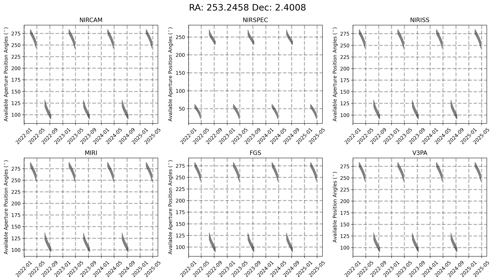
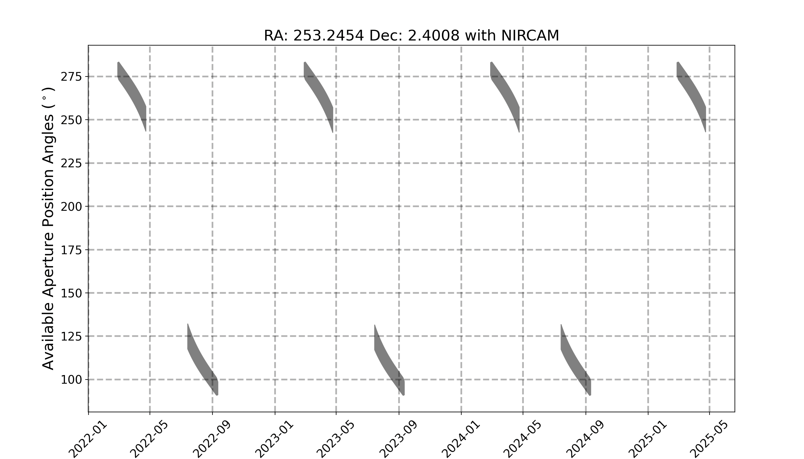

# JWST General Target Visbility Tool (jwst_gtvt)

JWST requires shielding from the sun for operation, which limits the available position angles observable at a given time.  
This script calculates the allowed position angle for a given Right Ascension and Declination for each instrument on the telescope.

# Dependencies

This tool requires a few packages all of which are included in the Anaconda python distribution.

* NumPy

* Maplotlib

* AstroPy

# Installation

You can install the tool using `pip` with 
`pip install git+https://github.com/mattjhill/jwst_gtvt.git`

Alternatively, you can download the .zip file or clone the respository from GitHub and install the tool from inside the resulting directory with
`python setup.py install`

# Usage
To see the help info use

    $ jwst_gtvt -h
        usage: jwst_gtvt [-h] [--v3pa V3PA] [--save_plot SAVE_PLOT]
                         [--save_table SAVE_TABLE] [--instrument INSTRUMENT]
                         [--name NAME] [--start_date START_DATE] [--end_date END_DATE]
                         ra dec

        positional arguments:
          ra                    Right Ascension of target in either sexagesimal
                                (hh:mm:ss.s) or degrees.
          dec                   Declination of target in either sexagesimal
                                (dd:mm:ss.s) or degrees.

        optional arguments:
          -h, --help            show this help message and exit
          --v3pa V3PA           Specify a desired V3 (telescope frame) Position Angle.
          --save_plot SAVE_PLOT
                                Path of file to save plot output.
          --save_table SAVE_TABLE
                                Path of file to save table output.
          --instrument INSTRUMENT
                                If specified plot shows only windows for this
                                instrument. Options: nircam, nirspec, niriss, miri,
                                fgs, v3 (case insensitive).
          --name NAME           Target Name to appear on plots. Names with space
                                should use double quotes e.g. "NGC 6240".
          --start_date START_DATE
                                Start date for visibility search in yyyy-mm-dd format.
                                Earliest available is 2018-01-01.
          --end_date END_DATE   End date for visibility search in yyyy-mm-dd format.
                                Latest available is 2021-12-31.
# Example

By default you need only specify R.A. and Dec. in either sexigesimal or degrees.
The observability windows will be printed to the terminal and a plot showing the windows for each instrument will pop up.
`jwst_gtvt 16:52:58.9 02:24:03`
`jwst_gtvt 253.2458 2.4008`

Setting the `--name` flag will add a target name to the plot title

`jwst_gtvt 16:52:58.9 02:24:03 --name "NGC 6240"`

You can specify the instrument via the `--instrument` flag.

`jwst_gtvt 16:52:58.9 02:24:03 --name "NGC 6240" --instrument nircam`

and the resulting plot will only contain the windows for the specified instrument.
The allowed values for `--instrument` are 'nircam', 'nirspec', 'niriss', 'miri', 'fgs', and 'v3' (case insensitive).

You can save the text ouput to a file instead of having it output to terminal with `--save_table`.  
Likewise, you can save the plot with `--save_plot`.
The plot can be saved in any format supported by matplotlib (.png, .jpeg, .pdf, .eps) by specifying the desired extension in the filename.

`jwst_gtvt 16:52:58.9 02:24:03 --save_table visibility.txt --save_plot visibility.png`

If you only want to plot a specific range of dates, rather than the entire available ephemeris you specify a `--start_date` or `--end_date` in ISO format (yyyy-mm-dd).
For example
`jwst_gtvt 16:52:58.9 02:24:03 --name "NGC 6240" --start_date 2019-01-01 --end_date 2020-01-01`

Specifying the `--v3pa` will display the observing windows which contain the desired V3 position angle in the text output.

Below is an example of the full text output
`
    $ jwst_gtvt 16:52:58.9 02:24:03
    Using Equatorial Coordinates

           Target
                    ecliptic
    RA      Dec     latitude
      0.000   0.000   0.000

    Checked interval [2019-01-01, 2020-12-31]
    |           Window [days]                 |    Normal V3 PA [deg]    |
       Start           End         Duration         Start         End          RA             Dec
     2019-06-16      2019-08-08        52.59     246.56334     246.56319       0.00000       0.00000
     2019-11-07      2019-12-27        49.55      66.56348      66.56333       0.00000       0.00000
     2020-06-15      2020-08-07        52.59     246.56338     246.56322       0.00000       0.00000
     2020-11-07      2020-12-26        49.56      66.56356      66.56338       0.00000       0.00000

                    V3PA          NIRCam           NIRSpec         NIRISS           MIRI          FGS
       Date      min    max      min    max       min    max     min    max      min    max      min    max

    2019-06-17   242.85 250.27   242.83 250.25    20.34  27.76   242.28 249.70   247.87 255.29   241.60 249.02
    2019-06-18   242.26 250.87   242.23 250.84    19.74  28.36   241.69 250.30   247.27 255.89   241.00 249.62
    2019-06-19   241.66 251.47   241.63 251.44    19.15  28.96   241.09 250.90   246.67 256.48   240.41 250.22
    2019-06-20   241.46 251.67   241.43 251.64    18.95  29.15   240.89 251.10   246.48 256.68   240.21 250.42
    2019-06-21   241.46 251.66   241.44 251.64    18.95  29.15   240.89 251.09   246.48 256.68   240.21 250.41
    2019-06-22   241.46 251.66   241.44 251.64    18.95  29.15   240.89 251.09   246.48 256.68   240.21 250.41
    2019-06-23   241.46 251.66   241.44 251.64    18.95  29.15   240.89 251.09   246.48 256.68   240.21 250.41
    2019-06-24   241.46 251.67   241.43 251.64    18.95  29.15   240.89 251.10   246.48 256.68   240.21 250.42
    2019-06-25   241.46 251.67   241.43 251.64    18.94  29.16   240.89 251.10   246.47 256.69   240.21 250.42
    2019-06-26   241.45 251.68   241.43 251.65    18.94  29.16   240.88 251.11   246.47 256.69   240.20 250.42
    2019-06-27   241.45 251.68   241.42 251.65    18.93  29.17   240.88 251.11   246.46 256.70   240.19 250.43
    2019-06-28   241.44 251.69   241.41 251.66    18.92  29.18   240.87 251.12   246.45 256.70   240.19 250.44
    2019-06-29   241.43 251.70   241.40 251.67    18.92  29.19   240.86 251.13   246.44 256.71   240.18 250.45
    2019-06-30   241.42 251.71   241.39 251.68    18.90  29.20   240.85 251.14   246.43 256.72   240.17 250.46
    2019-07-01   241.40 251.72   241.38 251.70    18.89  29.21   240.83 251.15   246.42 256.74   240.15 250.47
    2019-07-02   241.39 251.74   241.36 251.71    18.88  29.22   240.82 251.17   246.41 256.75   240.14 250.49
    2019-07-03   241.38 251.75   241.35 251.72    18.86  29.24   240.81 251.18   246.39 256.77   240.12 250.50
    2019-07-04   241.36 251.77   241.33 251.74    18.85  29.26   240.79 251.20   246.37 256.78   240.11 250.52
    2019-07-05   241.34 251.79   241.31 251.76    18.83  29.27   240.77 251.22   246.36 256.80   240.09 250.54
    2019-07-06   241.32 251.81   241.29 251.78    18.81  29.29   240.75 251.24   246.34 256.82   240.07 250.56
    2019-07-07   241.30 251.83   241.27 251.80    18.79  29.32   240.73 251.26   246.31 256.84   240.05 250.58
    2019-07-08   241.28 251.85   241.25 251.83    18.76  29.34   240.71 251.28   246.29 256.87   240.02 250.60
    2019-07-09   241.25 251.88   241.22 251.85    18.74  29.36   240.68 251.31   246.27 256.89   240.00 250.63
    2019-07-10   241.22 251.90   241.20 251.88    18.71  29.39   240.65 251.33   246.24 256.92   239.97 250.65
    2019-07-11   241.19 251.93   241.17 251.91    18.68  29.42   240.62 251.36   246.21 256.95   239.94 250.68
    2019-07-12   241.16 251.96   241.14 251.94    18.65  29.45   240.59 251.39   246.18 256.98   239.91 250.71
    2019-07-13   241.13 251.99   241.11 251.97    18.62  29.48   240.56 251.42   246.15 257.01   239.88 250.74
    2019-07-14   241.10 252.03   241.07 252.00    18.59  29.52   240.53 251.46   246.11 257.04   239.85 250.78
    2019-07-15   241.06 252.06   241.04 252.04    18.55  29.55   240.49 251.49   246.08 257.08   239.81 250.81
    2019-07-16   241.02 252.10   241.00 252.08    18.51  29.59   240.45 251.53   246.04 257.12   239.77 250.85
    2019-07-17   240.98 252.14   240.96 252.12    18.47  29.63   240.41 251.57   246.00 257.16   239.73 250.89
    2019-07-18   240.94 252.19   240.91 252.16    18.43  29.67   240.37 251.62   245.96 257.20   239.69 250.93
    2019-07-19   240.90 252.23   240.87 252.20    18.38  29.72   240.33 251.66   245.91 257.24   239.65 250.98
    2019-07-20   240.85 252.28   240.82 252.25    18.34  29.76   240.28 251.71   245.87 257.29   239.60 251.03
    2019-07-21   240.80 252.33   240.77 252.30    18.29  29.81   240.23 251.76   245.82 257.34   239.55 251.08
    2019-07-22   240.75 252.38   240.72 252.35    18.24  29.87   240.18 251.81   245.76 257.39   239.50 251.13
    2019-07-23   240.69 252.43   240.67 252.41    18.18  29.92   240.12 251.86   245.71 257.45   239.44 251.18
    2019-07-24   240.64 252.49   240.61 252.46    18.12  29.98   240.07 251.92   245.65 257.50   239.39 251.24
    2019-07-25   240.58 252.55   240.55 252.52    18.06  30.04   240.01 251.98   245.59 257.56   239.33 251.30
    2019-07-26   240.51 252.61   240.49 252.59    18.00  30.10   239.94 252.04   245.53 257.63   239.26 251.36
    2019-07-27   240.45 252.68   240.42 252.65    17.94  30.17   239.88 252.11   245.46 257.69   239.20 251.43
    2019-07-28   240.38 252.75   240.35 252.72    17.87  30.24   239.81 252.18   245.39 257.76   239.13 251.50
    2019-07-29   240.31 252.82   240.28 252.79    17.79  30.31   239.74 252.25   245.32 257.84   239.06 251.57
    2019-07-30   240.23 252.90   240.20 252.87    17.72  30.38   239.66 252.33   245.25 257.91   238.98 251.65
    2019-07-31   240.15 252.98   240.12 252.95    17.64  30.46   239.58 252.41   245.17 257.99   238.90 251.73
    2019-08-01   240.07 253.06   240.04 253.03    17.55  30.55   239.50 252.49   245.08 258.08   238.82 251.81
    2019-08-02   239.98 253.15   239.95 253.12    17.47  30.64   239.41 252.58   244.99 258.16   238.73 251.90
    2019-08-03   239.89 253.24   239.86 253.21    17.37  30.73   239.32 252.67   244.90 258.26   238.64 251.99
    2019-08-04   239.79 253.34   239.76 253.31    17.28  30.82   239.22 252.77   244.80 258.35   238.54 252.09
    2019-08-05   239.69 253.44   239.66 253.41    17.18  30.93   239.12 252.87   244.70 258.45   238.44 252.19
    2019-08-06   239.58 253.54   239.55 253.52    17.07  31.03   239.01 252.97   244.60 258.56   238.33 252.29
    2019-08-07   239.47 253.66   239.44 253.63    16.96  31.14   238.90 253.09   244.48 258.67   238.22 252.41
    2019-08-08   239.35 253.78   239.32 253.75    16.84  31.26   238.78 253.21   244.37 258.79   238.10 252.52

    2019-11-08    59.34  73.79    59.32  73.76   196.83 211.27    58.77  73.22    64.36  78.80    58.09  72.53
    2019-11-09    59.47  73.66    59.44  73.64   196.95 211.15    58.90  73.09    64.48  78.68    58.21  72.41
    2019-11-10    59.58  73.54    59.56  73.52   197.07 211.03    59.01  72.97    64.60  78.56    58.33  72.29
    2019-11-11    59.69  73.43    59.67  73.41   197.18 210.92    59.12  72.86    64.71  78.45    58.44  72.18
    2019-11-12    59.80  73.33    59.77  73.30   197.29 210.81    59.23  72.76    64.82  78.34    58.55  72.08
    2019-11-13    59.90  73.22    59.88  73.20   197.39 210.71    59.33  72.65    64.92  78.24    58.65  71.97
    2019-11-14    60.00  73.13    59.97  73.10   197.49 210.62    59.43  72.56    65.01  78.14    58.75  71.88
    2019-11-15    60.09  73.04    60.06  73.01   197.58 210.52    59.52  72.47    65.10  78.05    58.84  71.79
    2019-11-16    60.18  72.95    60.15  72.92   197.66 210.44    59.61  72.38    65.19  77.97    58.93  71.70
    2019-11-17    60.26  72.87    60.23  72.84   197.75 210.35    59.69  72.30    65.27  77.88    59.01  71.62
    2019-11-18    60.34  72.79    60.31  72.76   197.83 210.28    59.77  72.22    65.35  77.80    59.09  71.54
    2019-11-19    60.41  72.71    60.39  72.69   197.90 210.20    59.84  72.14    65.43  77.73    59.16  71.46
    2019-11-20    60.48  72.64    60.46  72.62   197.97 210.13    59.91  72.07    65.50  77.66    59.23  71.39
    2019-11-21    60.55  72.57    60.53  72.55   198.04 210.06    59.98  72.00    65.57  77.59    59.30  71.32
    2019-11-22    60.62  72.51    60.59  72.48   198.10 210.00    60.05  71.94    65.63  77.53    59.37  71.26
    2019-11-23    60.68  72.45    60.65  72.42   198.17 209.94    60.11  71.88    65.69  77.46    59.43  71.20
    2019-11-24    60.74  72.39    60.71  72.36   198.22 209.88    60.17  71.82    65.75  77.41    59.49  71.14
    2019-11-25    60.79  72.33    60.77  72.31   198.28 209.82    60.22  71.76    65.81  77.35    59.54  71.08
    2019-11-26    60.84  72.28    60.82  72.26   198.33 209.77    60.27  71.71    65.86  77.30    59.59  71.03
    2019-11-27    60.89  72.23    60.87  72.21   198.38 209.72    60.32  71.66    65.91  77.25    59.64  70.98
    2019-11-28    60.94  72.18    60.92  72.16   198.43 209.67    60.37  71.61    65.96  77.20    59.69  70.93
    2019-11-29    60.99  72.14    60.96  72.11   198.47 209.63    60.42  71.57    66.00  77.16    59.74  70.89
    2019-11-30    61.03  72.10    61.00  72.07   198.52 209.58    60.46  71.53    66.04  77.11    59.78  70.85
    2019-12-01    61.07  72.06    61.04  72.03   198.56 209.54    60.50  71.49    66.08  77.07    59.82  70.81
    2019-12-02    61.11  72.02    61.08  71.99   198.59 209.51    60.54  71.45    66.12  77.03    59.86  70.77
    2019-12-03    61.14  71.98    61.12  71.96   198.63 209.47    60.57  71.41    66.16  77.00    59.89  70.73
    2019-12-04    61.18  71.95    61.15  71.92   198.66 209.44    60.61  71.38    66.19  76.97    59.93  70.70
    2019-12-05    61.21  71.92    61.18  71.89   198.70 209.41    60.64  71.35    66.22  76.93    59.96  70.67
    2019-12-06    61.24  71.89    61.21  71.86   198.72 209.38    60.67  71.32    66.25  76.90    59.99  70.64
    2019-12-07    61.26  71.86    61.24  71.84   198.75 209.35    60.69  71.29    66.28  76.88    60.01  70.61
    2019-12-08    61.29  71.84    61.26  71.81   198.78 209.32    60.72  71.27    66.31  76.85    60.04  70.59
    2019-12-09    61.31  71.81    61.29  71.79   198.80 209.30    60.74  71.24    66.33  76.83    60.06  70.56
    2019-12-10    61.34  71.79    61.31  71.76   198.82 209.28    60.77  71.22    66.35  76.81    60.09  70.54
    2019-12-11    61.36  71.77    61.33  71.74   198.84 209.26    60.79  71.20    66.37  76.79    60.11  70.52
    2019-12-12    61.37  71.75    61.35  71.73   198.86 209.24    60.80  71.18    66.39  76.77    60.12  70.50
    2019-12-13    61.39  71.74    61.36  71.71   198.88 209.22    60.82  71.17    66.41  76.75    60.14  70.49
    2019-12-14    61.41  71.72    61.38  71.69   198.89 209.21    60.84  71.15    66.42  76.74    60.15  70.47
    2019-12-15    61.42  71.71    61.39  71.68   198.91 209.20    60.85  71.14    66.43  76.72    60.17  70.46
    2019-12-16    61.43  71.70    61.40  71.67   198.92 209.18    60.86  71.13    66.44  76.71    60.18  70.45
    2019-12-17    61.44  71.69    61.41  71.66   198.93 209.17    60.87  71.12    66.45  76.70    60.19  70.44
    2019-12-18    61.45  71.68    61.42  71.65   198.93 209.17    60.88  71.11    66.46  76.69    60.20  70.43
    2019-12-19    61.45  71.67    61.43  71.65   198.94 209.16    60.88  71.10    66.47  76.69    60.20  70.42
    2019-12-20    61.46  71.67    61.43  71.64   198.95 209.16    60.89  71.10    66.47  76.68    60.21  70.42
    2019-12-21    61.46  71.67    61.44  71.64   198.95 209.15    60.89  71.10    66.48  76.68    60.21  70.41
    2019-12-22    61.46  71.66    61.44  71.64   198.95 209.15    60.89  71.09    66.48  76.68    60.21  70.41
    2019-12-23    61.46  71.66    61.44  71.64   198.95 209.15    60.89  71.09    66.48  76.68    60.21  70.41
    2019-12-24    61.46  71.67    61.43  71.64   198.95 209.15    60.89  71.10    66.48  76.68    60.21  70.41
    2019-12-25    61.53  71.60    61.50  71.57   199.01 209.09    60.96  71.03    66.54  76.62    60.28  70.35
    2019-12-26    62.16  70.96    62.14  70.94   199.65 208.45    61.59  70.39    67.18  75.98    60.91  69.71
    2019-12-27    62.80  70.32    62.78  70.30   200.29 207.81    62.23  69.75    67.82  75.34    61.55  69.07

    2020-06-16   243.01 250.12   242.98 250.09    20.49  27.61   242.44 249.55   248.02 255.13   241.76 248.87
    2020-06-17   242.41 250.72   242.38 250.69    19.90  28.20   241.84 250.15   247.43 255.73   241.16 249.47
    2020-06-18   241.81 251.31   241.79 251.29    19.30  28.80   241.24 250.74   246.83 256.33   240.56 250.06
    2020-06-19   241.46 251.67   241.43 251.64    18.95  29.15   240.89 251.10   246.48 256.68   240.21 250.42
    2020-06-20   241.46 251.66   241.44 251.64    18.95  29.15   240.89 251.09   246.48 256.68   240.21 250.41
    2020-06-21   241.46 251.66   241.44 251.64    18.95  29.15   240.89 251.09   246.48 256.68   240.21 250.41
    2020-06-22   241.46 251.66   241.44 251.64    18.95  29.15   240.89 251.09   246.48 256.68   240.21 250.41
    2020-06-23   241.46 251.67   241.43 251.64    18.95  29.15   240.89 251.10   246.48 256.68   240.21 250.41
    2020-06-24   241.46 251.67   241.43 251.64    18.95  29.16   240.89 251.10   246.47 256.68   240.21 250.42
    2020-06-25   241.45 251.67   241.43 251.65    18.94  29.16   240.88 251.10   246.47 256.69   240.20 250.42
    2020-06-26   241.45 251.68   241.42 251.65    18.93  29.17   240.88 251.11   246.46 256.69   240.20 250.43
    2020-06-27   241.44 251.69   241.41 251.66    18.93  29.17   240.87 251.12   246.45 256.70   240.19 250.44
    2020-06-28   241.43 251.70   241.40 251.67    18.92  29.18   240.86 251.13   246.45 256.71   240.18 250.45
    2020-06-29   241.42 251.71   241.39 251.68    18.91  29.19   240.85 251.14   246.44 256.72   240.17 250.46
    2020-06-30   241.41 251.72   241.38 251.69    18.90  29.21   240.84 251.15   246.42 256.73   240.16 250.47
    2020-07-01   241.39 251.73   241.37 251.71    18.88  29.22   240.82 251.16   246.41 256.75   240.14 250.48
    2020-07-02   241.38 251.75   241.35 251.72    18.87  29.23   240.81 251.18   246.39 256.76   240.13 250.50
    2020-07-03   241.36 251.76   241.34 251.74    18.85  29.25   240.79 251.19   246.38 256.78   240.11 250.51
    2020-07-04   241.35 251.78   241.32 251.76    18.83  29.27   240.78 251.21   246.36 256.80   240.09 250.53
    2020-07-05   241.33 251.80   241.30 251.77    18.81  29.29   240.76 251.23   246.34 256.82   240.07 250.55
    2020-07-06   241.30 251.82   241.28 251.80    18.79  29.31   240.73 251.25   246.32 256.84   240.05 250.57
    2020-07-07   241.28 251.85   241.25 251.82    18.77  29.33   240.71 251.28   246.30 256.86   240.03 250.59
    2020-07-08   241.26 251.87   241.23 251.84    18.74  29.36   240.69 251.30   246.27 256.89   240.01 250.62
    2020-07-09   241.23 251.90   241.20 251.87    18.72  29.38   240.66 251.33   246.25 256.91   239.98 250.65
    2020-07-10   241.20 251.92   241.18 251.90    18.69  29.41   240.63 251.35   246.22 256.94   239.95 250.67
    2020-07-11   241.17 251.95   241.15 251.93    18.66  29.44   240.60 251.38   246.19 256.97   239.92 250.70
    2020-07-12   241.14 251.99   241.11 251.96    18.63  29.47   240.57 251.42   246.16 257.00   239.89 250.74
    2020-07-13   241.11 252.02   241.08 251.99    18.59  29.51   240.54 251.45   246.12 257.03   239.86 250.77
    2020-07-14   241.07 252.05   241.05 252.03    18.56  29.54   240.50 251.48   246.09 257.07   239.82 250.80
    2020-07-15   241.03 252.09   241.01 252.07    18.52  29.58   240.46 251.52   246.05 257.11   239.78 250.84
    2020-07-16   240.99 252.13   240.97 252.11    18.48  29.62   240.42 251.56   246.01 257.15   239.74 250.88
    2020-07-17   240.95 252.17   240.93 252.15    18.44  29.66   240.38 251.60   245.97 257.19   239.70 250.92
    2020-07-18   240.91 252.22   240.88 252.19    18.40  29.71   240.34 251.65   245.92 257.23   239.66 250.97
    2020-07-19   240.86 252.26   240.84 252.24    18.35  29.75   240.29 251.69   245.88 257.28   239.61 251.01
    2020-07-20   240.81 252.31   240.79 252.29    18.30  29.80   240.24 251.74   245.83 257.33   239.56 251.06
    2020-07-21   240.76 252.36   240.74 252.34    18.25  29.85   240.19 251.79   245.78 257.38   239.51 251.11
    2020-07-22   240.71 252.42   240.68 252.39    18.20  29.91   240.14 251.85   245.72 257.43   239.46 251.17
    2020-07-23   240.65 252.47   240.63 252.45    18.14  29.96   240.08 251.90   245.67 257.49   239.40 251.22
    2020-07-24   240.59 252.53   240.57 252.51    18.08  30.02   240.02 251.96   245.61 257.55   239.34 251.28
    2020-07-25   240.53 252.60   240.50 252.57    18.02  30.08   239.96 252.03   245.55 257.61   239.28 251.35
    2020-07-26   240.47 252.66   240.44 252.63    17.95  30.15   239.90 252.09   245.48 257.68   239.21 251.41
    2020-07-27   240.40 252.73   240.37 252.70    17.88  30.22   239.83 252.16   245.41 257.74   239.15 251.48
    2020-07-28   240.33 252.80   240.30 252.77    17.81  30.29   239.76 252.23   245.34 257.82   239.07 251.55
    2020-07-29   240.25 252.88   240.22 252.85    17.74  30.36   239.68 252.31   245.27 257.89   239.00 251.63
    2020-07-30   240.17 252.96   240.14 252.93    17.66  30.44   239.60 252.39   245.19 257.97   238.92 251.70
    2020-07-31   240.09 253.04   240.06 253.01    17.58  30.53   239.52 252.47   245.10 258.05   238.84 251.79
    2020-08-01   240.00 253.12   239.98 253.10    17.49  30.61   239.43 252.55   245.02 258.14   238.75 251.87
    2020-08-02   239.91 253.22   239.88 253.19    17.40  30.70   239.34 252.65   244.93 258.23   238.66 251.97
    2020-08-03   239.82 253.31   239.79 253.28    17.30  30.80   239.25 252.74   244.83 258.33   238.56 252.06
    2020-08-04   239.71 253.41   239.69 253.39    17.20  30.90   239.14 252.84   244.73 258.43   238.46 252.16
    2020-08-05   239.61 253.52   239.58 253.49    17.10  31.00   239.04 252.95   244.62 258.53   238.36 252.27
    2020-08-06   239.50 253.63   239.47 253.60    16.99  31.12   238.93 253.06   244.51 258.64   238.25 252.38
    2020-08-07   239.38 253.74   239.36 253.72    16.87  31.23   238.81 253.17   244.40 258.76   238.13 252.49

    2020-11-08    59.43  73.69    59.41  73.67   196.92 211.18    58.86  73.12    64.45  78.71    58.18  72.44
    2020-11-09    59.55  73.57    59.53  73.55   197.04 211.06    58.98  73.00    64.57  78.59    58.30  72.32
    2020-11-10    59.67  73.46    59.64  73.43   197.15 210.95    59.10  72.89    64.68  78.48    58.42  72.21
    2020-11-11    59.77  73.35    59.75  73.33   197.26 210.84    59.20  72.78    64.79  78.37    58.52  72.10
    2020-11-12    59.88  73.25    59.85  73.22   197.36 210.74    59.31  72.68    64.89  78.27    58.63  72.00
    2020-11-13    59.97  73.15    59.95  73.13   197.46 210.64    59.40  72.58    64.99  78.17    58.72  71.90
    2020-11-14    60.07  73.06    60.04  73.03   197.55 210.55    59.50  72.49    65.08  78.08    58.82  71.81
    2020-11-15    60.15  72.97    60.13  72.95   197.64 210.46    59.58  72.40    65.17  77.99    58.90  71.72
    2020-11-16    60.24  72.89    60.21  72.86   197.73 210.38    59.67  72.32    65.25  77.90    58.99  71.64
    2020-11-17    60.32  72.81    60.29  72.78   197.81 210.30    59.75  72.24    65.33  77.82    59.07  71.56
    2020-11-18    60.39  72.73    60.37  72.71   197.88 210.22    59.82  72.16    65.41  77.75    59.14  71.48
    2020-11-19    60.47  72.66    60.44  72.63   197.95 210.15    59.90  72.09    65.48  77.68    59.22  71.41
    2020-11-20    60.54  72.59    60.51  72.57   198.02 210.08    59.97  72.02    65.55  77.61    59.28  71.34
    2020-11-21    60.60  72.53    60.57  72.50   198.09 210.01    60.03  71.96    65.62  77.54    59.35  71.28
    2020-11-22    60.66  72.46    60.64  72.44   198.15 209.95    60.09  71.89    65.68  77.48    59.41  71.21
    2020-11-23    60.72  72.40    60.70  72.38   198.21 209.89    60.15  71.83    65.74  77.42    59.47  71.15
    2020-11-24    60.78  72.35    60.75  72.32   198.27 209.84    60.21  71.78    65.79  77.36    59.53  71.10
    2020-11-25    60.83  72.30    60.81  72.27   198.32 209.78    60.26  71.73    65.85  77.31    59.58  71.04
    2020-11-26    60.88  72.24    60.86  72.22   198.37 209.73    60.31  71.67    65.90  77.26    59.63  70.99
    2020-11-27    60.93  72.20    60.90  72.17   198.42 209.68    60.36  71.63    65.95  77.21    59.68  70.95
    2020-11-28    60.98  72.15    60.95  72.12   198.46 209.64    60.41  71.58    65.99  77.17    59.73  70.90
    2020-11-29    61.02  72.11    60.99  72.08   198.51 209.60    60.45  71.54    66.03  77.12    59.77  70.86
    2020-11-30    61.06  72.07    61.03  72.04   198.55 209.55    60.49  71.50    66.07  77.08    59.81  70.82
    2020-12-01    61.10  72.03    61.07  72.00   198.59 209.52    60.53  71.46    66.11  77.04    59.85  70.78
    2020-12-02    61.13  71.99    61.11  71.97   198.62 209.48    60.56  71.42    66.15  77.01    59.88  70.74
    2020-12-03    61.17  71.96    61.14  71.93   198.66 209.45    60.60  71.39    66.18  76.97    59.92  70.71
    2020-12-04    61.20  71.93    61.17  71.90   198.69 209.41    60.63  71.36    66.22  76.94    59.95  70.68
    2020-12-05    61.23  71.90    61.20  71.87   198.72 209.38    60.66  71.33    66.25  76.91    59.98  70.65
    2020-12-06    61.26  71.87    61.23  71.84   198.75 209.36    60.69  71.30    66.27  76.88    60.01  70.62
    2020-12-07    61.28  71.84    61.26  71.82   198.77 209.33    60.71  71.27    66.30  76.86    60.03  70.59
    2020-12-08    61.31  71.82    61.28  71.79   198.80 209.31    60.74  71.25    66.32  76.83    60.06  70.57
    2020-12-09    61.33  71.80    61.30  71.77   198.82 209.28    60.76  71.23    66.35  76.81    60.08  70.55
    2020-12-10    61.35  71.78    61.32  71.75   198.84 209.26    60.78  71.21    66.37  76.79    60.10  70.53
    2020-12-11    61.37  71.76    61.34  71.73   198.86 209.24    60.80  71.19    66.38  76.77    60.12  70.51
    2020-12-12    61.39  71.74    61.36  71.71   198.87 209.23    60.82  71.17    66.40  76.76    60.14  70.49
    2020-12-13    61.40  71.73    61.38  71.70   198.89 209.21    60.83  71.16    66.42  76.74    60.15  70.47
    2020-12-14    61.42  71.71    61.39  71.69   198.90 209.20    60.85  71.14    66.43  76.73    60.16  70.46
    2020-12-15    61.43  71.70    61.40  71.67   198.91 209.19    60.86  71.13    66.44  76.72    60.18  70.45
    2020-12-16    61.44  71.69    61.41  71.66   198.92 209.18    60.87  71.12    66.45  76.70    60.19  70.44
    2020-12-17    61.45  71.68    61.42  71.65   198.93 209.17    60.88  71.11    66.46  76.70    60.19  70.43
    2020-12-18    61.45  71.67    61.43  71.65   198.94 209.16    60.88  71.10    66.47  76.69    60.20  70.42
    2020-12-19    61.46  71.67    61.43  71.64   198.94 209.16    60.89  71.10    66.47  76.68    60.21  70.42
    2020-12-20    61.46  71.67    61.43  71.64   198.95 209.15    60.89  71.10    66.48  76.68    60.21  70.41
    2020-12-21    61.46  71.66    61.44  71.64   198.95 209.15    60.89  71.09    66.48  76.68    60.21  70.41
    2020-12-22    61.46  71.66    61.44  71.64   198.95 209.15    60.89  71.09    66.48  76.68    60.21  70.41
    2020-12-23    61.46  71.66    61.44  71.64   198.95 209.15    60.89  71.09    66.48  76.68    60.21  70.41
    2020-12-24    61.46  71.67    61.43  71.64   198.95 209.16    60.89  71.10    66.47  76.68    60.21  70.42
    2020-12-25    62.00  71.12    61.98  71.10   199.49 208.61    61.43  70.55    67.02  76.14    60.75  69.87
    2020-12-26    62.64  70.49    62.61  70.46   200.13 207.97    62.07  69.92    67.65  75.50    61.39  69.24

