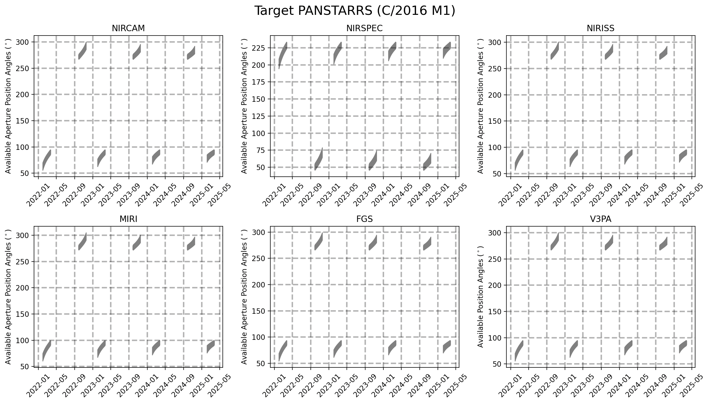

# JWST General Target Visibility Tool (jwst_gtvt)

JWST requires shielding from the Sun for operation, which limits the available position angles observable at a given time. This script calculates the allowed position angle for a given Right Ascension and Declination for each instrument on the telescope.To report any issues, please use the JWST help portal https://jwsthelp.stsci.edu or feel free to open a github issue https://github.com/spacetelescope/jwst_gtvt/issues.

# Dependencies

This tool requires a few packages all of which are included in the Anaconda Python distribution.

* numpy

* maplotlib

* astropy

* astroquery (For moving target support)

# Installation

You can install the tool using `pip` with 
`pip install jwst-gtvt`

Alternatively, you can clone the respository from GitHub and install the tool from inside the resulting directory with
`python setup.py install`

# Usage

There are two scripts available.  `jwst_gtvt` for fixed targets, and `jwst_mtvt` for moving targets.  To see the help info use

    $ jwst_gtvt -h
        usage: jwst_gtvt [-h] [--v3pa V3PA] [--save_plot SAVE_PLOT]
                 [--save_table SAVE_TABLE] [--instrument INSTRUMENT]
                 [--name NAME] [--start_date START_DATE] [--end_date END_DATE]
                 [--no_verbose]
                 ra dec

        positional arguments:
        ra                    Right Ascension of target in either sexagesimal
                                (hh:mm:ss.s) or degrees.
        dec                   Declination of target in either sexagesimal
                                (dd:mm:ss.s) or degrees.

        optional arguments:
        -h, --help            show this help message and exit
        --v3pa V3PA           Specify a desired V3 (telescope frame) Position Angle.
        --save_plot SAVE_PLOT
                                Path of file to save plot output.
        --save_table SAVE_TABLE
                                Path of file to save table output.
        --instrument INSTRUMENT
                                If specified plot shows only windows for this
                                instrument. Options: nircam, nirspec, niriss, miri,
                                fgs, v3 (case insensitive).
        --name NAME           Target Name to appear on plots. Names with space
                                should use double quotes e.g. "NGC 6240".
        --start_date START_DATE
                                Start date for visibility search in yyyy-mm-dd format.
                                Earliest available is 2022-06-01.
        --end_date END_DATE   End date for visibility search in yyyy-mm-dd format.
                                Latest available is 2023-12-31.
        --no_verbose          Suppress table output to screen

# Example

By default you need only specify R.A. and Dec. in either sexigesimal or degrees.
The observability windows will be printed to the terminal and a plot showing the windows for each instrument will pop up.

`$ jwst_gtvt 16:52:58.9 02:24:03`

`$ jwst_gtvt 253.2458 2.4008`

For moving targets, use `jwst_mtvt`

`$ jwst_mtvt Ceres`

Periodic comets and most asteroids benefit from using the `--smallbody` flag

`$ jwst_mtvt 2`  # Venus (no windows)

`$ jwst_mtvt 2 --smallbody`  # Pallas

`$ jwst_mtvt 2P --smallbody`  # Comet Encke

`$ jwst_mtvt C/2016 M1`  # works with or without --smallbody

Setting the `--name` flag will add a target name to the plot title

`$ jwst_gtvt 16:52:58.9 02:24:03 --name "NGC 6240"`

You can specify the instrument via the `--instrument` flag.

`$ jwst_gtvt 16:52:58.9 02:24:03 --name "NGC 6240" --instrument nircam`

and the resulting plot will only contain the windows for the specified instrument.
The allowed values for `--instrument` are 'nircam', 'nirspec', 'niriss', 'miri', 'fgs', and 'v3' (case insensitive).

You can save the text ouput to a file instead of having it output to terminal with `--save_table`.  
Likewise, you can save the plot with `--save_plot`.
The plot can be saved in any format supported by matplotlib (.png, .jpeg, .pdf, .eps) by specifying the desired extension in the filename.

`$ jwst_gtvt 16:52:58.9 02:24:03 --save_table visibility.txt --save_plot visibility.png`

If you only want to plot a specific range of dates, rather than the entire available ephemeris you specify a `--start_date` or `--end_date` in ISO format (yyyy-mm-dd).
For example

`$ jwst_gtvt 16:52:58.9 02:24:03 --name "NGC 6240" --start_date 2022-06-01 --end_date 2023-06-01`

Specifying the `--v3pa` will display the observing windows which contain the desired V3 position angle in the text output.

Below is an example of the full text output

    $ jwst_gtvt 16:52:58.9 02:24:03

            Target
                        ecliptic
        RA      Dec     latitude
        253.245   2.401  24.771

        Checked interval [2022-06-01, 2023-12-31]
        |           Window [days]                 |    Normal V3 PA [deg]    |
        Start           End         Duration         Start         End         RA            Dec     
        2022-07-13      2022-09-10        59.00     123.90127      94.59937     253.24542       2.40083 
        2023-02-24      2023-04-23        58.00     279.52495     249.40672     253.24542       2.40083 
        2023-07-13      2023-09-10        59.00     124.06733      94.73488     253.24542       2.40083 

                        V3PA          NIRCam           NIRSpec         NIRISS           MIRI          FGS
        Date      min    max      min    max       min    max     min    max      min    max      min    max

        2022-07-14   116.69 130.95   116.66 130.93   254.18 268.44   116.12 130.38   121.71 135.97   115.44 129.70
        2022-07-15   116.01 130.09   115.99 130.06   253.50 267.58   115.44 129.52   121.03 135.10   114.76 128.84
        2022-07-16   115.35 129.24   115.32 129.22   252.84 266.73   114.78 128.67   120.37 134.26   114.10 127.99
        2022-07-17   114.70 128.42   114.68 128.40   252.19 265.91   114.13 127.85   119.72 133.44   113.45 127.17
        2022-07-18   114.07 127.62   114.05 127.60   251.56 265.11   113.50 127.05   119.09 132.64   112.82 126.37
        2022-07-19   113.46 126.84   113.43 126.82   250.95 264.33   112.89 126.27   118.47 131.86   112.21 125.59
        2022-07-20   112.86 126.08   112.83 126.06   250.34 263.57   112.29 125.51   117.87 131.10   111.61 124.83
        2022-07-21   112.27 125.34   112.24 125.32   249.75 262.83   111.70 124.77   117.28 130.36   111.02 124.09
        2022-07-22   111.69 124.62   111.66 124.59   249.18 262.11   111.12 124.05   116.71 129.63   110.44 123.37
        2022-07-23   111.13 123.91   111.10 123.89   248.61 261.40   110.56 123.34   116.14 128.93   109.87 122.66
        2022-07-24   110.57 123.22   110.55 123.20   248.06 260.71   110.00 122.65   115.59 128.24   109.32 121.97
        2022-07-25   110.03 122.55   110.00 122.52   247.52 260.04   109.46 121.98   115.04 127.56   108.78 121.30
        2022-07-26   109.50 121.89   109.47 121.86   246.98 259.38   108.93 121.32   114.51 126.90   108.24 120.64
        2022-07-27   108.97 121.24   108.95 121.22   246.46 258.73   108.40 120.67   113.99 126.26   107.72 119.99
        2022-07-28   108.46 120.61   108.43 120.58   245.95 258.10   107.89 120.04   113.47 125.63   107.21 119.36
        2022-07-29   107.95 119.99   107.93 119.97   245.44 257.48   107.38 119.42   112.97 125.01   106.70 118.74
        2022-07-30   107.45 119.39   107.43 119.36   244.94 256.87   106.88 118.82   112.47 124.40   106.20 118.14
        2022-07-31   106.96 118.79   106.94 118.77   244.45 256.28   106.39 118.22   111.98 123.81   105.71 117.54
        2022-08-01   106.48 118.21   106.46 118.18   243.97 255.70   105.91 117.64   111.50 123.22   105.23 116.96
        2022-08-02   106.01 117.64   105.98 117.61   243.49 255.12   105.44 117.07   111.02 122.65   104.76 116.39
        2022-08-03   105.54 117.08   105.51 117.05   243.02 254.56   104.97 116.51   110.55 122.09   104.29 115.82
        2022-08-04   105.07 116.52   105.05 116.50   242.56 254.01   104.50 115.95   110.09 121.54   103.82 115.27
        2022-08-05   104.62 115.98   104.59 115.96   242.10 253.47   104.05 115.41   109.63 121.00   103.37 114.73
        2022-08-06   104.17 115.45   104.14 115.42   241.65 252.94   103.60 114.88   109.18 120.46   102.91 114.20
        2022-08-07   103.72 114.92   103.69 114.90   241.21 252.41   103.15 114.35   108.73 119.94   102.47 113.67
        2022-08-08   103.28 114.41   103.25 114.38   240.77 251.90   102.71 113.84   108.29 119.42   102.03 113.16
        2022-08-09   102.84 113.90   102.81 113.87   240.33 251.39   102.27 113.33   107.86 118.92   101.59 112.65
        2022-08-10   102.41 113.40   102.38 113.37   239.90 250.89   101.84 112.83   107.42 118.41   101.16 112.15
        2022-08-11   101.98 112.91   101.95 112.88   239.47 250.39   101.41 112.34   106.99 117.92   100.73 111.65
        2022-08-12   101.55 112.42   101.53 112.39   239.04 249.91   100.98 111.85   106.57 117.43   100.30 111.17
        2022-08-13   101.13 111.94   101.11 111.91   238.62 249.43   100.56 111.37   106.15 116.95    99.88 110.69
        2022-08-14   100.71 111.46   100.69 111.44   238.20 248.95   100.14 110.89   105.73 116.48    99.46 110.21
        2022-08-15   100.30 111.00   100.27 110.97   237.79 248.48    99.73 110.43   105.31 116.01    99.05 109.75
        2022-08-16    99.89 110.53    99.86 110.51   237.37 248.02    99.32 109.96   104.90 115.55    98.64 109.28
        2022-08-17    99.48 110.08    99.45 110.05   236.96 247.56    98.91 109.51   104.49 115.09    98.23 108.83
        2022-08-18    99.07 109.63    99.04 109.60   236.56 247.11    98.50 109.06   104.08 114.64    97.82 108.37
        2022-08-19    98.66 109.18    98.64 109.15   236.15 246.67    98.09 108.61   103.68 114.19    97.41 107.93
        2022-08-20    98.26 108.74    98.23 108.71   235.75 246.22    97.69 108.17   103.27 113.75    97.01 107.48
        2022-08-21    97.86 108.30    97.83 108.27   235.34 245.78    97.29 107.73   102.87 113.31    96.61 107.05
        2022-08-22    97.46 107.86    97.43 107.84   234.94 245.35    96.89 107.29   102.47 112.88    96.20 106.61
        2022-08-23    97.06 107.43    97.03 107.41   234.54 244.92    96.49 106.86   102.07 112.45    95.80 106.18
        2022-08-24    96.66 107.01    96.63 106.98   234.14 244.49    96.09 106.44   101.67 112.02    95.41 105.75
        2022-08-25    96.26 106.58    96.23 106.56   233.75 244.07    95.69 106.01   101.27 111.60    95.01 105.33
        2022-08-26    95.86 106.16    95.84 106.13   233.35 243.65    95.29 105.59   100.88 111.18    94.61 104.91
        2022-08-27    95.46 105.74    95.44 105.72   232.95 243.23    94.89 105.17   100.48 110.76    94.21 104.49
        2022-08-28    95.07 105.33    95.04 105.30   232.56 242.82    94.50 104.76   100.08 110.34    93.82 104.08
        2022-08-29    94.67 104.92    94.65 104.89   232.16 242.40    94.10 104.35    99.69 109.93    93.42 103.67
        2022-08-30    94.27 104.51    94.25 104.48   231.76 241.99    93.70 103.94    99.29 109.52    93.02 103.25
        2022-08-31    93.88 104.10    93.85 104.07   231.36 241.58    93.31 103.53    98.89 109.11    92.63 102.85
        2022-09-01    93.48 103.69    93.45 103.66   230.97 241.18    92.91 103.12    98.50 108.71    92.23 102.44
        2022-09-02    93.08 103.29    93.05 103.26   230.57 240.77    92.51 102.72    98.10 108.30    91.83 102.04
        2022-09-03    92.68 102.88    92.66 102.86   230.17 240.37    92.11 102.31    97.70 107.90    91.43 101.63
        2022-09-04    92.28 102.48    92.25 102.45   229.77 239.97    91.71 101.91    97.30 107.50    91.03 101.23
        2022-09-05    91.88 102.08    91.85 102.05   229.37 239.57    91.31 101.51    96.89 107.10    90.63 100.83
        2022-09-06    91.48 101.68    91.45 101.65   228.96 239.17    90.91 101.11    96.49 106.70    90.23 100.43
        2022-09-07    91.12 101.24    91.09 101.21   228.60 238.72    90.55 100.67    96.13 106.25    89.87  99.99
        2022-09-08    91.26 100.28    91.24 100.26   228.75 237.77    90.69  99.71    96.28 105.30    90.01  99.03
        2022-09-09    91.41  99.33    91.38  99.30   228.90 236.82    90.84  98.76    96.42 104.35    90.16  98.08
        2022-09-10    91.55  98.38    91.53  98.35   229.04 235.86    90.98  97.81    96.57 103.39    90.30  97.13

        2023-02-25   275.95 283.02   275.92 282.99    53.43  60.51   275.38 282.45   280.96 288.03   274.70 281.77
        2023-02-26   274.95 283.16   274.93 283.13    52.44  60.65   274.38 282.59   279.97 288.18   273.70 281.91
        2023-02-27   273.96 283.30   273.93 283.28    51.45  60.79   273.39 282.73   278.98 288.32   272.71 282.05
        2023-02-28   273.11 283.31   273.08 283.29    50.59  60.80   272.54 282.74   278.12 288.33   271.85 282.06
        2023-03-01   272.69 282.89   272.66 282.86    50.17  60.38   272.12 282.32   277.70 287.90   271.44 281.64
        2023-03-02   272.27 282.47   272.24 282.44    49.75  59.95   271.70 281.90   277.28 287.48   271.01 281.22
        2023-03-03   271.84 282.04   271.82 282.02    49.33  59.53   271.27 281.47   276.86 287.06   270.59 280.79
        2023-03-04   271.42 281.63   271.40 281.60    48.91  59.11   270.85 281.06   276.44 286.64   270.17 280.37
        2023-03-05   271.00 281.21   270.97 281.18    48.49  58.69   270.43 280.64   276.01 286.22   269.75 279.96
        2023-03-06   270.57 280.79   270.55 280.76    48.06  58.28   270.00 280.22   275.59 285.81   269.32 279.54
        2023-03-07   270.15 280.37   270.12 280.35    47.64  57.86   269.58 279.80   275.16 285.39   268.90 279.12
        2023-03-08   269.72 279.96   269.69 279.93    47.21  57.45   269.15 279.39   274.74 284.97   268.47 278.71
        2023-03-09   269.29 279.54   269.26 279.52    46.78  57.03   268.72 278.97   274.31 284.56   268.04 278.29
        2023-03-10   268.86 279.13   268.83 279.10    46.35  56.62   268.29 278.56   273.87 284.14   267.61 277.88
        2023-03-11   268.42 278.71   268.40 278.69    45.91  56.20   267.85 278.14   273.44 283.73   267.17 277.46
        2023-03-12   267.99 278.30   267.96 278.27    45.47  55.79   267.42 277.73   273.00 283.32   266.73 277.05
        2023-03-13   267.54 277.89   267.52 277.86    45.03  55.37   266.97 277.32   272.56 282.90   266.29 276.63
        2023-03-14   267.10 277.47   267.07 277.44    44.59  54.96   266.53 276.90   272.12 282.49   265.85 276.22
        2023-03-15   266.65 277.05   266.63 277.03    44.14  54.54   266.08 276.48   271.67 282.07   265.40 275.80
        2023-03-16   266.20 276.64   266.18 276.61    43.69  54.12   265.63 276.07   271.22 281.65   264.95 275.39
        2023-03-17   265.75 276.22   265.72 276.19    43.24  53.71   265.18 275.65   270.76 281.23   264.50 274.97
        2023-03-18   265.29 275.80   265.26 275.77    42.78  53.29   264.72 275.23   270.30 280.81   264.04 274.55
        2023-03-19   264.83 275.38   264.80 275.35    42.31  52.86   264.26 274.81   269.84 280.39   263.58 274.13
        2023-03-20   264.36 274.95   264.33 274.93    41.85  52.44   263.79 274.38   269.37 279.97   263.11 273.70
        2023-03-21   263.89 274.53   263.86 274.50    41.37  52.02   263.32 273.96   268.90 279.54   262.63 273.28
        2023-03-22   263.41 274.10   263.38 274.07    40.89  51.59   262.84 273.53   268.42 279.12   262.16 272.85
        2023-03-23   262.92 273.67   262.90 273.64    40.41  51.16   262.35 273.10   267.94 278.69   261.67 272.42
        2023-03-24   262.43 273.24   262.41 273.21    39.92  50.73   261.86 272.67   267.45 278.25   261.18 271.99
        2023-03-25   261.94 272.80   261.91 272.78    39.43  50.29   261.37 272.23   266.95 277.82   260.69 271.55
        2023-03-26   261.44 272.36   261.41 272.34    38.92  49.85   260.87 271.79   266.45 277.38   260.19 271.11
        2023-03-27   260.93 271.92   260.90 271.89    38.41  49.41   260.36 271.35   265.94 276.94   259.68 270.67
        2023-03-28   260.41 271.47   260.39 271.45    37.90  48.96   259.84 270.90   265.43 276.49   259.16 270.22
        2023-03-29   259.89 271.02   259.86 271.00    37.38  48.51   259.32 270.45   264.90 276.04   258.64 269.77
        2023-03-30   259.36 270.57   259.33 270.54    36.84  48.05   258.79 270.00   264.37 275.58   258.11 269.32
        2023-03-31   258.82 270.11   258.79 270.08    36.31  47.59   258.25 269.54   263.83 275.12   257.57 268.86
        2023-04-01   258.27 269.64   258.24 269.62    35.76  47.13   257.70 269.07   263.28 274.66   257.02 268.39
        2023-04-02   257.71 269.17   257.69 269.14    35.20  46.66   257.14 268.60   262.73 274.19   256.46 267.92
        2023-04-03   257.15 268.70   257.12 268.67    34.63  46.18   256.58 268.13   262.16 273.71   255.90 267.44
        2023-04-04   256.57 268.21   256.54 268.19    34.06  45.70   256.00 267.64   261.58 273.23   255.32 266.96
        2023-04-05   255.98 267.72   255.96 267.70    33.47  45.21   255.41 267.15   261.00 272.74   254.73 266.47
        2023-04-06   255.38 267.23   255.36 267.20    32.87  44.72   254.81 266.66   260.40 272.24   254.13 265.98
        2023-04-07   254.78 266.73   254.75 266.70    32.26  44.21   254.21 266.16   259.79 271.74   253.53 265.48
        2023-04-08   254.16 266.22   254.13 266.19    31.64  43.70   253.59 265.65   259.17 271.23   252.90 264.96
        2023-04-09   253.52 265.70   253.50 265.67    31.01  43.18   252.95 265.13   258.54 270.71   252.27 264.45
        2023-04-10   252.88 265.17   252.85 265.14    30.36  42.66   252.31 264.60   257.89 270.19   251.62 263.92
        2023-04-11   252.22 264.63   252.19 264.61    29.70  42.12   251.65 264.06   257.23 269.65   250.96 263.38
        2023-04-12   251.54 264.09   251.51 264.06    29.03  41.58   250.97 263.52   256.56 269.10   250.29 262.84
        2023-04-13   250.85 263.53   250.83 263.51    28.34  41.02   250.28 262.96   255.87 268.55   249.60 262.28
        2023-04-14   250.15 262.97   250.12 262.94    27.63  40.45   249.58 262.40   255.16 267.98   248.90 261.72
        2023-04-15   249.43 262.39   249.40 262.36    26.91  39.88   248.86 261.82   254.44 267.40   248.18 261.14
        2023-04-16   248.69 261.80   248.66 261.77    26.18  39.29   248.12 261.23   253.70 266.82   247.44 260.55
        2023-04-17   247.93 261.20   247.91 261.17    25.42  38.69   247.36 260.63   252.95 266.21   246.68 259.95
        2023-04-18   247.16 260.58   247.13 260.56    24.65  38.07   246.59 260.01   252.17 265.60   245.91 259.33
        2023-04-19   246.36 259.96   246.34 259.93    23.85  37.44   245.79 259.39   251.38 264.97   245.11 258.70
        2023-04-20   245.55 259.31   245.52 259.29    23.04  36.80   244.98 258.74   250.56 264.33   244.30 258.06
        2023-04-21   244.71 258.65   244.69 258.63    22.20  36.14   244.14 258.08   249.73 263.67   243.46 257.40
        2023-04-22   243.86 257.98   243.83 257.95    21.34  35.47   243.29 257.41   248.87 263.00   242.61 256.73
        2023-04-23   242.97 257.29   242.95 257.26    20.46  34.78   242.40 256.72   247.99 262.31   241.72 256.04

        2023-07-14   116.84 131.14   116.81 131.11   254.33 268.63   116.27 130.57   121.85 136.15   115.59 129.89
        2023-07-15   116.16 130.27   116.13 130.24   253.64 267.76   115.59 129.70   121.17 135.28   114.91 129.02
        2023-07-16   115.49 129.42   115.47 129.40   252.98 266.91   114.92 128.85   120.51 134.44   114.24 128.17
        2023-07-17   114.85 128.60   114.82 128.57   252.33 266.09   114.28 128.03   119.86 133.61   113.60 127.35
        2023-07-18   114.21 127.80   114.19 127.77   251.70 265.28   113.64 127.23   119.23 132.81   112.96 126.55
        2023-07-19   113.60 127.02   113.57 126.99   251.08 264.50   113.03 126.45   118.61 132.03   112.35 125.76
        2023-07-20   112.99 126.25   112.97 126.23   250.48 263.74   112.42 125.68   118.01 131.27   111.74 125.00
        2023-07-21   112.40 125.51   112.38 125.48   249.89 263.00   111.83 124.94   117.42 130.52   111.15 124.26
        2023-07-22   111.83 124.78   111.80 124.76   249.31 262.27   111.26 124.21   116.84 129.80   110.57 123.53
        2023-07-23   111.26 124.08   111.23 124.05   248.75 261.56   110.69 123.51   116.27 129.09   110.01 122.82
        2023-07-24   110.70 123.38   110.68 123.36   248.19 260.87   110.13 122.81   115.72 128.40   109.45 122.13
        2023-07-25   110.16 122.71   110.13 122.68   247.65 260.19   109.59 122.14   115.18 127.72   108.91 121.46
        2023-07-26   109.63 122.05   109.60 122.02   247.11 259.53   109.06 121.48   114.64 127.06   108.38 120.80
        2023-07-27   109.10 121.40   109.08 121.37   246.59 258.89   108.53 120.83   114.12 126.41   107.85 120.15
        2023-07-28   108.59 120.77   108.56 120.74   246.08 258.25   108.02 120.20   113.60 125.78   107.34 119.52
        2023-07-29   108.08 120.15   108.05 120.12   245.57 257.63   107.51 119.58   113.10 125.16   106.83 118.89
        2023-07-30   107.58 119.54   107.56 119.51   245.07 257.03   107.01 118.97   112.60 124.55   106.33 118.29
        2023-07-31   107.09 118.94   107.07 118.92   244.58 256.43   106.52 118.37   112.11 123.96   105.84 117.69
        2023-08-01   106.61 118.36   106.58 118.33   244.10 255.85   106.04 117.79   111.62 123.37   105.36 117.11
        2023-08-02   106.13 117.79   106.11 117.76   243.62 255.27   105.56 117.22   111.15 122.80   104.88 116.53
        2023-08-03   105.66 117.22   105.64 117.20   243.15 254.71   105.09 116.65   110.68 122.24   104.41 115.97
        2023-08-04   105.20 116.67   105.17 116.64   242.69 254.16   104.63 116.10   110.22 121.69   103.95 115.42
        2023-08-05   104.74 116.13   104.72 116.10   242.23 253.61   104.17 115.56   109.76 121.14   103.49 114.88
        2023-08-06   104.29 115.59   104.26 115.57   241.78 253.08   103.72 115.02   109.31 120.61   103.04 114.34
        2023-08-07   103.84 115.07   103.82 115.04   241.33 252.55   103.27 114.50   108.86 120.08   102.59 113.82
        2023-08-08   103.40 114.55   103.38 114.52   240.89 252.04   102.83 113.98   108.42 119.57   102.15 113.30
        2023-08-09   102.97 114.04   102.94 114.01   240.45 251.53   102.40 113.47   107.98 119.06   101.71 112.79
        2023-08-10   102.53 113.54   102.51 113.51   240.02 251.03   101.96 112.97   107.55 118.56   101.28 112.29
        2023-08-11   102.10 113.05   102.08 113.02   239.59 250.53   101.53 112.48   107.12 118.06   100.85 111.79
        2023-08-12   101.68 112.56   101.65 112.53   239.17 250.05   101.11 111.99   106.69 117.57   100.43 111.31
        2023-08-13   101.26 112.08   101.23 112.05   238.74 249.57   100.69 111.51   106.27 117.09   100.01 110.83
        2023-08-14   100.84 111.60   100.81 111.58   238.33 249.09   100.27 111.03   105.85 116.62    99.59 110.35
        2023-08-15   100.42 111.13   100.40 111.11   237.91 248.62    99.85 110.56   105.44 116.15    99.17 109.88
        2023-08-16   100.01 110.67    99.98 110.65   237.50 248.16    99.44 110.10   105.03 115.69    98.76 109.42
        2023-08-17    99.60 110.21    99.57 110.19   237.09 247.70    99.03 109.64   104.62 115.23    98.35 108.96
        2023-08-18    99.19 109.76    99.17 109.74   236.68 247.25    98.62 109.19   104.21 114.78    97.94 108.51
        2023-08-19    98.79 109.31    98.76 109.29   236.28 246.80    98.22 108.74   103.80 114.33    97.54 108.06
        2023-08-20    98.38 108.87    98.36 108.84   235.87 246.36    97.81 108.30   103.40 113.89    97.13 107.62
        2023-08-21    97.98 108.43    97.96 108.41   235.47 245.92    97.41 107.86   103.00 113.45    96.73 107.18
        2023-08-22    97.58 108.00    97.55 107.97   235.07 245.48    97.01 107.43   102.60 113.01    96.33 106.75
        2023-08-23    97.18 107.57    97.16 107.54   234.67 245.05    96.61 107.00   102.20 112.58    95.93 106.32
        2023-08-24    96.78 107.14    96.76 107.11   234.27 244.63    96.21 106.57   101.80 112.15    95.53 105.89
        2023-08-25    96.39 106.72    96.36 106.69   233.87 244.20    95.82 106.15   101.40 111.73    95.14 105.46
        2023-08-26    95.99 106.29    95.96 106.27   233.48 243.78    95.42 105.72   101.00 111.31    94.74 105.04
        2023-08-27    95.59 105.88    95.57 105.85   233.08 243.36    95.02 105.31   100.61 110.89    94.34 104.63
        2023-08-28    95.20 105.46    95.17 105.43   232.68 242.95    94.63 104.89   100.21 110.48    93.95 104.21
        2023-08-29    94.80 105.05    94.77 105.02   232.29 242.54    94.23 104.48    99.82 110.06    93.55 103.80
        2023-08-30    94.40 104.64    94.38 104.61   231.89 242.13    93.83 104.07    99.42 109.65    93.15 103.39
        2023-08-31    94.01 104.23    93.98 104.20   231.49 241.72    93.44 103.66    99.02 109.25    92.76 102.98
        2023-09-01    93.61 103.82    93.58 103.80   231.10 241.31    93.04 103.25    98.63 108.84    92.36 102.57
        2023-09-02    93.21 103.42    93.19 103.39   230.70 240.91    92.64 102.85    98.23 108.43    91.96 102.17
        2023-09-03    92.81 103.02    92.79 102.99   230.30 240.50    92.24 102.45    97.83 108.03    91.56 101.76
        2023-09-04    92.41 102.61    92.39 102.59   229.90 240.10    91.84 102.04    97.43 107.63    91.16 101.36
        2023-09-05    92.01 102.21    91.99 102.19   229.50 239.70    91.44 101.64    97.03 107.23    90.76 100.96
        2023-09-06    91.61 101.81    91.58 101.79   229.10 239.30    91.04 101.24    96.63 106.83    90.36 100.56
        2023-09-07    91.21 101.41    91.18 101.39   228.69 238.90    90.64 100.84    96.22 106.43    89.95 100.16
        2023-09-08    91.24 100.58    91.21 100.55   228.73 238.06    90.67 100.01    96.25 105.59    89.99  99.33
        2023-09-09    91.38  99.63    91.36  99.60   228.87 237.11    90.81  99.06    96.40 104.64    90.13  98.37
        2023-09-10    91.53  98.67    91.50  98.65   229.01 236.16    90.96  98.10    96.54 103.69    90.28  97.42

# Troubleshooting

Unless specified, astroquery will cache queries to Horizons. This can cause some issues when trying to query targets
when changes are made upstream at JPL. To find and clear the cache, you can use the astropy.

    >>> import astropy
    >>> path = astropy.config.get_cache_dir()
    >>> print(path)

This will print where astropy is caching all of it's data. If astroquery has been used to search for targets in the past,
`<value_of_path>/astroquery/Horizons/` will exist. Now you have the full path and can remove it manually.

You can also use our `delete_cache` utility function. After the software is installed you can enter:
   
    $ delete_cache

If cached results exist you will be prompted whether you want to delete the cache folder or not.

# Contributing

The `jwst_gtvt` follows the STScI ["forking workflow"](https://github.com/spacetelescope/style-guides/blob/master/guides/git-workflow.md#forking-workflow).

# Citation

If you use the JWST General Target Visibility Tool (GTVT) or JWST Moving Target Visibility Tool (MTVT) for work/research presented in a publication, or as a dependency in a software package, we recommend and encourage the following acknowledgment:

This work made use of the JWST General Target Visibility Tool (GTVT) and/or the JWST Moving Target Visibility Tool (MTVT) originally written by Matthew Hill, expanded for moving targets by Michael Kelley, and maintained by Mees Fix.